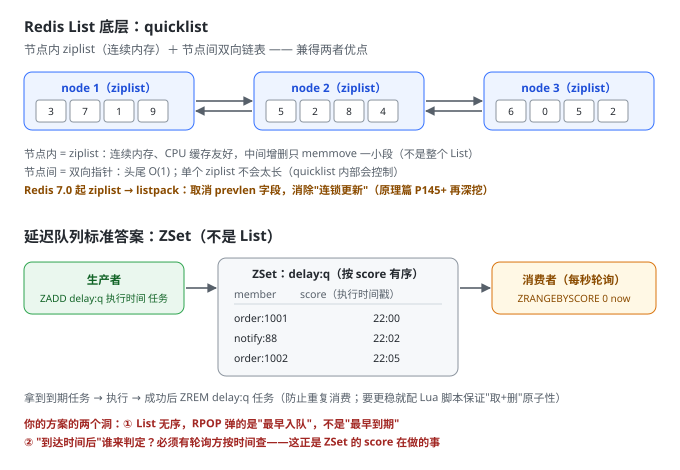
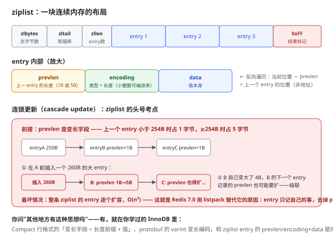

## Day 60 (2026-9-19)
### 今天练习了Redis List的底层实现与消息队列,学习了Linux的概念,Git只看了基础概念,写了LC515,116,117,104,111.
> Redis List的底层如何实现?List常被用来作为简单的消息队列,它与RabbitMQ有什么区别?怎么用List实现一个简单的延迟队列?

**我的回答**
1. Redis List底层QuickList结合了zipList和LinkedList,节点采用zipList结构,节点间采用双向链表结构,使其可以实现双向链表的特殊效果
- 单纯的zipList中间增删需要整体memmove,单纯的LinkedList每个节点需要存储两个指针,效率较差,且内存地址不连续,QuickList结合了这两个结构的优点.
2. List的消息队列实现简单,只支持单行队列,不支持ACK和数据持久化,宕机可能会导致数据的丢失,而RabbitMQ更加专业,支持ACK和持久化,但实现相较来说复杂一些
3. List本身不支持延时效果,但我们可以通过一个delay_list里面放时间戳,到达时间后立即RPOP出队放入ready_list中执行,达成简单的延时效果.

**错漏点**

quicklist 的判断全对：**节点内 ziplist（连续内存）+ 节点间双向链表**，以及“为什么要结合”的两条理由（ziplist 中间增删 memmove、linkedlist 指针开销且不连续）都答到了。三处修正，其中第三处是**实质错误**：

| 你的表述 | 修正  |
| --- | --- |
| “双向链表的特殊效果” | “双向操作”：头尾 push/pop 均 O(1)——你 Day 56 学 LPUSH/RPOP 时建立的认知，接上 |
| “单行队列” | **单消费者**队列：BRPOP 抢走一条，其他消费者看不到 |
| “不支持数据持久化” | 不准确：开着 RDB/AOF 时 List 数据也落盘。真正的缺陷是**消费无 ACK**——BRPOP 弹出即删除，消费者拿到消息后崩溃，这条消息就**永久丢了**，没有“确认后才删”的机制 |

和 RabbitMQ 的对比框架对，补齐成面试标准版：List 方案的三大缺陷（无 ACK / 单消费者 / 内存堆积有上限）→ RabbitMQ 的三大补位（消息确认机制、发布订阅模型可多消费者广播、专业持久化与死信队列）。RabbitMQ 你阶段五才正式学，现在记这个对比就够了。

**延迟队列你的方案有实质错误**。你写“delay_list 放时间戳，到达时间后 RPOP 放入 ready_list”——两个洞：① **List 是无序的**，RPOP 弹出的是“最早入队的”，不是“最早到期的”，两个任务下错顺序就乱了；
② “到达时间后”这个动作谁来判定？必须有一个轮询方不停查询“谁到期了”——而按时间排序 + 范围查询正好是 **ZSet 的 score 机制**。所以标准答案是 ZSet 不是 List，看图：

> vi/vim编辑器和用户,用户组.

**我的回答**
1. vi/vim编辑器是Linux中提供的文件编辑器,vim是vi的升级版,兼容所有的vi命令,还能提供shell程序编辑功能,vi编辑器的三种模式:
- 命令模式: 所敲按键都理解为命令,可以通过输入i进入输入模式或输入:进入底线命令模式
- 输入模式: 此模式下可以对文件进行修改,可以按Esc退出到命令模式
- 底线命令模式: 常用于对文件的保存,退出,可以输入:wq保存并退出到命令模式
2. 编辑器中存在多种快捷方式,如命令模式下的: yy复制 p粘贴 dd:删除一行 u:撤销修改 i:在当前光标进入输入模式 o:在当前行的下一行进入输入模式 G:跳到文件尾
3. root用户: 普通用户在Linux中的权限有限,而root用户拥有最大权限,可以通过语法 su [-] [用户名] 切换用户,包括root用户,其中-表示是否加载该用户对应的环境变量
- 长期使用root用户,可能会损坏Linux系统的内容,通过语法:sudo 其他命令 可以临时获得管理员权限,但该用户必须被配置sudo认证
4. Linux可以对用户和用户组进行权限管理
- 创建用户组: groupadd 用户组名
- 删除用户组: groupdel 用户组名
- 创建用户: useradd [-g -d] 用户名 -g表示指定用户的组,不指定会自动创建同名组并加入 -d指定用户home目录,不指定就默认在: /home/用户名
- 删除用户: userdel [-r] 用户名 -r表示删除用户的home目录,不加则不删除
- id[用户名] 查看用户所属组 usermod -aG 用户组 用户名 给用户分配组 getent 查看当前系统中存在哪些用户

**错漏点**

1. vi/vim

这节全对率很高，快捷键、useradd/userdel/id/groupadd 的参数语义基本零失误。三处修正：

| 你的表述 | 修正  |
| --- | --- |
| “:wq 保存并退出**到命令模式**” | :wq 退出的是**整个 vim，回到 shell**。三种模式里只有 Esc 从输入/底线模式**回到命令模式**——终点搞错，整个模式环就画歪了 |
| usermod **-aG** 分配组 | 漏了 `-a` 的关键性：`-a` = append 追加。**​不带 -a 的 -G 会把用户从其他附加组全部踢掉**（覆盖式），这是真实运维事故点，进纠错本 |
| “getent 查看用户” | 要带参数：`getent passwd`（查组是 `getent group`） |

补两个你下节课大概率要学的：`gg` 跳文件头（你只记了 G 跳尾，一对才完整）；权限三组 `rwx`（`r=4, w=2, x=1`，所以 chmod 754 是啥意思）——这是 Linux 权限体系的核心，和用户组正好接上

> 对LC几道题目的反思.

**我的回答**
1. 这几道题仍然可以使用广度优先的方法进行解答,但104递归实现更简单,111我使用的是广度优先,关键是当left&&right 一个存在为null时直接返回depth.
515只需要用一个max来记录最大值即可,116和117广度优先算法,同一个代码解两题

**错漏点**

- **111 最小深度的表述是错的**（或写得太潦草）：“当 left&&right **一个存在为 null** 时直接返回 depth”——**错**，正确条件是**左右都为 null（真叶子）**​才返回。
这正是 111 的经典坑：只有一个孩子为 null 时（比如 `1 → 2`），**必须继续往非空那边走**，不能 min 左右（min 会取到 0）。BFS 遇到第一个真叶子返回当前层深度就是正解；递归版规则：`left == null` 返回右子树深度+1，`right == null` 返回左子树深度+1，都存在才 min。你既然标了“关键是……”，这个“关键”本身得先写对。
- **515 每层最大值**：节点值可为**负数**，`max` 初始化用 `Integer.MIN_VALUE`（或直接取本层第一个 poll 的值）——这是“能过样例、错负数”型边界，你“能过，但有没有问题”系列的老朋友。

## Day 61 (2026-9-20)
### 今天深入了解了一下ziplist,学习了查看Linux中的权限信息及一些快捷键,开始执行mark-reading,LC写了226,589,590
> 关于ziplist的是什么?底层结构是什么样的?有什么作用,只有Redis有这种结构吗?这样好用的结构能不能在其他方向应用?

**我的回答**
1. ziplist是一种紧凑的数据结构;它没有指针,不是数组,存放了多个连续的变长entry.
2. ziplist内部的entry内包含上一个entry的地址(方便跳回上一个entry),encoding编码(用于记录当前entry的类型和长度)和当前entry的值(如果是int类型会被编码进encoding从而减少内存消耗).entry外还包含byte长度和尾部tail记录尾部偏移量方便进行尾部定位,end结束标记.
- ziplist的性质有点类似数组,中间插入需要后面整体memmove
3. ziplist在Redis的很多结构,如list中和LinkedList的结构结合使用,可以减少很多不必要的内存消耗
4. 在之前的学习中好像并未遇到这种结构,这种节省内存的方法可能只有才内存操作时才需要

**错漏点**

结构描述的骨架全对（header 三字段、尾部偏移、entry 内 encoding 编 int 省内存、memmove 代价），但有一个**字段记错**和一个**最大考点漏掉**：

| 你的表述 | 修正  |
| --- | --- |
| entry 内包含上一个 entry 的**地址** | 是上一个 entry 的**长度**（prevlen）。地址要 8 字节，长度通常 1 字节（entry < 254B 时）——**反向遍历是“当前位置减去 prevlen”反推出来的**，不是顺着地址跳。记长度不记地址，本身就是这个结构省内存哲学的一部分 |
| header 里你提了 zlbytes、zltail、end | 漏了 **zllen**（entry 数量，2 字节）——header 是三兄弟：总字节数 + 尾偏移 + entry 计数 |
| **连锁更新整段缺失** | 这是 ziplist 的头号考点，也是昨天 Day 60 我提“7.0 用 listpack 取消 prevlen、消除连锁更新”的那个“连锁更新”——你今天深入学它却没接上这根线 |

把结构和连锁更新一次画全：

> Linux的权限信息,一些快捷键执行mark-reading时遇到一个新的API: Optional.

**我的回答**
1. Linux中ls -l .前显示的内容表示了什么,如:drwxrwxrwx. 数字后跟的 root root 表示属于root用户,root用户组
- 第一个d表示这是一个文件夹,-表示文件,l表示软连接
- 其中r表示read权限(对应的shown值为4),w表示写权限(2),x表示执行权限(1). 前三个rwx表示拥有用户的权限,中间三个表示该用户用户组权限,最后三个表示其他用户权限.
2. chmod命令: 修改文件,文件夹的权限信息,可以: chmod -R u=rwx,g=rx,o=x 文件 执行,其中-R表示对其全部内容都进行更改;也可以通过 chmod 751 文件
3. chown命令: 可以修改文件,文件夹所属的用户,用户组; chown [-R] [用户][:][用户组] 文件或文件夹 其中:用于分隔用户与用户组
4. 常用快捷键: 1.ctrl+c 强制结束运行当前命令 2.ctrl+d 退出当前用户登录 3.history命令 列举出历史命令,可用grep过滤 4.ctrl+r 输入命令去匹配历史命令 5.ctrl+a跳到命令开头,ctrl+e跳到命令结尾,ctrl+左/右键,向左/右跳一个单词
5. Optional是jdk8提供的一个容器类,它的作用就是表达容器内可能什么都没有,在mark-reading中的作用就是消除歧义,不存在就直接抛出异常,而不是返回null,让人猜没找到还是字段本来就是空的

**错漏点**

三处小修：

1. **“r 对应的 shown 值为 4”**——“shown”是错字，应为“**数值**”4。这条进纠错本的原因和“临键锁”一样：权限数字是面试/实操双高频词；
2. `chmod 751` 的读法补一层：751 = **所有者 rwx(7) + 组 r-x(5) + 其他 --x(1)**​——数字是三组各自“加和”出来的，反推要能秒答“6 是 rw-”；
3. 一个易漏点：`chown .group 文件`（用户名前只写点和组名）= **只改组不改用户**，记一下有这个变体。

**Optional** 的理解方向全对——“消除歧义，不让人猜是没找到还是本来就是空”，这正是它存在的意义（方法**签名**上显式声明“可能没有”）。但有一处归因要拧准：

> “不存在就直接抛出异常”

**抛异常的不是 Optional，是 `orElseThrow(() -> new BookNotFoundException(...))`**。Optional 本身只是容器，抛不抛、抛什么，全看你在它身上接的终结操作。
这也是 mark-reading 里那行代码的真正分工：Optional 负责“显式表达可能为空”，`orElseThrow` 负责“把空翻译成业务异常”。顺带送你一个经典面试追问，现在存着：**`orElse` vs `orElseGet` 的区别**——`orElse(v)` 无论 Optional 是否为空都**先算出** v（每次都执行）；`orElseGet(() -> v)` 是惰性的，空了才调。用 `orElse(new Book())` 会白白 new 对象，高频坑。

> LC226,589和590

**我的回答**
1. LC226反转二叉树,其实就是在每次操作节点时将两个子节点交换一下,可以使用递归实现,也可以使用广度优先,每次入队后将子节点交换
2. 589和590也可以直接使用递归,只需要修改list.add(node.val)的时机即可

**错漏点**

一个值得记的知识点：N 叉树没有中序遍历——“根放中间”需要孩子只有左右两个确定位置，N 个孩子“中间”不唯一，中序失去定义。这是 589/590 只出前后序的原因，面试冷门但一旦问出来很见功底。另外注意 children 可能为 null（叶子），for 之前判空——和 LC429 同一个坑。

