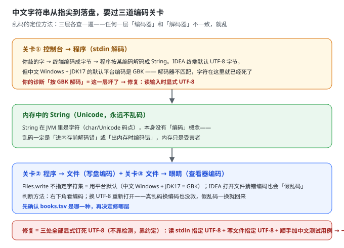
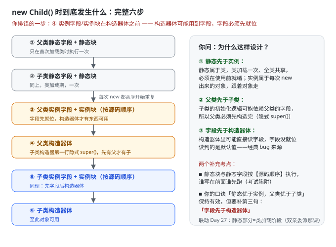

## Day 60 (2026-9-19)
### 今天练习了Redis List的底层实现与消息队列,学习了Linux的概念,Git只看了基础概念,写了LC515,116,117,104,111.
> Redis List的底层如何实现?List常被用来作为简单的消息队列,它与RabbitMQ有什么区别?怎么用List实现一个简单的延迟队列?

**我的回答**
1. Redis List底层QuickList结合了zipList和LinkedList,节点采用zipList结构,节点间采用双向链表结构,使其可以实现双向链表的特殊效果
- 单纯的zipList中间增删需要整体memmove,单纯的LinkedList每个节点需要存储两个指针,效率较差,且内存地址不连续,QuickList结合了这两个结构的优点.
2. List的消息队列实现简单,只支持单行队列,不支持ACK和数据持久化,宕机可能会导致数据的丢失,而RabbitMQ更加专业,支持ACK和持久化,但实现相较来说复杂一些
3. List本身不支持延时效果,但我们可以通过一个delay_list里面放时间戳,到达时间后立即RPOP出队放入ready_list中执行,达成简单的延时效果.

**错漏点**

quicklist 的判断全对：**节点内 ziplist（连续内存）+ 节点间双向链表**，以及“为什么要结合”的两条理由（ziplist 中间增删 memmove、linkedlist 指针开销且不连续）都答到了。三处修正，其中第三处是**实质错误**：

| 你的表述 | 修正  |
| --- | --- |
| “双向链表的特殊效果” | “双向操作”：头尾 push/pop 均 O(1)——你 Day 56 学 LPUSH/RPOP 时建立的认知，接上 |
| “单行队列” | **单消费者**队列：BRPOP 抢走一条，其他消费者看不到 |
| “不支持数据持久化” | 不准确：开着 RDB/AOF 时 List 数据也落盘。真正的缺陷是**消费无 ACK**——BRPOP 弹出即删除，消费者拿到消息后崩溃，这条消息就**永久丢了**，没有“确认后才删”的机制 |

和 RabbitMQ 的对比框架对，补齐成面试标准版：List 方案的三大缺陷（无 ACK / 单消费者 / 内存堆积有上限）→ RabbitMQ 的三大补位（消息确认机制、发布订阅模型可多消费者广播、专业持久化与死信队列）。RabbitMQ 你阶段五才正式学，现在记这个对比就够了。

**延迟队列你的方案有实质错误**。你写“delay_list 放时间戳，到达时间后 RPOP 放入 ready_list”——两个洞：① **List 是无序的**，RPOP 弹出的是“最早入队的”，不是“最早到期的”，两个任务下错顺序就乱了；
② “到达时间后”这个动作谁来判定？必须有一个轮询方不停查询“谁到期了”——而按时间排序 + 范围查询正好是 **ZSet 的 score 机制**。所以标准答案是 ZSet 不是 List，看图：

> vi/vim编辑器和用户,用户组.

**我的回答**
1. vi/vim编辑器是Linux中提供的文件编辑器,vim是vi的升级版,兼容所有的vi命令,还能提供shell程序编辑功能,vi编辑器的三种模式:
- 命令模式: 所敲按键都理解为命令,可以通过输入i进入输入模式或输入:进入底线命令模式
- 输入模式: 此模式下可以对文件进行修改,可以按Esc退出到命令模式
- 底线命令模式: 常用于对文件的保存,退出,可以输入:wq保存并退出到命令模式
2. 编辑器中存在多种快捷方式,如命令模式下的: yy复制 p粘贴 dd:删除一行 u:撤销修改 i:在当前光标进入输入模式 o:在当前行的下一行进入输入模式 G:跳到文件尾
3. root用户: 普通用户在Linux中的权限有限,而root用户拥有最大权限,可以通过语法 su [-] [用户名] 切换用户,包括root用户,其中-表示是否加载该用户对应的环境变量
- 长期使用root用户,可能会损坏Linux系统的内容,通过语法:sudo 其他命令 可以临时获得管理员权限,但该用户必须被配置sudo认证
4. Linux可以对用户和用户组进行权限管理
- 创建用户组: groupadd 用户组名
- 删除用户组: groupdel 用户组名
- 创建用户: useradd [-g -d] 用户名 -g表示指定用户的组,不指定会自动创建同名组并加入 -d指定用户home目录,不指定就默认在: /home/用户名
- 删除用户: userdel [-r] 用户名 -r表示删除用户的home目录,不加则不删除
- id[用户名] 查看用户所属组 usermod -aG 用户组 用户名 给用户分配组 getent 查看当前系统中存在哪些用户

**错漏点**

1. vi/vim

这节全对率很高，快捷键、useradd/userdel/id/groupadd 的参数语义基本零失误。三处修正：

| 你的表述 | 修正  |
| --- | --- |
| “:wq 保存并退出**到命令模式**” | :wq 退出的是**整个 vim，回到 shell**。三种模式里只有 Esc 从输入/底线模式**回到命令模式**——终点搞错，整个模式环就画歪了 |
| usermod **-aG** 分配组 | 漏了 `-a` 的关键性：`-a` = append 追加。**​不带 -a 的 -G 会把用户从其他附加组全部踢掉**（覆盖式），这是真实运维事故点，进纠错本 |
| “getent 查看用户” | 要带参数：`getent passwd`（查组是 `getent group`） |

补两个你下节课大概率要学的：`gg` 跳文件头（你只记了 G 跳尾，一对才完整）；权限三组 `rwx`（`r=4, w=2, x=1`，所以 chmod 754 是啥意思）——这是 Linux 权限体系的核心，和用户组正好接上

> 对LC几道题目的反思.

**我的回答**
1. 这几道题仍然可以使用广度优先的方法进行解答,但104递归实现更简单,111我使用的是广度优先,关键是当left&&right 一个存在为null时直接返回depth.
515只需要用一个max来记录最大值即可,116和117广度优先算法,同一个代码解两题

**错漏点**

- **111 最小深度的表述是错的**（或写得太潦草）：“当 left&&right **一个存在为 null** 时直接返回 depth”——**错**，正确条件是**左右都为 null（真叶子）**​才返回。
这正是 111 的经典坑：只有一个孩子为 null 时（比如 `1 → 2`），**必须继续往非空那边走**，不能 min 左右（min 会取到 0）。BFS 遇到第一个真叶子返回当前层深度就是正解；递归版规则：`left == null` 返回右子树深度+1，`right == null` 返回左子树深度+1，都存在才 min。你既然标了“关键是……”，这个“关键”本身得先写对。
- **515 每层最大值**：节点值可为**负数**，`max` 初始化用 `Integer.MIN_VALUE`（或直接取本层第一个 poll 的值）——这是“能过样例、错负数”型边界，你“能过，但有没有问题”系列的老朋友。

## Day 61 (2026-9-20)
### 今天深入了解了一下ziplist,学习了查看Linux中的权限信息及一些快捷键,开始执行mark-reading,LC写了226,589,590
> 关于ziplist的是什么?底层结构是什么样的?有什么作用,只有Redis有这种结构吗?这样好用的结构能不能在其他方向应用?

**我的回答**
1. ziplist是一种紧凑的数据结构;它没有指针,不是数组,存放了多个连续的变长entry.
2. ziplist内部的entry内包含上一个entry的地址(方便跳回上一个entry),encoding编码(用于记录当前entry的类型和长度)和当前entry的值(如果是int类型会被编码进encoding从而减少内存消耗).entry外还包含byte长度和尾部tail记录尾部偏移量方便进行尾部定位,end结束标记.
- ziplist的性质有点类似数组,中间插入需要后面整体memmove
3. ziplist在Redis的很多结构,如list中和LinkedList的结构结合使用,可以减少很多不必要的内存消耗
4. 在之前的学习中好像并未遇到这种结构,这种节省内存的方法可能只有才内存操作时才需要

**错漏点**

结构描述的骨架全对（header 三字段、尾部偏移、entry 内 encoding 编 int 省内存、memmove 代价），但有一个**字段记错**和一个**最大考点漏掉**：

| 你的表述 | 修正  |
| --- | --- |
| entry 内包含上一个 entry 的**地址** | 是上一个 entry 的**长度**（prevlen）。地址要 8 字节，长度通常 1 字节（entry < 254B 时）——**反向遍历是“当前位置减去 prevlen”反推出来的**，不是顺着地址跳。记长度不记地址，本身就是这个结构省内存哲学的一部分 |
| header 里你提了 zlbytes、zltail、end | 漏了 **zllen**（entry 数量，2 字节）——header 是三兄弟：总字节数 + 尾偏移 + entry 计数 |
| **连锁更新整段缺失** | 这是 ziplist 的头号考点，也是昨天 Day 60 我提“7.0 用 listpack 取消 prevlen、消除连锁更新”的那个“连锁更新”——你今天深入学它却没接上这根线 |

把结构和连锁更新一次画全：

> Linux的权限信息,一些快捷键执行mark-reading时遇到一个新的API: Optional.

**我的回答**
1. Linux中ls -l .前显示的内容表示了什么,如:drwxrwxrwx. 数字后跟的 root root 表示属于root用户,root用户组
- 第一个d表示这是一个文件夹,-表示文件,l表示软连接
- 其中r表示read权限(对应的shown值为4),w表示写权限(2),x表示执行权限(1). 前三个rwx表示拥有用户的权限,中间三个表示该用户用户组权限,最后三个表示其他用户权限.
2. chmod命令: 修改文件,文件夹的权限信息,可以: chmod -R u=rwx,g=rx,o=x 文件 执行,其中-R表示对其全部内容都进行更改;也可以通过 chmod 751 文件
3. chown命令: 可以修改文件,文件夹所属的用户,用户组; chown [-R] [用户][:][用户组] 文件或文件夹 其中:用于分隔用户与用户组
4. 常用快捷键: 1.ctrl+c 强制结束运行当前命令 2.ctrl+d 退出当前用户登录 3.history命令 列举出历史命令,可用grep过滤 4.ctrl+r 输入命令去匹配历史命令 5.ctrl+a跳到命令开头,ctrl+e跳到命令结尾,ctrl+左/右键,向左/右跳一个单词
5. Optional是jdk8提供的一个容器类,它的作用就是表达容器内可能什么都没有,在mark-reading中的作用就是消除歧义,不存在就直接抛出异常,而不是返回null,让人猜没找到还是字段本来就是空的

**错漏点**

三处小修：

1. **“r 对应的 shown 值为 4”**——“shown”是错字，应为“**数值**”4。这条进纠错本的原因和“临键锁”一样：权限数字是面试/实操双高频词；
2. `chmod 751` 的读法补一层：751 = **所有者 rwx(7) + 组 r-x(5) + 其他 --x(1)**​——数字是三组各自“加和”出来的，反推要能秒答“6 是 rw-”；
3. 一个易漏点：`chown .group 文件`（用户名前只写点和组名）= **只改组不改用户**，记一下有这个变体。

**Optional** 的理解方向全对——“消除歧义，不让人猜是没找到还是本来就是空”，这正是它存在的意义（方法**签名**上显式声明“可能没有”）。但有一处归因要拧准：

> “不存在就直接抛出异常”

**抛异常的不是 Optional，是 `orElseThrow(() -> new BookNotFoundException(...))`**。Optional 本身只是容器，抛不抛、抛什么，全看你在它身上接的终结操作。
这也是 mark-reading 里那行代码的真正分工：Optional 负责“显式表达可能为空”，`orElseThrow` 负责“把空翻译成业务异常”。顺带送你一个经典面试追问，现在存着：**`orElse` vs `orElseGet` 的区别**——`orElse(v)` 无论 Optional 是否为空都**先算出** v（每次都执行）；`orElseGet(() -> v)` 是惰性的，空了才调。用 `orElse(new Book())` 会白白 new 对象，高频坑。

> LC226,589和590

**我的回答**
1. LC226反转二叉树,其实就是在每次操作节点时将两个子节点交换一下,可以使用递归实现,也可以使用广度优先,每次入队后将子节点交换
2. 589和590也可以直接使用递归,只需要修改list.add(node.val)的时机即可

**错漏点**

一个值得记的知识点：N 叉树没有中序遍历——“根放中间”需要孩子只有左右两个确定位置，N 个孩子“中间”不唯一，中序失去定义。这是 589/590 只出前后序的原因，面试冷门但一旦问出来很见功底。另外注意 children 可能为 null（叶子），for 之前判空——和 LC429 同一个坑。

## Day 62 (2026-9-21)
### 今天学习了Linux的yum,systemctl,软连接,date命令,一些git命令,写了LC100,101,572.
> 这些Linux命令的作用及语法.

**我的回答**
1. yum是RPM的软件安装器,用于安装Linux软件并自动解决依赖问题. 对于Ubuntu则需要使用apt管理器下载
- 语法: yum [-y] [install | remove | serach] 软件名称 其中-y表示自动确认
2. systemctl用于设置服务的开启,停止和自动启动 部分软件需要自己配置才能用systemctl设置
- 语法: systemctl start|stop|enable|disable|status 服务
3. 软连接的作用相当于快捷方式,帮助我们快速使用其他目录的软件内容
- 语法: ln -s 参数1 参数2  -s表示创建软路径
4. date命令用于显示和操作系统中的时间
- 语法: date [-d] [+格式化字符串]
- 其中-d用于操作时间,如-d "+1 day".格式化字符串与java中类似:%Y 年,%m 月,%d 日,%H 小时,%M 分钟,%S 秒
5. 查看主机名及修改主机名: hostname 查看,hostnamectl set-hostname 主机名 修改主机名
6. 一些git指令:
- git log: 查看提交日志 git log --pretty=online 简洁日志
- git回退版本块是因为git内部是通过head指针指向每个版本的
- git reset: 退回到上个版本. --hard 退回到上个版本已提交的状态, --soft 退回到上个版本未提交的状态 --mixed 退回到上个版本已添加但未提交的版本
- git reflog: 查看commit id帮助我们回到退回前的版本

**错漏点**
1. 关于Linux 

四条命令的语义和语法框架全对（yum 是“RPM 包管理器 + 自动解决依赖”、apt 对 Ubuntu、systemctl 的 start/stop/enable/disable、软连接=快捷方式、date 格式化 %Y%m%d%H%M%S）。六处修正，前两处是错的，后面是术语精度：

| 你的表述 | 修正  |
| --- | --- |
| `serach` | **search**（拼写） |
| `ln -s` 的“-s 表示创建软路径” | **-s = soft/符号链接**。没有 -s 创建的是**硬链接**（同一文件的两个名字，同 inode，删原文件不影响）——硬/软链接的区别是 Linux 面试真题，正好接你 P32 那集 |
| yum 是“RPM 的软件安装器” | 更准确：yum 基于 RPM 包格式，但**从远程仓库自动下载 + 解决依赖**；rpm 本身不解决依赖（著名的依赖地狱） |
| “git 回退版本块是因为 git 内部通过 head 指针指向每个版本” | **错**。HEAD → 分支(main) → 最新 commit，是**链条**不是 HEAD 直接指每个版本；“回退”本质是 reset 挪动分支指针 |
| --hard/--soft/--mixed 的描述 | 方向反了（详见下节） |
| `--pretty=online` | **oneline**（拼写，你 9/18 那张四区图里是过的） |

2. 关于Git 

你写：“--hard 退回到上个版本已提交的状态，--soft 退回到未提交的状态，--mixed 退回到已添加但未提交”——**三层全反了**。正确版本（对照你 9/18 四区图回忆）：

| 模式  | HEAD | 暂存区 | 工作区 | 退完后的效果 |
| --- | --- | --- | --- | --- |
| `--soft` | 挪回  | **保留** | **保留** | 改动完整躺在**暂存区**，就差再 commit |
| `--mixed`（默认） | 挪回  | 清掉  | **保留** | 改动回到**工作区**，等重新 add |
| `--hard` | 挪回  | 清掉  | 清掉  | **改动全没了**，干净得像没写过 |

记忆口诀：**soft 动 HEAD 一个，mixed 动两个，hard 动三个**——动得多丢得多。你前天刚亲手玩过 `git restore --staged .idea`（撤暂存区不动工作区），和 mixed 的“半程”是同一族操作。\
建议今天就在 mark-reading 里做那次说好的实验：故意 commit 一版“坏代码”，`reset --soft HEAD~1` 看一眼 status，再 `--mixed` 看一眼——**两个输出的差异你看一次就永远记住了**。

> 对于LC几道题的反思.

**我的回答**
1. 对于这种比较两个树的题目,需要逐个对比各个节点的信息.
2. LC100 只需要递归逐个比较两个树的左子节点和右子节点是否相同,主要分为几种情况:1.两个节点都为null:返回true 2.某一个节点为null或者val不相等:返回false.
其它两题比较也是这个思路,不过对称树需要将子树的外侧与另一个子树的外侧比较
3. 对于LC572,需要一个额外递归来从root的每一个节点与subRoot的开头节点进行对比,用于确定比较开始.

**补充**

三题的递归结构全对，尤其两处表述显出真理解：100 的“两节点都 null 返回 true / 有一个 null 或 val 不等返回 false”（**先判空再判值**的顺序写对了，这是这类题唯一能翻车的点）；572 “额外递归从 root 每个节点与 subRoot 开头对比”（双递归结构说准了）。补两个升级点：

1. **101 对称的更通用心智**：你说“子树的外侧与另一个子树的外侧比较”，精确说法是**镜像递归**——`isMirror(l.left, r.right) && isMirror(l.right, r.left)`：左子树的左 ↔ 右子树的右（外侧），左子树的右 ↔ 右子树的左（内侧）。这四个指针的配对关系是 101 的题眼，面试官让你白板写时配对写错就全错。
2. **572 的复杂度要心里有账**：最坏 O(m×n)（每个节点都要尝试当起点）。存在 KMP/树哈希的 O(m+n) 解法——了解到即可，面试说出来是加分项，说不出来不扣分。

## Day 63 (2026-9-22)
### 今天学习了Linux固定ip,端口及进程和一下指令,尝试git reset并查看差异,看了mark-reading.LC写了222完全二叉树的节点个数和110平衡二叉树.
> 今天学习的Linux内容审核.

**我的回答**
1. Linux固定ip的原因是Linux采用DHCP动态获取ip,此种方法会导致我们的虚拟机ip地址不固定,不利于我们连接.需要我们修改VM配置的IP地址网关和网段.涉及的一些语法:
- ping指令: 语法:ping [-c num] ip或主机名 作用:用于检查连接是否通畅.-c表示检查次数,不加会无限检查
- wget指令: 语法:wget [-b] url 作用:用于在命令行下载网络文件.-b表示后台下载,不影响控制台输入
- curl指令: 语法: curl [-O] url 作用:发送http网络请求,用于下载文件和获取信息 -O表示下载文件
2. 端口: 与ip地址一起帮助我们锁定主机与程序.相关命令:
- nmap命令:查看端口的占用情况 语法:nmap 被查看的ip地址
- netstat命令: 查看指定端口的占用情况 语法: netstat -anp|grep 端口
3. 进程: 可用通过ps命令查看Linux系统的进程信息 语法: ps [-e -f] 其中-e表示显示出全部进程,-f表示以格式化形式输出,通常使用ps -ef
- kill命令: kill [-9] 进程ID -9表示强制停止,不加会向进程发送停止信息,是否停止由进程内部判断
- top命令: 查看系统资源占用,也支持选项和交互式运行,相关选项和快捷键比较多.选项: -p:只显示某个进行的信息 -i:不显示任何无用或闲置线程
- df命令: 语法:df [-h] 显示硬盘的使用情况,-h表示以更人性化的方式显示
- iostat命令: 语法:iostat [-x] [num1] [num2] 显示CPU和磁盘的相关信息,-x:显示更多内容 num1: 刷新间隔 num2: 刷新次数
- sar命令: 查看网络的相关统计,这里只学简单语法:sar -n DEV num1 num2 -n:查看网络 DEV:查看网络接口

**错漏点**

命令语义全对，几处亮点和补充：

| 项   | 判定/补充 |
| --- | --- |
| kill “不加 -9 时是否停止由进程内部判断” | **第三层水平**。精确术语：普通 kill 发 **SIGTERM(15)**​，进程可捕获并做清理后退出（优雅）；-9 是 **SIGKILL**，进程无法捕获无法忽略（强杀）。面试就问这两个信号的区别 |
| ping -c | 对。补一个对照：**Linux 的 ping 不加 -c 无限刷，Windows 的 ping 默认只发 4 个**——两个系统各用一段时间后极易记混 |
| nmap / netstat | 补视角差：nmap 是**外部视角扫别人的开放端口**，netstat 是**本机视角查端口被哪个进程占**——排查“端口被谁占了”用 netstat，排查“服务器开了哪些门”用 nmap |
| 固定 IP | 你的描述只有一半（VM 网段），漏了另一半：虚机内要改**网卡配置文件**（`/etc/sysconfig/network-scripts/ifcfg-ens33`：BOOTPROTO=static + IPADDR/GATEWAY/DNS1）再 `systemctl restart network`。这个“静态 IP 配置”动作，以后云服务器到手第一件事就是它的变体 |

curl 补一个定位：它以后是你**调自己接口的冒烟测试神器**——`curl http://localhost:8080/api/xxx`，JavaWeb 阶段天天用，比开 Postman 快。

> git reset整理.

**我的回答**
- --soft表示只改变commit,依旧存在于暂存区中
- --mixed表示改变commit和清除暂存区中的内容,工作区中的仍然不动
- --hard将commit,暂存区和工作区中的内容全部清除
1. 自己尝试使用三种方式对脏提交进行回退,前两次git status都能查看到,最后--hard把我上一次的提交给退回了,通过git reflog查看commit id重新找回了

**错漏点**

- **`--hard` 不挑好坏**：它眼里没有“脏提交”和“好提交”的区别——HEAD 指到哪，就把三层全部重置到哪。你被退掉的那次“上一次的提交”就是证明：你只想删坏的，它连好的一起带走。
- **reflog 是本地后悔药，且有效期有限**（引用移动记录默认只留 ~90 天，且只存在本地 .git 里）。
- **如果那个坏提交已经 push 过，reset 就不能用了**——远端历史被改写，协作必炸。那时只能 `git revert <commit>` 生成一笔反向提交。你现在的实验环境没 push，所以 reset 随便玩；真仓库里“已 push 用 revert、未 push 用 reset”这条纪律要焊死。

> LC222与110.

**我的回答**
1. 222这道题首先使用层序遍历方法,结果超时了.看了题解,发现正确解法递归中,因为是完全二叉树;
通过leftHeight和rightHeight是否相等就能判断是否为满二叉树.满二叉树就直接 (2 << leftHeight) - 1,(2 << leftHeight)相当于2 * 2^leftHeight.否则就递归求节点个数.
2. 110题也可使用递归解法,如果Math,abs(leftHeight - rightHeight) > 1,就代表不是平衡二叉树,直接逐层返回-1,无需其他检查;如果是平衡二叉树,就返回其左右中最长的Height+1,其中1表示加上本层,再与另一个递归结果比较,看看是否平衡

**错漏点**

**`(2 << leftHeight) - 1` 有个隐藏的 off-by-one 依赖**：`2 << h = 2^(h+1)`，所以这个公式对应“高度从 0 起数”（根=0）；如果你的 leftHeight 是从 1 起数（根=1），公式应为 `(1 << h) - 1 = 2^h - 1`。你能 AC 说明你自己的定义自洽，但**白板写之前要先声明“我的高度从几起数”**——否则和面试官各说各话，全盘皆错。

## Day 64 (2026-9-23)
### 今天复习了vi编辑器的一些高效指令,学习了Linux的环境变量,上传下载,压缩和解压的内容,mark-reading添加书籍时发现乱码问题,写了LC257二叉树的所有路径.
> vi常用的指令.

**我的回答**
1. 常用查找: /word(向下查找),?word向上查找,n跳到下一查找,N跳到上一查找
2. 替换: %s/new/old/g
3. 跳转: 0:移动到当前光标行首,$:移动到当前行尾,gg:跳到页首,G:跳到页尾,:行数 跳到指定行
4. 删除: dd: 删除一行
5. 复制粘贴命令: yy:复制一行 p:粘贴 u:撤销修改
6. 不重启vi的情况下重新加载文件: e!
7. 批量替换所有匹配字符串: %s/new/old/g 替换前按c确定

**错漏点**

查找、跳转、dd/yy/p/u、`:e!` 全对。三处要修：

| 你的表述 | 修正  |
| --- | --- |
| `%s/new/old/g` | 替换语法是 `:%s/旧文本/新文本/g`——**旧在前、新在后**（你写的字面方向是“把 new 换成 old”，容易把自己绕反）；且底线命令要带冒号 `:%s` |
| “替换前按 c 确定” | 不是按键，是**命令末尾加 c 标志**：`:%s/旧/新/gc`——每处弹问，y 换 n 跳 |
| 第 2 条和第 7 条 | 同一条写了两遍（整理笔记时合并） |

> Linux的环境变量,上传下载,压缩和解压.

**我的回答**
1. 环境变量记录了操作系统运行时的一些关键信息,以键值对的形式存在,可以使用env命令查看Linux的环境变量.
2. $符号: 可用于取"变量"的值.语法: echo $环境变量名 可以用于取环境变量的值
3. 设置Linux的环境变量: 1.临时设置: export 变量名=变量值 2.永久生效: 针对单个用户: 配置在~/.bashrc文件中 针对全部用户: 配置在/etc/profile中
- 立即生效: source 配置文件
- 配置环境变量究竟有什么用处呢?好像没什么用
4. 上传下载: FinalShell下方的文件管理器中,可以找到文件并下载. 将windows文件拖入文件管理器相关位置也可以将文件上传,或者使用相关命令:
- rz命令: 上传数据,输入rz后在文件列表中选择上传即可,比直接拖入慢
- sz命令: 下载数据,语法:sz 要下载的文件. 会自动下载到桌面的fsdownload文件夹中
5. 压缩与解压: Linux常用两种压缩格式: .tar tarball格式,不做多大压缩,主要进行封装 .gz 一般为.tar.gz 用于压缩文件
- tar命令 语法: tar [-c -v -f -x -z -C] 压缩包名 参数1...参数N
- -c create创建 -v显示创建过程 -f要创建或要解压的文件,必须放在选项最后面 -x 解压模式 -z gzip模式,不加就是tarball模式 -C 指定解压或压缩位置
- zip命令: 压缩文件为zip的压缩包 语法: zip [-r] 压缩包名 参数1... -r 包含文件夹时选择
- unzip: 解压缩zip压缩包 语法: unzip [-d] 参数 -d指定解压位置

**错漏点**

框架全对：export 临时、`~/.bashrc` 单用户、`/etc/profile` 全用户、source 立即生效、tar 的 `-f 必须放最后`（这个细节记住了，好评）。补两块，第二块是重点：

**1. tar 是组合拳**，光记选项不够，记四条成品命令：压缩 `tar -zcvf test.tar.gz a.txt b.txt`、纯打包 `tar -cvf test.tar ...`、解压 `tar -zxvf test.tar.gz -C /root`、纯解包 `tar -xvf test.tar`。口诀：**压 c 解 x，见 z 必 gzip**。

**2. “配置环境变量有什么用？好像没什么用”——这个问题问出来，说明它一直在暗中救你的命**：

> **PATH 本身就是环境变量**。你每天敲 `ls`、`vi`、`git`，shell 能找到这些命令，靠的就是逐个翻 PATH 里列出的目录。PATH 没了，每条命令都得写全路径 `/usr/bin/ls`。
>
> 而且你有一个活生生的反面案例，就发生在你眼前：**我的执行环境 bash 的 PATH 就是坏的**（`dirname`、`ls`、`head` 全找不到，我每次要操作文件都得写绝对路径修复）——这就是“没有 PATH 的世界”，我在这环境里干活每次都要多花三行命令修它。
>
> 再往 Java 看：`JAVA_HOME` 是装 JDK 配的第一件事，Maven、各种启动脚本都读它；代码里 `System.getenv("JAVA_HOME")` 也能读。**环境变量 = 进程之间的公共配置协议**，不是“没什么用”，是“用得太频繁以至于隐形”。

> mark-reading乱码.

**我的回答**
1. 程序将控制台送来的UTF-8格式的字符串按照GBK形式解码,并正确地放入文件中.
2. 解决方案: 思路换成看字节,UTF-8的位格式非常严格,GBK文字很难满足,所以可以这样判断,但依旧可能存在巧合,此时需要手动固定位GBK

**错漏点**

先肯定你那个方案的含金量：**“看字节模式判断编码”**——UTF-8 的多字节序列有严格前缀格式（`110xxxxx 10xxxxxx…`），随机 GBK 字节恰好凑成合法 UTF-8 的概率很低——**这就是工业级检测库（如 juniversalchardet）的核心思想之一**，你第一次遇到乱码就自己摸到了，且你自己也意识到了“可能存在巧合”（检测法天然有误判率）。这个 9 分是给思想的。

但工程上，**检测是兜底手段，不是首选**——编码问题的工程哲学一句话：**不靠猜（detect），靠约定（specify）**​。先把链路画出来，你的乱码藏在哪一层一目了然:

> LC257反思

**我的回答**
1. 首次书写递归+回溯的题目,对于该题的递归解法,一个关键点是判断该节点是否为叶子节点,为叶子节点时才停止递归(node.left == null && node.right == null),防止用(node == null),进行一次多的递归,却添加null导致混乱.
2. 当递归完成后回到上级时,清除记录路径的paths中的该节点,退一个节点remove一个节点.

## Day 65 (2026-9-24)
### 今天初步了解了Shell脚本,自定义Shell环境变量,复习了try-finally得close坑,java中类的初始化顺序;写了LC404左叶子之和,513找树左下角的值
> Shell是什么?它的脚本的编写规范与执行方式?

**我的回答**
1. Shell既是一种命令,又是一种程序编程语言;我们可以通过编写Shell脚本来帮助我们更方便地操作Linux系统.Shell通过不同的解析器操作系统,默认为bash,通过echo $SHELL可以查看当前解析器
2. 编写规范: 文件必须以"#!/bin/bash" 为首行,单行注释为:"# 注释内容";多行注释为:":<<! #注释内容 !"; 文件后缀统一为.sh结尾.
3. 3种执行方式: sh Shell文件; bash Shell文件; Shell文件(文件路径直接执行) 文件直接执行需要执行权限

**错漏点**

规范三件套（shebang、#注释、.sh 后缀）和三种执行方式都对，但**漏了第四种，而且它和你下一节的 export 恰好是一对**：

| 执行方式 | 进程模型 | 关键差异 |
| --- | --- | --- |
| `sh / bash 文件` | 开**子 Shell** 执行 | 脚本里定义的变量，执行完在当前终端**消失** |
| `./文件`（需 chmod +x） | 开**子 Shell** 执行 | 同上；靠 shebang 决定用哪个解释器 |
| `source 文件`（或 `. 文件`） | **当前 Shell 内**执行 | 变量留在当前终端——这就是为什么配 `.bashrc` 后要 `source` 生效 |

你笔记里“永久生效要配 ~/.bashrc”——**为什么配完要 source？因为 bash/sh 执行会在子 Shell 里跑，export 的变量带不回父 Shell**。你 Day 63 学的 source 和今天的子 Shell 概念，答案早就在你手里，只是没连上。

一处修正：“Shell 既是一种**命令**”——精确说是**命令解释器**（shell 这个程序本身），脚本语言是它的第二身份。另外多行注释 `:<<!...!` 是课程写法，可移植的标准形式是 `:<<'EOF' ... EOF`，知道即可。

> 怎么自定义局部变量,常量,全局变量?

**我的回答**
1. 局部变量: 语法:var_name=value 需要注意的是不能以数字开头,只能又字母,下划线和数字组成;=两侧不能有空格;bash环境中value都是以字符串形式,无法计算;如果变量有空格需要用" "括起来
2. 常量: 语法:readonly var_name=value 
3. 全局变量: 语法: export var_name= value,此时子Shell环境可以调用父Shell环境的全局变量
4. 注意: 变量删除: unset var_name 需要字符串拼接时需要用{}将var_name包裹起来

**错漏点**

`= 两侧不能有空格`（和你 Java 的肌肉记忆正相反，是 shell 第一坑）、readonly、unset、`${var}` 拼接定界——全对。两处要修：

1. “bash 中 value 都以字符串存储，**无法计算**”——前半句对，后半句错：能算，只是**不能直接算**，要换语法：`$((1+2))`、`let`、`expr`。这正好是你那门 Shell 课 P36-42 的“计算命令”部分——我之前裁决“跳大半”，现在修正为：**`(())` 这一集要看**，其余（expr/bc 五讲）确实可跳。
2. “`export var_name= value`”——**等号后不能有空格**（你笔记里带了一个空格，照抄会报错）。再加一条方向性：export 是**单向的**——父 Shell 的变量子 Shell 可见，但**子 Shell 里改了这个变量，父 Shell 不受影响**（进程地址空间隔离）。结合上面的执行模型一起记。

> try-fianlly的close坑与初始化.

**我的回答**
1. 在try-catch-finally中,如果try块中抛出异常,且close()中同步抛出异常,close中抛出的异常会将原始异常覆盖,难以寻找问题和维护.
2. 在try-with-resource中,try块无论正常执行或异常,都会自动执行close,且close中抛出的异常不会覆盖原有异常,可以进行查看
3. 父类静态块->子类静态块->父类构造器->父类实例->子类构造器->子类实例 总结:静态优于实列,父类优于子类
- 为什么是这样的初始化方法呢?

**错漏点**

`try-finally 那半块全对，而且用词可以再升一级：try-with-resources 里 close 的异常不是“不会覆盖、可以查看”，术语叫**被抑制（suppressed）**​——原始异常正常抛出，close 的异常挂在它身上，`e.getSuppressed()` 能取出来。面试说出"suppressed"这个词，和说“不覆盖”是两档人。

**类初始化顺序你排错了一处**。你写“父类静态块→子类静态块→**父类构造器→父类实例**→子类构造器→子类实例”——实例字段/实例块的初始化在**构造器体之前**，不是之后。完整六步看图：

> LC404与LC513的反思

**我的回答**
1. LC404: 该题的思路主要是判断递归的当前节点的左子节点是否为叶子节点,但同时也需要左子节点不为null,可以(node.left != null && node.left.left == null && node.left.right == null)进行判断
- 我在解此题中主要出现了一个问题:我对左子节点为叶子节点的情况,进行 return node.left.val + dfs(node.right) 这种写法违背了递归的拆分思想,进行了特殊处理,导致我的思维出现混乱.
- 正确的思想是应该用一个变量记录值,不是叶子节点就为0,而不是破坏递归的结构.
- 这题迭代法的解法,如果是左子节点是叶子节点就只添加右子节点,逐层遍历即可
2. LC513: 迭代法逐层从右向左遍历,最后一个节点必定是答案节点

**错漏点**
无