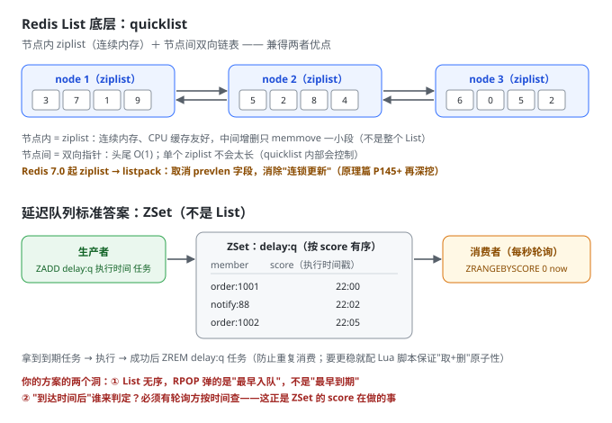
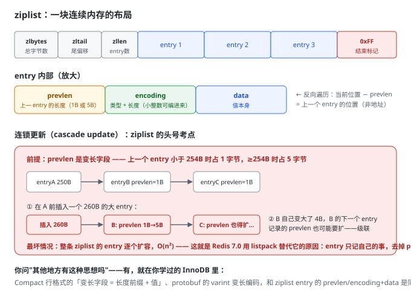
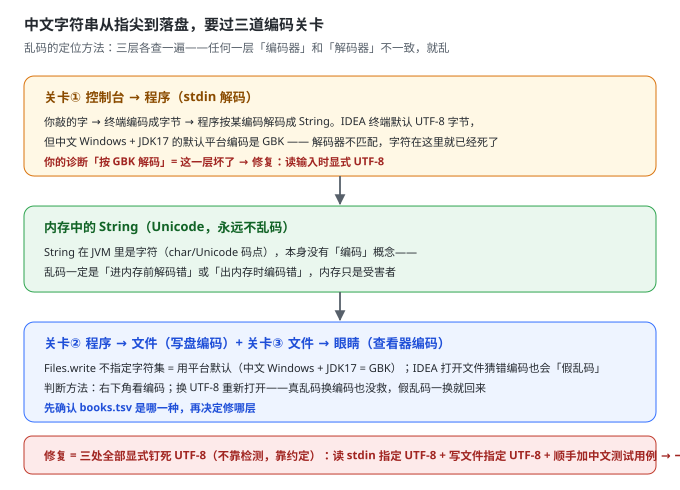
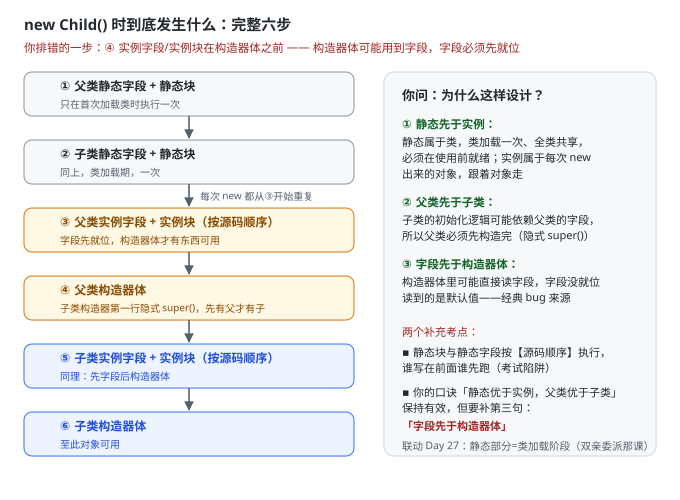
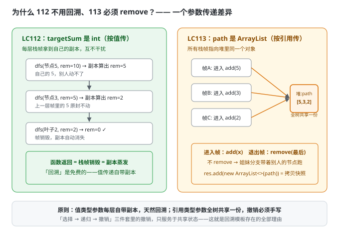
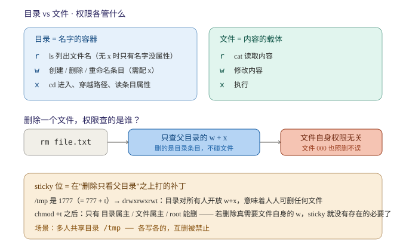

## Day 60 (2026-9-19)
### 今天练习了Redis List的底层实现与消息队列,学习了Linux的概念,Git只看了基础概念,写了LC515,116,117,104,111.
> Redis List的底层如何实现?List常被用来作为简单的消息队列,它与RabbitMQ有什么区别?怎么用List实现一个简单的延迟队列?

**我的回答**
1. Redis List底层QuickList结合了zipList和LinkedList,节点采用zipList结构,节点间采用双向链表结构,使其可以实现双向链表的特殊效果
- 单纯的zipList中间增删需要整体memmove,单纯的LinkedList每个节点需要存储两个指针,效率较差,且内存地址不连续,QuickList结合了这两个结构的优点.
2. List的消息队列实现简单,只支持单行队列,不支持ACK和数据持久化,宕机可能会导致数据的丢失,而RabbitMQ更加专业,支持ACK和持久化,但实现相较来说复杂一些
3. List本身不支持延时效果,但我们可以通过一个delay_list里面放时间戳,到达时间后立即RPOP出队放入ready_list中执行,达成简单的延时效果.

**错漏点**

quicklist 的判断全对：**节点内 ziplist（连续内存）+ 节点间双向链表**，以及“为什么要结合”的两条理由（ziplist 中间增删 memmove、linkedlist 指针开销且不连续）都答到了。三处修正，其中第三处是**实质错误**：

| 你的表述 | 修正  |
| --- | --- |
| “双向链表的特殊效果” | “双向操作”：头尾 push/pop 均 O(1)——你 Day 56 学 LPUSH/RPOP 时建立的认知，接上 |
| “单行队列” | **单消费者**队列：BRPOP 抢走一条，其他消费者看不到 |
| “不支持数据持久化” | 不准确：开着 RDB/AOF 时 List 数据也落盘。真正的缺陷是**消费无 ACK**——BRPOP 弹出即删除，消费者拿到消息后崩溃，这条消息就**永久丢了**，没有“确认后才删”的机制 |

和 RabbitMQ 的对比框架对，补齐成面试标准版：List 方案的三大缺陷（无 ACK / 单消费者 / 内存堆积有上限）→ RabbitMQ 的三大补位（消息确认机制、发布订阅模型可多消费者广播、专业持久化与死信队列）。RabbitMQ 你阶段五才正式学，现在记这个对比就够了。

**延迟队列你的方案有实质错误**。你写“delay_list 放时间戳，到达时间后 RPOP 放入 ready_list”——两个洞：① **List 是无序的**，RPOP 弹出的是“最早入队的”，不是“最早到期的”，两个任务下错顺序就乱了；
② “到达时间后”这个动作谁来判定？必须有一个轮询方不停查询“谁到期了”——而按时间排序 + 范围查询正好是 **ZSet 的 score 机制**。所以标准答案是 ZSet 不是 List，看图：



> vi/vim编辑器和用户,用户组.

**我的回答**
1. vi/vim编辑器是Linux中提供的文件编辑器,vim是vi的升级版,兼容所有的vi命令,还能提供shell程序编辑功能,vi编辑器的三种模式:
- 命令模式: 所敲按键都理解为命令,可以通过输入i进入输入模式或输入:进入底线命令模式
- 输入模式: 此模式下可以对文件进行修改,可以按Esc退出到命令模式
- 底线命令模式: 常用于对文件的保存,退出,可以输入:wq保存并退出到命令模式
2. 编辑器中存在多种快捷方式,如命令模式下的: yy复制 p粘贴 dd:删除一行 u:撤销修改 i:在当前光标进入输入模式 o:在当前行的下一行进入输入模式 G:跳到文件尾
3. root用户: 普通用户在Linux中的权限有限,而root用户拥有最大权限,可以通过语法 su [-] [用户名] 切换用户,包括root用户,其中-表示是否加载该用户对应的环境变量
- 长期使用root用户,可能会损坏Linux系统的内容,通过语法:sudo 其他命令 可以临时获得管理员权限,但该用户必须被配置sudo认证
4. Linux可以对用户和用户组进行权限管理
- 创建用户组: groupadd 用户组名
- 删除用户组: groupdel 用户组名
- 创建用户: useradd [-g -d] 用户名 -g表示指定用户的组,不指定会自动创建同名组并加入 -d指定用户home目录,不指定就默认在: /home/用户名
- 删除用户: userdel [-r] 用户名 -r表示删除用户的home目录,不加则不删除
- id[用户名] 查看用户所属组 usermod -aG 用户组 用户名 给用户分配组 getent 查看当前系统中存在哪些用户

**错漏点**

1. vi/vim

这节全对率很高，快捷键、useradd/userdel/id/groupadd 的参数语义基本零失误。三处修正：

| 你的表述 | 修正  |
| --- | --- |
| “:wq 保存并退出**到命令模式**” | :wq 退出的是**整个 vim，回到 shell**。三种模式里只有 Esc 从输入/底线模式**回到命令模式**——终点搞错，整个模式环就画歪了 |
| usermod **-aG** 分配组 | 漏了 `-a` 的关键性：`-a` = append 追加。**​不带 -a 的 -G 会把用户从其他附加组全部踢掉**（覆盖式），这是真实运维事故点，进纠错本 |
| “getent 查看用户” | 要带参数：`getent passwd`（查组是 `getent group`） |

补两个你下节课大概率要学的：`gg` 跳文件头（你只记了 G 跳尾，一对才完整）；权限三组 `rwx`（`r=4, w=2, x=1`，所以 chmod 754 是啥意思）——这是 Linux 权限体系的核心，和用户组正好接上

> 对LC几道题目的反思.

**我的回答**
1. 这几道题仍然可以使用广度优先的方法进行解答,但104递归实现更简单,111我使用的是广度优先,关键是当left&&right 一个存在为null时直接返回depth.
515只需要用一个max来记录最大值即可,116和117广度优先算法,同一个代码解两题

**错漏点**

- **111 最小深度的表述是错的**（或写得太潦草）：“当 left&&right **一个存在为 null** 时直接返回 depth”——**错**，正确条件是**左右都为 null（真叶子）**​才返回。
这正是 111 的经典坑：只有一个孩子为 null 时（比如 `1 → 2`），**必须继续往非空那边走**，不能 min 左右（min 会取到 0）。BFS 遇到第一个真叶子返回当前层深度就是正解；递归版规则：`left == null` 返回右子树深度+1，`right == null` 返回左子树深度+1，都存在才 min。你既然标了“关键是……”，这个“关键”本身得先写对。
- **515 每层最大值**：节点值可为**负数**，`max` 初始化用 `Integer.MIN_VALUE`（或直接取本层第一个 poll 的值）——这是“能过样例、错负数”型边界，你“能过，但有没有问题”系列的老朋友。

## Day 61 (2026-9-20)
### 今天深入了解了一下ziplist,学习了查看Linux中的权限信息及一些快捷键,开始执行mark-reading,LC写了226,589,590
> 关于ziplist的是什么?底层结构是什么样的?有什么作用,只有Redis有这种结构吗?这样好用的结构能不能在其他方向应用?

**我的回答**
1. ziplist是一种紧凑的数据结构;它没有指针,不是数组,存放了多个连续的变长entry.
2. ziplist内部的entry内包含上一个entry的地址(方便跳回上一个entry),encoding编码(用于记录当前entry的类型和长度)和当前entry的值(如果是int类型会被编码进encoding从而减少内存消耗).entry外还包含byte长度和尾部tail记录尾部偏移量方便进行尾部定位,end结束标记.
- ziplist的性质有点类似数组,中间插入需要后面整体memmove
3. ziplist在Redis的很多结构,如list中和LinkedList的结构结合使用,可以减少很多不必要的内存消耗
4. 在之前的学习中好像并未遇到这种结构,这种节省内存的方法可能只有才内存操作时才需要

**错漏点**

结构描述的骨架全对（header 三字段、尾部偏移、entry 内 encoding 编 int 省内存、memmove 代价），但有一个**字段记错**和一个**最大考点漏掉**：

| 你的表述 | 修正  |
| --- | --- |
| entry 内包含上一个 entry 的**地址** | 是上一个 entry 的**长度**（prevlen）。地址要 8 字节，长度通常 1 字节（entry < 254B 时）——**反向遍历是“当前位置减去 prevlen”反推出来的**，不是顺着地址跳。记长度不记地址，本身就是这个结构省内存哲学的一部分 |
| header 里你提了 zlbytes、zltail、end | 漏了 **zllen**（entry 数量，2 字节）——header 是三兄弟：总字节数 + 尾偏移 + entry 计数 |
| **连锁更新整段缺失** | 这是 ziplist 的头号考点，也是昨天 Day 60 我提“7.0 用 listpack 取消 prevlen、消除连锁更新”的那个“连锁更新”——你今天深入学它却没接上这根线 |

把结构和连锁更新一次画全：



> Linux的权限信息,一些快捷键执行mark-reading时遇到一个新的API: Optional.

**我的回答**
1. Linux中ls -l .前显示的内容表示了什么,如:drwxrwxrwx. 数字后跟的 root root 表示属于root用户,root用户组
- 第一个d表示这是一个文件夹,-表示文件,l表示软连接
- 其中r表示read权限(对应的shown值为4),w表示写权限(2),x表示执行权限(1). 前三个rwx表示拥有用户的权限,中间三个表示该用户用户组权限,最后三个表示其他用户权限.
2. chmod命令: 修改文件,文件夹的权限信息,可以: chmod -R u=rwx,g=rx,o=x 文件 执行,其中-R表示对其全部内容都进行更改;也可以通过 chmod 751 文件
3. chown命令: 可以修改文件,文件夹所属的用户,用户组; chown [-R] [用户][:][用户组] 文件或文件夹 其中:用于分隔用户与用户组
4. 常用快捷键: 1.ctrl+c 强制结束运行当前命令 2.ctrl+d 退出当前用户登录 3.history命令 列举出历史命令,可用grep过滤 4.ctrl+r 输入命令去匹配历史命令 5.ctrl+a跳到命令开头,ctrl+e跳到命令结尾,ctrl+左/右键,向左/右跳一个单词
5. Optional是jdk8提供的一个容器类,它的作用就是表达容器内可能什么都没有,在mark-reading中的作用就是消除歧义,不存在就直接抛出异常,而不是返回null,让人猜没找到还是字段本来就是空的

**错漏点**

三处小修：

1. **“r 对应的 shown 值为 4”**——“shown”是错字，应为“**数值**”4。这条进纠错本的原因和“临键锁”一样：权限数字是面试/实操双高频词；
2. `chmod 751` 的读法补一层：751 = **所有者 rwx(7) + 组 r-x(5) + 其他 --x(1)**​——数字是三组各自“加和”出来的，反推要能秒答“6 是 rw-”；
3. 一个易漏点：`chown .group 文件`（用户名前只写点和组名）= **只改组不改用户**，记一下有这个变体。

**Optional** 的理解方向全对——“消除歧义，不让人猜是没找到还是本来就是空”，这正是它存在的意义（方法**签名**上显式声明“可能没有”）。但有一处归因要拧准：

> “不存在就直接抛出异常”

**抛异常的不是 Optional，是 `orElseThrow(() -> new BookNotFoundException(...))`**。Optional 本身只是容器，抛不抛、抛什么，全看你在它身上接的终结操作。
这也是 mark-reading 里那行代码的真正分工：Optional 负责“显式表达可能为空”，`orElseThrow` 负责“把空翻译成业务异常”。顺带送你一个经典面试追问，现在存着：**`orElse` vs `orElseGet` 的区别**——`orElse(v)` 无论 Optional 是否为空都**先算出** v（每次都执行）；`orElseGet(() -> v)` 是惰性的，空了才调。用 `orElse(new Book())` 会白白 new 对象，高频坑。

> LC226,589和590

**我的回答**
1. LC226反转二叉树,其实就是在每次操作节点时将两个子节点交换一下,可以使用递归实现,也可以使用广度优先,每次入队后将子节点交换
2. 589和590也可以直接使用递归,只需要修改list.add(node.val)的时机即可

**错漏点**

一个值得记的知识点：N 叉树没有中序遍历——“根放中间”需要孩子只有左右两个确定位置，N 个孩子“中间”不唯一，中序失去定义。这是 589/590 只出前后序的原因，面试冷门但一旦问出来很见功底。另外注意 children 可能为 null（叶子），for 之前判空——和 LC429 同一个坑。

## Day 62 (2026-9-21)
### 今天学习了Linux的yum,systemctl,软连接,date命令,一些git命令,写了LC100,101,572.
> 这些Linux命令的作用及语法.

**我的回答**
1. yum是RPM的软件安装器,用于安装Linux软件并自动解决依赖问题. 对于Ubuntu则需要使用apt管理器下载
- 语法: yum [-y] [install | remove | serach] 软件名称 其中-y表示自动确认
2. systemctl用于设置服务的开启,停止和自动启动 部分软件需要自己配置才能用systemctl设置
- 语法: systemctl start|stop|enable|disable|status 服务
3. 软连接的作用相当于快捷方式,帮助我们快速使用其他目录的软件内容
- 语法: ln -s 参数1 参数2  -s表示创建软路径
4. date命令用于显示和操作系统中的时间
- 语法: date [-d] [+格式化字符串]
- 其中-d用于操作时间,如-d "+1 day".格式化字符串与java中类似:%Y 年,%m 月,%d 日,%H 小时,%M 分钟,%S 秒
5. 查看主机名及修改主机名: hostname 查看,hostnamectl set-hostname 主机名 修改主机名
6. 一些git指令:
- git log: 查看提交日志 git log --pretty=online 简洁日志
- git回退版本块是因为git内部是通过head指针指向每个版本的
- git reset: 退回到上个版本. --hard 退回到上个版本已提交的状态, --soft 退回到上个版本未提交的状态 --mixed 退回到上个版本已添加但未提交的版本
- git reflog: 查看commit id帮助我们回到退回前的版本

**错漏点**
1. 关于Linux 

四条命令的语义和语法框架全对（yum 是“RPM 包管理器 + 自动解决依赖”、apt 对 Ubuntu、systemctl 的 start/stop/enable/disable、软连接=快捷方式、date 格式化 %Y%m%d%H%M%S）。六处修正，前两处是错的，后面是术语精度：

| 你的表述 | 修正  |
| --- | --- |
| `serach` | **search**（拼写） |
| `ln -s` 的“-s 表示创建软路径” | **-s = soft/符号链接**。没有 -s 创建的是**硬链接**（同一文件的两个名字，同 inode，删原文件不影响）——硬/软链接的区别是 Linux 面试真题，正好接你 P32 那集 |
| yum 是“RPM 的软件安装器” | 更准确：yum 基于 RPM 包格式，但**从远程仓库自动下载 + 解决依赖**；rpm 本身不解决依赖（著名的依赖地狱） |
| “git 回退版本块是因为 git 内部通过 head 指针指向每个版本” | **错**。HEAD → 分支(main) → 最新 commit，是**链条**不是 HEAD 直接指每个版本；“回退”本质是 reset 挪动分支指针 |
| --hard/--soft/--mixed 的描述 | 方向反了（详见下节） |
| `--pretty=online` | **oneline**（拼写，你 9/18 那张四区图里是过的） |

2. 关于Git 

你写：“--hard 退回到上个版本已提交的状态，--soft 退回到未提交的状态，--mixed 退回到已添加但未提交”——**三层全反了**。正确版本（对照你 9/18 四区图回忆）：

| 模式  | HEAD | 暂存区 | 工作区 | 退完后的效果 |
| --- | --- | --- | --- | --- |
| `--soft` | 挪回  | **保留** | **保留** | 改动完整躺在**暂存区**，就差再 commit |
| `--mixed`（默认） | 挪回  | 清掉  | **保留** | 改动回到**工作区**，等重新 add |
| `--hard` | 挪回  | 清掉  | 清掉  | **改动全没了**，干净得像没写过 |

记忆口诀：**soft 动 HEAD 一个，mixed 动两个，hard 动三个**——动得多丢得多。你前天刚亲手玩过 `git restore --staged .idea`（撤暂存区不动工作区），和 mixed 的“半程”是同一族操作。\
建议今天就在 mark-reading 里做那次说好的实验：故意 commit 一版“坏代码”，`reset --soft HEAD~1` 看一眼 status，再 `--mixed` 看一眼——**两个输出的差异你看一次就永远记住了**。

> 对于LC几道题的反思.

**我的回答**
1. 对于这种比较两个树的题目,需要逐个对比各个节点的信息.
2. LC100 只需要递归逐个比较两个树的左子节点和右子节点是否相同,主要分为几种情况:1.两个节点都为null:返回true 2.某一个节点为null或者val不相等:返回false.
其它两题比较也是这个思路,不过对称树需要将子树的外侧与另一个子树的外侧比较
3. 对于LC572,需要一个额外递归来从root的每一个节点与subRoot的开头节点进行对比,用于确定比较开始.

**补充**

三题的递归结构全对，尤其两处表述显出真理解：100 的“两节点都 null 返回 true / 有一个 null 或 val 不等返回 false”（**先判空再判值**的顺序写对了，这是这类题唯一能翻车的点）；572 “额外递归从 root 每个节点与 subRoot 开头对比”（双递归结构说准了）。补两个升级点：

1. **101 对称的更通用心智**：你说“子树的外侧与另一个子树的外侧比较”，精确说法是**镜像递归**——`isMirror(l.left, r.right) && isMirror(l.right, r.left)`：左子树的左 ↔ 右子树的右（外侧），左子树的右 ↔ 右子树的左（内侧）。这四个指针的配对关系是 101 的题眼，面试官让你白板写时配对写错就全错。
2. **572 的复杂度要心里有账**：最坏 O(m×n)（每个节点都要尝试当起点）。存在 KMP/树哈希的 O(m+n) 解法——了解到即可，面试说出来是加分项，说不出来不扣分。

## Day 63 (2026-9-22)
### 今天学习了Linux固定ip,端口及进程和一下指令,尝试git reset并查看差异,看了mark-reading.LC写了222完全二叉树的节点个数和110平衡二叉树.
> 今天学习的Linux内容审核.

**我的回答**
1. Linux固定ip的原因是Linux采用DHCP动态获取ip,此种方法会导致我们的虚拟机ip地址不固定,不利于我们连接.需要我们修改VM配置的IP地址网关和网段.涉及的一些语法:
- ping指令: 语法:ping [-c num] ip或主机名 作用:用于检查连接是否通畅.-c表示检查次数,不加会无限检查
- wget指令: 语法:wget [-b] url 作用:用于在命令行下载网络文件.-b表示后台下载,不影响控制台输入
- curl指令: 语法: curl [-O] url 作用:发送http网络请求,用于下载文件和获取信息 -O表示下载文件
2. 端口: 与ip地址一起帮助我们锁定主机与程序.相关命令:
- nmap命令:查看端口的占用情况 语法:nmap 被查看的ip地址
- netstat命令: 查看指定端口的占用情况 语法: netstat -anp|grep 端口
3. 进程: 可用通过ps命令查看Linux系统的进程信息 语法: ps [-e -f] 其中-e表示显示出全部进程,-f表示以格式化形式输出,通常使用ps -ef
- kill命令: kill [-9] 进程ID -9表示强制停止,不加会向进程发送停止信息,是否停止由进程内部判断
- top命令: 查看系统资源占用,也支持选项和交互式运行,相关选项和快捷键比较多.选项: -p:只显示某个进行的信息 -i:不显示任何无用或闲置线程
- df命令: 语法:df [-h] 显示硬盘的使用情况,-h表示以更人性化的方式显示
- iostat命令: 语法:iostat [-x] [num1] [num2] 显示CPU和磁盘的相关信息,-x:显示更多内容 num1: 刷新间隔 num2: 刷新次数
- sar命令: 查看网络的相关统计,这里只学简单语法:sar -n DEV num1 num2 -n:查看网络 DEV:查看网络接口

**错漏点**

命令语义全对，几处亮点和补充：

| 项   | 判定/补充 |
| --- | --- |
| kill “不加 -9 时是否停止由进程内部判断” | **第三层水平**。精确术语：普通 kill 发 **SIGTERM(15)**​，进程可捕获并做清理后退出（优雅）；-9 是 **SIGKILL**，进程无法捕获无法忽略（强杀）。面试就问这两个信号的区别 |
| ping -c | 对。补一个对照：**Linux 的 ping 不加 -c 无限刷，Windows 的 ping 默认只发 4 个**——两个系统各用一段时间后极易记混 |
| nmap / netstat | 补视角差：nmap 是**外部视角扫别人的开放端口**，netstat 是**本机视角查端口被哪个进程占**——排查“端口被谁占了”用 netstat，排查“服务器开了哪些门”用 nmap |
| 固定 IP | 你的描述只有一半（VM 网段），漏了另一半：虚机内要改**网卡配置文件**（`/etc/sysconfig/network-scripts/ifcfg-ens33`：BOOTPROTO=static + IPADDR/GATEWAY/DNS1）再 `systemctl restart network`。这个“静态 IP 配置”动作，以后云服务器到手第一件事就是它的变体 |

curl 补一个定位：它以后是你**调自己接口的冒烟测试神器**——`curl http://localhost:8080/api/xxx`，JavaWeb 阶段天天用，比开 Postman 快。

> git reset整理.

**我的回答**
- --soft表示只改变commit,依旧存在于暂存区中
- --mixed表示改变commit和清除暂存区中的内容,工作区中的仍然不动
- --hard将commit,暂存区和工作区中的内容全部清除
1. 自己尝试使用三种方式对脏提交进行回退,前两次git status都能查看到,最后--hard把我上一次的提交给退回了,通过git reflog查看commit id重新找回了

**错漏点**

- **`--hard` 不挑好坏**：它眼里没有“脏提交”和“好提交”的区别——HEAD 指到哪，就把三层全部重置到哪。你被退掉的那次“上一次的提交”就是证明：你只想删坏的，它连好的一起带走。
- **reflog 是本地后悔药，且有效期有限**（引用移动记录默认只留 ~90 天，且只存在本地 .git 里）。
- **如果那个坏提交已经 push 过，reset 就不能用了**——远端历史被改写，协作必炸。那时只能 `git revert <commit>` 生成一笔反向提交。你现在的实验环境没 push，所以 reset 随便玩；真仓库里“已 push 用 revert、未 push 用 reset”这条纪律要焊死。

> LC222与110.

**我的回答**
1. 222这道题首先使用层序遍历方法,结果超时了.看了题解,发现正确解法递归中,因为是完全二叉树;
通过leftHeight和rightHeight是否相等就能判断是否为满二叉树.满二叉树就直接 (2 << leftHeight) - 1,(2 << leftHeight)相当于2 * 2^leftHeight.否则就递归求节点个数.
2. 110题也可使用递归解法,如果Math,abs(leftHeight - rightHeight) > 1,就代表不是平衡二叉树,直接逐层返回-1,无需其他检查;如果是平衡二叉树,就返回其左右中最长的Height+1,其中1表示加上本层,再与另一个递归结果比较,看看是否平衡

**错漏点**

**`(2 << leftHeight) - 1` 有个隐藏的 off-by-one 依赖**：`2 << h = 2^(h+1)`，所以这个公式对应“高度从 0 起数”（根=0）；如果你的 leftHeight 是从 1 起数（根=1），公式应为 `(1 << h) - 1 = 2^h - 1`。你能 AC 说明你自己的定义自洽，但**白板写之前要先声明“我的高度从几起数”**——否则和面试官各说各话，全盘皆错。

## Day 64 (2026-9-23)
### 今天复习了vi编辑器的一些高效指令,学习了Linux的环境变量,上传下载,压缩和解压的内容,mark-reading添加书籍时发现乱码问题,写了LC257二叉树的所有路径.
> vi常用的指令.

**我的回答**
1. 常用查找: /word(向下查找),?word向上查找,n跳到下一查找,N跳到上一查找
2. 替换: %s/new/old/g
3. 跳转: 0:移动到当前光标行首,$:移动到当前行尾,gg:跳到页首,G:跳到页尾,:行数 跳到指定行
4. 删除: dd: 删除一行
5. 复制粘贴命令: yy:复制一行 p:粘贴 u:撤销修改
6. 不重启vi的情况下重新加载文件: e!
7. 批量替换所有匹配字符串: %s/new/old/g 替换前按c确定

**错漏点**

查找、跳转、dd/yy/p/u、`:e!` 全对。三处要修：

| 你的表述 | 修正  |
| --- | --- |
| `%s/new/old/g` | 替换语法是 `:%s/旧文本/新文本/g`——**旧在前、新在后**（你写的字面方向是“把 new 换成 old”，容易把自己绕反）；且底线命令要带冒号 `:%s` |
| “替换前按 c 确定” | 不是按键，是**命令末尾加 c 标志**：`:%s/旧/新/gc`——每处弹问，y 换 n 跳 |
| 第 2 条和第 7 条 | 同一条写了两遍（整理笔记时合并） |

> Linux的环境变量,上传下载,压缩和解压.

**我的回答**
1. 环境变量记录了操作系统运行时的一些关键信息,以键值对的形式存在,可以使用env命令查看Linux的环境变量.
2. $符号: 可用于取"变量"的值.语法: echo $环境变量名 可以用于取环境变量的值
3. 设置Linux的环境变量: 1.临时设置: export 变量名=变量值 2.永久生效: 针对单个用户: 配置在~/.bashrc文件中 针对全部用户: 配置在/etc/profile中
- 立即生效: source 配置文件
- 配置环境变量究竟有什么用处呢?好像没什么用
4. 上传下载: FinalShell下方的文件管理器中,可以找到文件并下载. 将windows文件拖入文件管理器相关位置也可以将文件上传,或者使用相关命令:
- rz命令: 上传数据,输入rz后在文件列表中选择上传即可,比直接拖入慢
- sz命令: 下载数据,语法:sz 要下载的文件. 会自动下载到桌面的fsdownload文件夹中
5. 压缩与解压: Linux常用两种压缩格式: .tar tarball格式,不做多大压缩,主要进行封装 .gz 一般为.tar.gz 用于压缩文件
- tar命令 语法: tar [-c -v -f -x -z -C] 压缩包名 参数1...参数N
- -c create创建 -v显示创建过程 -f要创建或要解压的文件,必须放在选项最后面 -x 解压模式 -z gzip模式,不加就是tarball模式 -C 指定解压或压缩位置
- zip命令: 压缩文件为zip的压缩包 语法: zip [-r] 压缩包名 参数1... -r 包含文件夹时选择
- unzip: 解压缩zip压缩包 语法: unzip [-d] 参数 -d指定解压位置

**错漏点**

框架全对：export 临时、`~/.bashrc` 单用户、`/etc/profile` 全用户、source 立即生效、tar 的 `-f 必须放最后`（这个细节记住了，好评）。补两块，第二块是重点：

**1. tar 是组合拳**，光记选项不够，记四条成品命令：压缩 `tar -zcvf test.tar.gz a.txt b.txt`、纯打包 `tar -cvf test.tar ...`、解压 `tar -zxvf test.tar.gz -C /root`、纯解包 `tar -xvf test.tar`。口诀：**压 c 解 x，见 z 必 gzip**。

**2. “配置环境变量有什么用？好像没什么用”——这个问题问出来，说明它一直在暗中救你的命**：

> **PATH 本身就是环境变量**。你每天敲 `ls`、`vi`、`git`，shell 能找到这些命令，靠的就是逐个翻 PATH 里列出的目录。PATH 没了，每条命令都得写全路径 `/usr/bin/ls`。
>
> 而且你有一个活生生的反面案例，就发生在你眼前：**我的执行环境 bash 的 PATH 就是坏的**（`dirname`、`ls`、`head` 全找不到，我每次要操作文件都得写绝对路径修复）——这就是“没有 PATH 的世界”，我在这环境里干活每次都要多花三行命令修它。
>
> 再往 Java 看：`JAVA_HOME` 是装 JDK 配的第一件事，Maven、各种启动脚本都读它；代码里 `System.getenv("JAVA_HOME")` 也能读。**环境变量 = 进程之间的公共配置协议**，不是“没什么用”，是“用得太频繁以至于隐形”。

> mark-reading乱码.

**我的回答**
1. 程序将控制台送来的UTF-8格式的字符串按照GBK形式解码,并正确地放入文件中.
2. 解决方案: 思路换成看字节,UTF-8的位格式非常严格,GBK文字很难满足,所以可以这样判断,但依旧可能存在巧合,此时需要手动固定位GBK

**错漏点**

先肯定你那个方案的含金量：**“看字节模式判断编码”**——UTF-8 的多字节序列有严格前缀格式（`110xxxxx 10xxxxxx…`），随机 GBK 字节恰好凑成合法 UTF-8 的概率很低——**这就是工业级检测库（如 juniversalchardet）的核心思想之一**，你第一次遇到乱码就自己摸到了，且你自己也意识到了“可能存在巧合”（检测法天然有误判率）。这个 9 分是给思想的。

但工程上，**检测是兜底手段，不是首选**——编码问题的工程哲学一句话：**不靠猜（detect），靠约定（specify）**​。先把链路画出来，你的乱码藏在哪一层一目了然:




> LC257反思

**我的回答**
1. 首次书写递归+回溯的题目,对于该题的递归解法,一个关键点是判断该节点是否为叶子节点,为叶子节点时才停止递归(node.left == null && node.right == null),防止用(node == null),进行一次多的递归,却添加null导致混乱.
2. 当递归完成后回到上级时,清除记录路径的paths中的该节点,退一个节点remove一个节点.

## Day 65 (2026-9-24)
### 今天初步了解了Shell脚本,自定义Shell环境变量,复习了try-finally得close坑,java中类的初始化顺序;写了LC404左叶子之和,513找树左下角的值
> Shell是什么?它的脚本的编写规范与执行方式?

**我的回答**
1. Shell既是一种命令,又是一种程序编程语言;我们可以通过编写Shell脚本来帮助我们更方便地操作Linux系统.Shell通过不同的解析器操作系统,默认为bash,通过echo $SHELL可以查看当前解析器
2. 编写规范: 文件必须以"#!/bin/bash" 为首行,单行注释为:"# 注释内容";多行注释为:":<<! #注释内容 !"; 文件后缀统一为.sh结尾.
3. 3种执行方式: sh Shell文件; bash Shell文件; Shell文件(文件路径直接执行) 文件直接执行需要执行权限

**错漏点**

规范三件套（shebang、#注释、.sh 后缀）和三种执行方式都对，但**漏了第四种，而且它和你下一节的 export 恰好是一对**：

| 执行方式 | 进程模型 | 关键差异 |
| --- | --- | --- |
| `sh / bash 文件` | 开**子 Shell** 执行 | 脚本里定义的变量，执行完在当前终端**消失** |
| `./文件`（需 chmod +x） | 开**子 Shell** 执行 | 同上；靠 shebang 决定用哪个解释器 |
| `source 文件`（或 `. 文件`） | **当前 Shell 内**执行 | 变量留在当前终端——这就是为什么配 `.bashrc` 后要 `source` 生效 |

你笔记里“永久生效要配 ~/.bashrc”——**为什么配完要 source？因为 bash/sh 执行会在子 Shell 里跑，export 的变量带不回父 Shell**。你 Day 63 学的 source 和今天的子 Shell 概念，答案早就在你手里，只是没连上。

一处修正：“Shell 既是一种**命令**”——精确说是**命令解释器**（shell 这个程序本身），脚本语言是它的第二身份。另外多行注释 `:<<!...!` 是课程写法，可移植的标准形式是 `:<<'EOF' ... EOF`，知道即可。

> 怎么自定义局部变量,常量,全局变量?

**我的回答**
1. 局部变量: 语法:var_name=value 需要注意的是不能以数字开头,只能又字母,下划线和数字组成;=两侧不能有空格;bash环境中value都是以字符串形式,无法计算;如果变量有空格需要用" "括起来
2. 常量: 语法:readonly var_name=value 
3. 全局变量: 语法: export var_name= value,此时子Shell环境可以调用父Shell环境的全局变量
4. 注意: 变量删除: unset var_name 需要字符串拼接时需要用{}将var_name包裹起来

**错漏点**

`= 两侧不能有空格`（和你 Java 的肌肉记忆正相反，是 shell 第一坑）、readonly、unset、`${var}` 拼接定界——全对。两处要修：

1. “bash 中 value 都以字符串存储，**无法计算**”——前半句对，后半句错：能算，只是**不能直接算**，要换语法：`$((1+2))`、`let`、`expr`。这正好是你那门 Shell 课 P36-42 的“计算命令”部分——我之前裁决“跳大半”，现在修正为：**`(())` 这一集要看**，其余（expr/bc 五讲）确实可跳。
2. “`export var_name= value`”——**等号后不能有空格**（你笔记里带了一个空格，照抄会报错）。再加一条方向性：export 是**单向的**——父 Shell 的变量子 Shell 可见，但**子 Shell 里改了这个变量，父 Shell 不受影响**（进程地址空间隔离）。结合上面的执行模型一起记。

> try-fianlly的close坑与初始化.

**我的回答**
1. 在try-catch-finally中,如果try块中抛出异常,且close()中同步抛出异常,close中抛出的异常会将原始异常覆盖,难以寻找问题和维护.
2. 在try-with-resource中,try块无论正常执行或异常,都会自动执行close,且close中抛出的异常不会覆盖原有异常,可以进行查看
3. 父类静态块->子类静态块->父类构造器->父类实例->子类构造器->子类实例 总结:静态优于实列,父类优于子类
- 为什么是这样的初始化方法呢?

**错漏点**

`try-finally 那半块全对，而且用词可以再升一级：try-with-resources 里 close 的异常不是“不会覆盖、可以查看”，术语叫**被抑制（suppressed）**​——原始异常正常抛出，close 的异常挂在它身上，`e.getSuppressed()` 能取出来。面试说出"suppressed"这个词，和说“不覆盖”是两档人。

**类初始化顺序你排错了一处**。你写“父类静态块→子类静态块→**父类构造器→父类实例**→子类构造器→子类实例”——实例字段/实例块的初始化在**构造器体之前**，不是之后。完整六步看图：



> LC404与LC513的反思

**我的回答**
1. LC404: 该题的思路主要是判断递归的当前节点的左子节点是否为叶子节点,但同时也需要左子节点不为null,可以(node.left != null && node.left.left == null && node.left.right == null)进行判断
- 我在解此题中主要出现了一个问题:我对左子节点为叶子节点的情况,进行 return node.left.val + dfs(node.right) 这种写法违背了递归的拆分思想,进行了特殊处理,导致我的思维出现混乱.
- 正确的思想是应该用一个变量记录值,不是叶子节点就为0,而不是破坏递归的结构.
- 这题迭代法的解法,如果是左子节点是叶子节点就只添加右子节点,逐层遍历即可
2. LC513: 迭代法逐层从右向左遍历,最后一个节点必定是答案节点

**错漏点**
无

## Day 66 (2026-9-25)
### 今天学习了一些特殊变量,更加深入地了解了一下Shell;执行了mark-reading的fix commit;写了LC112与113.
> Linux中存在哪些特殊变量,它们有什么作用?

**我的回答**
1. `$n` 用于接收脚本文件的参数,`$2`时表示搜收第2个参数,对于10个及以上的,需要`${10}`进行包裹,否则会出现`$1`与0进行拼接的结果
2. `$#` 获取所有参数的个数,不知道有什么用
3. `$*与$@` 含义都是获取所有参数,但在使用双引号括起来时,所表达的意思`"$*"`为将所有参数拼接`$1...$n`;而对于`"$@"`,会获取全部参数的一个列表`"$1"..."$n"`.
- 循环语法: for var_name in 列表变量 do #循环开始 ... done #循环结束  用于循环处理列表中的参数
4. `$?` 获取上一个shell命令的退出状态码,一般1代表成功,其他数字代表失败 作用不知
5. `$$` 用于获取当前Shell环境的进程ID号 作用不知

**错漏点**

`${10}` 的包裹原因、`"$*"` vs `"$@"` 的区别你都答对了。但有一个**方向性错误**和一串“不知道有什么用”——前者必须立刻焊死，后者今天全部补上。

**`$?` 你说反了**：**0 才代表成功，非 0 代表失败**。这和你上周 Git reset 的方向错误是同一类病——反直觉的默认值。特殊值一并记：

| 退出码 | 含义  |
| --- | --- |
| **0** | 成功（唯一） |
| 1   | 常规错误（应用自定义） |
| 2   | shell 内建命令误用 |
| 126 | 命令存在但无执行权限 |
| 127 | **命令不存在**（你 PATH 坏了敲 ls 报的就是这个） |
| 130 | 被 Ctrl+C 材料中断（128+信号 2） |

为什么 0 是成功？**成功只有一种，失败各有各的失败**——退出码的消费者（父进程）需要区分失败原因，成功无需区分，0 就是“没有错误码”。这套约定全语言通用：C 的 `return 0`、Java 的 `System.exit(0)`、git/pytest 的退出码，全是一家人。

你三次“不知道有什么用”，逐一回答：

| 变量  | 它真正的用武之地 |
| --- | --- |
| `$#` | **参数个数守卫**：`[ $# -ne 2 ] && { echo "用法: $0 <源> <目标>"; exit 1; }`——脚本第一行防御，参数不对直接拒绝执行 |
| `$?` | 一切流程控制的地基：`grep -q xx file && echo 找到`、CI 里上一步失败就中断、`if cmd; then...` 判断的都是它 |
| `$$` | 临时文件名（`/tmp/lock.$$`）、防脚本重复运行（锁文件里写 PID，第二个实例检测到就退出） |

另外你**漏了 `$0`**——但讽刺的是你在下一节自己用了它（`echo $0` 看登录环境）。`$0` 的双重身份：脚本里 = 脚本自身名字（配合 `$#` 写用法提示），交互终端里 = `bash`/`-bash`（你已经在用了）。

> 深入了解Shell.

**我的回答**
1. 用户进入Linux就会初始化Shell环境,这个环境会加载全局配置文件和个人配置文件中的环境变量;每个文本都有自己的Shell环境.
2. Shell分为交互式Shell与非交互式Shell: 交互式Shell: 用户输入一个指令,Shell立即响应并做出反馈. 非交互式Shell: 无需用户参与,自动执行Shell内容并给出结果.
3. Shell环境分为登录环境和非登录环境:
- 登录Shell环境: 执行流程: /etc/profile ->(其内部会执行 /etc/profile.d/*.sh并调用/etc/bashrc) -> ~/.bash_profile(内部执行~/.bashrc)
- 非Shell登录环境: 只加载/etc/bashrc -> ~/.bashrc
4. 登录环境执行脚本的语法 sh/bash -l/--login 脚本文件 非登录环境: bash 切换到非登录环境; sh 脚本文件
5. 可以通过`echo $0`查看当前的Shell环境,-bash表示Shell登录环境,bash表示非Shell登录环境
6. 切换账户时 su 账户名 [-l/--login] 不加后面的内容就是bash环境
7. export的作用: 将当前shell文件导出为环境变量,使子进程可以使用
8. source的作用: 在当前Shell直接执行该脚本文件,相当于手动通知Shell多了个脚本文件可以执行

**错漏点**

三处要修：

1. **source 的描述是错的**：“相当于手动通知 Shell 多了个脚本文件可以执行”——不是“通知/注册”，是**在当前进程里把脚本内容原地跑一遍**，效果等于你把脚本里的命令逐行亲手敲进当前终端。所以里面的 export 和变量定义才会留在当前环境（bash 执行 = 子进程跑完即焚，这就是你 Day 65 学的第四种执行方式的价值）。
2. export “将当前 shell **文件**导出”——是**变量**（笔误，但这个词错了语义就错）。
3. “每个**文本**都有自己的 Shell 环境”——应为“每个**终端/进程**”（错字）。

> mark-reading的fix commit及阅读.

**我的回答**
1. 已将fix commit推送到远端,测试了添加书,没有出现乱码的情况了.首次具体了解this(excerptRepository, bookRepository, Clock.systemDefaultZone()); 能将参数传递致全参构造
2. 构造器中this或super必须在第一行的原因是防止未被初始化的对象被使用
3. 正在捋几个main方法中创建的对象的关系

**错漏点**

this(参数...)` 委托全参构造这个发现很有价值——那边的骨架统一用这个模式（两个构造器：生产用的简装版委托给全参版，Clock 版留给测试），你在真实代码里遇到它，比在教程里学快十倍。“this/super 必须第一行 = 防止未初始化的对象被使用”方向对，精确化成三条：

1. **为什么必须第一行**：子类构造器体可能访问从父类继承的字段/方法——父类部分必须先完工。这正好解释了你 Day 65 那张六步图里 ③④⑤⑥ 的顺序：④父构造器第一件事就是隐式 `super()`；
2. **this() 和 super() 互斥**——都要求第一行，所以不能同时出现；
3. **两者都不写时，编译器自动插入无参 `super()`**——若父类没有无参构造器，必须显式写，否则编译报错（这就是为什么那边骨架的异常类都显式写了构造器）。

> LC112路径总和与113路径总和Ⅱ反思

**我的回答**
1. 112: 题目要求判断是否有路径满足从根节点到叶子节点上的和为targetSum;可以采用递归,每次targetSum -= node.val 无需记录路径与自主回溯;当当前节点为叶子节点时return targetSum == 0即可,其他部分与正常递归一样.
2. 113: 这题需要记录path了,我们可以用ArrayList进行记录,并进行递归处理,当条件满足(node.left == null && node.right == null && targetSum == 0)时,再通过res.add(new ArrayList<>(path))添加到需要return的集合中.
需要注意节点的添加与移除,每次递归只移除一个

**补充**


## Day 67 (2026-9-26)
### 今天复习了类加载及双亲委派模型,学习了Shell中的字符串,数组及一些内置命令,认识到注入Clock的作用,写了LC105与106.
> 类加载,双亲委派模型及打破双亲委派模型的案例.

**我的回答**
1. Java中类加载主要分为一下5个阶段:
- 加载: 在元空间中加载字节码文件的元数据,并将class对象加载进堆中.
- 检验: 检验字节码的合法性
- 准备: 为静态变量赋默认初始值,编译期常量此时赋的是真实数据
- 解析: 将文件中符号引用变为实际引用
- 初始化: 负责进行数据的初始化,该阶段会触发静态代码块
2. 双亲委派模型: 类加载器在获得加载请求时不会自己直接加载,而是会交给自己的父加载器加载,当父加载器抛出ClassNotfoundException时才自己尝试执行; 分层:
- 启动类加载器: 负责加载JDK的核心字段
- 平台类加载器: 负责加载JDK的非核心字段
- 应用程序类加载器: 负责加载classpath中的类以及一些远端jar
- 自己写的加载器: 手动指定加载范围
- 双亲委派模型的两大好处: 第一点:保证了一个类只会被一个加载器加载,父加载器加载后子加载器就不会加载了,避免重复加载.第二点: 保证了沙箱安全,JDK内部字段会优先被加载,外部模仿的类会被排除在外,且会对内部包进行限制,不允许出现同包同类名的情况.
3. 打破双亲委派模型的案例: Tomcat的web项目每个都有自己的webAppClassLoader,会先在自己内部加载web中的类

**错漏点**

五阶段顺序、双亲委派机制、四层加载器、两大好处、Tomcat 案例——框架全对。四处修正/升级：

| 你的表述 | 修正  |
| --- | --- |
| “元空间加载字节码文件的**元数据**，并将 class 对象加载进堆” | 基本对，精确化：方法区（JDK8+ 元空间）存**运行时类结构**，堆中的 Class 对象是它的访问入口 |
| “**检验**” | 术语是**验证（Verification）**​，五阶段：加载→验证→准备→解析→初始化。这个和你“临键锁”级别的术语精度问题同款 |
| “父加载器抛出 **ClassNotFoundException**” | 机制精确化：父加载器**无法完成**（找不到）才反馈给子级，不是靠异常驱动整个流程；另外 ClassNotFoundException 是**使用时**找不到类，NoClassDefFoundError 是**编译存在但运行期失败**——这对兄弟考点先混脸熟 |
| Tomcat 案例 | 对，但只说了一半，补完就是面试加分版：WebappClassLoader **先自己试**（war 里的类优先）→ 不行才委托父级（JDK 核心仍走委派，防伪造）。另一经典案例 **SPI/JDBC**：核心库 `java.sql` 由启动类加载器加载，但 Driver 实现在 classpath 的 jar 里——启动类加载器**看不见**子级 jar，所以用**线程上下文类加载器**“开后门”反向委托 |

“两大好处”你的第二点可以再升华一句（面试标准收尾）：**保证 JDK 内部类型的一致性**——`java.lang.String` 全 JVM 只有委派链顶端加载的那一份，任何加载器拿到的都是同一个 Class 对象，`instanceof`/类型转换才不会乱。另外触发时机补一条：初始化是**懒加载**——首次 new/访问静态（非编译期常量）/反射时才触发，这就是你 Day 65 六步图里“静态只在首次加载执行一次”的机制来源，两天的知识在这里闭环。

> Shell学习过程.

**我的回答**
1. Shell中字符串不加引号,加双引号和单引号都可以表示,需要注意的是: 只有双引号会解析{}字符串拼接. ${#字符串变量}可以获得字符串的长度
2. 常用的截取字符串方法: `${变量名:start:length}` 表示从start开始,截取length个,也可以不加length完全截取start后的内容. `${变量名:0-start:length}`从右侧截取,截取规则与前面一致.
`${变量名:#*char}` 截取第一个char出现后的所有字符
3. Shell中数组的表示: array_name=(item1 item2...) 或array_name=([索引下标]=item1 [索引下标]=item2...)
- item=${arr[index]} 获取对应索引下标的值并赋值
- `${arr[@]}` `${arr[*]}` 获取所有的数组数据; 在arr前加#:获取元素个数,并且数组间也可以进行拼接
- 删除指定元素: unset arr[index] 删除整个数组: unset arr
4. Shell的一些内置命令:
- type命令可以确定一个命令是否是内部命令 语法: type 命令
- alias命令用于给命令设置别名,不加参数时会显示所有别名命令 语法: alias 别名="命令"; 删除别名: unalias 别名; 临时删除当前Shell环境中的所有别名: unalias -a
- echo命令 在终端输出字符串,并默认在行尾加换行 语法: echo [-e -n] 字符串 -e会解析字符串中的转义字符, -n表示不换行
- read命令 用于读取控制台输入,可以使用重定向符读取指定文件内容 语法: read [options] [var1 var2...]
- options表示选项: 常用的:-n num:读取num个字符 -p prompt:显示提示信息,提示内容为prompt -s静默模式 常用于密码输入等场景 -t seconds: 设置时间限制,单位为秒
- exit命令: 退出当前Shell环境并返回一个状态码
- (()) 常用于进行变量赋值及逻辑判断时使用

**错漏点**

`${#str}` 取长度、`:start:length` 截取（含负数从右）、`#*char`、数组定义/取值/`unset arr[index]`、read 的 -n/-p/-s/-t——全对，这批是照着用就能记住的，不展开。三个精度点：

1. **“只有双引号会解析 {} 字符串拼接”**——表述对象错了：解析的是 **`$` 变量引用**（`${var}` 只是规范写法）。三引号语义精确记：**单引号=所见即所得（不解析任何 $）；双引号=解析 $ 变量和 ` 命令替换、但转义符仍有效；无引号=解析 + 词会按空白分裂**（含空格的值必须加引号，这接你 Day 65 的“=两侧不能有空格”）。
2. `${变量名:0-start:length}`——**数字 0 不能省**（`:-` 会被解析成默认值语法，语义完全跑偏），这个坑你笔记里躲过了但值得点名。
3. “数组间也可以进行拼接”——补充真正高频的用法：**数组遍历** `for x in "${arr[@]}"`（配合你 Day 66 学的 for-in）。

`(())` 单独点名表扬：你 Day 65 我裁决“P37 这集要看”，今天已经用上了，收编完成。

> 在查看mark-reading时注意到Clock设置为注入的形式

**我的回答**
1. 首次了解到Clock的注入设计模式,而不是采用LocalDateTime.now()的方式及其利弊.
2. 采用Clock注入的设计模式,可以让我们控制注入的时间,如果采用LocalDatetime.now()的话,直接获取的就是系统时间,对于需要进行时间段的测试会需要我们真的等那么长时间才可行
.这种设计模式有效的解决了时间测试的问题

**错漏点**

你的理解全对且是自发的：**把“时间从哪来”从硬编码解耦成依赖，测试就能把“现在”定成任意时刻**。补三层把它变成面试可讲的完整版：

1. **术语**：这叫**可测试性设计（testability）**​，Clock 是它的经典载体。BookService 里那个双构造器（默认 `Clock.systemDefaultZone()` 委托给全参版）你现在完全看得懂了——生产传真时钟、测试传 `Clock.fixed(...)`，同一个类两种时间。
2. **推广成原则**：**“一切外部世界”都可以这样注入**——时间（Clock）、随机数（注入 `Random`/`Supplier`）、文件系统……凡是让测试“不可控”的东西，都值得从“直接调用”改成“注入进来”。这是 DIP（依赖倒置）在测试维度的应用，你 Spring 阶段的 mock 体系全建立在这上面。
3. **一个反直觉事实**（弹药库+1）：Spring Boot 从 **3.2** 起内置 `@Bean Clock` 支持——这正说明它已是业界标准做法，不是小众技巧。

> LC105与106

**我的回答**
1. 这两题的整体思路类似.对于前序和后序的数组,需要先获取根节点的位置,再在中序遍历数组中定位到根节点,根节点左侧数据就是左子树中的数据,右边反之.
然后进行递归不断拆分.这里有几个要注意的点就是:范围是个闭区间,只有当(inBegin > inEnd || ...) 时才return null,且要注意下一递归的参数如何书写,必须去掉根节点

**错漏点**

核心思想（前/后序定位根 → 中序切分左右 → 递归）和两个关键细节（闭区间、必须跳过根节点）都对，**且“范围是闭区间、参数怎么写”这个坑你注意到了**——这题的实现难度确实全在这种边界上。但你的反思停在“怎么解”，漏了这题真正的**第二层和第三层**：

1. **每个节点在中序数组里找根是 O(n)，整体 O(n²)**​——优化：**预处理 HashMap<值, 下标>**，查根位置 O(1)，整体 O(n)。这是这题从“能过”到“能讲”的分界线，面试必被追问“你的复杂度是多少、怎么优化”。
2. **106 有个更妙的写法**（加分项）：不切割数组，用**全局指针**——后序从**右往左**扫（先建右子树再建左子树），每次指针前移就是新根。这个解法把“分割数组”变成了“移动指针”，空间 O(1)（除递归栈）。了解即可，说得出思路就是亮点。
3. 一个工程提醒：**值有重复时这题无解**（HashMap 键冲突）——LeetCode 保证值唯一，但“你的解法建立在什么前提上”要能主动说出来，这是你“能过，但有没有问题”系列在工程维度的版本。

## Day 68 (2026-9-27)
### 今天通过通过面试题:MVCC可见性推演+锁范围实算,复习了相关内容;学习了Shell的流程控制语句及系统变量与自定义变量,写了LC654:最大二叉树
> MVCC可见性推演+锁范围实算题目的知识点复习.

**我的回答**
1. 几个记错的点:
- 当存在事务A且trx_id为20,事务B的trx_id为30;A执行select语句,后B执行update语句,最后A再执行select语句;当前行的trx_id应为30,而不是20.A从头到尾都没有更改该行的数据
- 搞错了readView生成的时机:我认为是在事务开启时生成readView,实际上是在事务第一次进行快照读时才会生成readView,RR级别下后序该事务都复用这个readView.
- 默写一下readView判断一个版本能否读取的规则: readView中存在一下几个字段:m_ids:存放活跃事务id集合 creator_trx_id: readView创建者的id min_trx_id:最小活跃事务id max_trx_id 即将分配的事务id
- creator_trx_id==trx_id ? 是 代表可以访问,readView就是本事务创建的
- trx_id < min_trx_id ? 小于 代表该事务已经提交,可以访问
- trx_id > max_trx_id ? 大于 代表该事务是readView创建后创建的,不可访问
- min_trx_id <= trx_id <= max_trx_id ? 是 看看在不在m_ids集合中,不在就代表可以访问,已经提交;在,就代表该事务还在活跃,不可访问

**错漏点**

两处自纠全对：

- **trx_id=30**：行的当前版本是 B 改的，A 从头到尾没碰它——你甚至说出了“A 从未更改该行”这个关键句。A 的第二次 select 看不到 B 的修改，不是“行还是 30 但被挡住”，而是**沿版本链回溯**去看旧版本——这正是你默写规则里缺的那一步；
- **readView 时机**：第一次**快照读**时生成，RR 复用——Day 54/55 连续撞过两次的墙，今天自己拆了。

你默写的四条规则主体全对（== creator 可见 / < min 可见 / > max 不可见 / 区间内看 m_ids），两处收尾：

1. **缺第五步：不可见 → 沿 `DB_ROLL_PTR` 跳到 undo 链上一版本，重新走一遍这四条**。Day 55 就点过——漏了它，不可见的版本就悬在半空没有出路。五步才是完整算法；
2. 区间写的是 `trx_id <= max`，精确应为 **`< max`**（max 是“将要分配”的 id，等于它的事务此刻不存在）——实际效果等价，笔记按 `<` 记。

**漏了半个板块**：标题里的“锁范围实算”没写复盘。既然做了题，把考试版的退化规则抄进笔记（四行就够）：

plaintext

```
唯一索引等值命中   → 临键锁退化为记录锁
唯一索引等值未命中 → 临键锁退化为间隙锁（两侧开区间）
非唯一索引/范围查询 → 临键锁（左开右闭）
条件列无索引      → 全部记录加临键锁 ≈ 锁表
```

> Shell的流程控制语句及变量的内容.

**我的回答**
1. 几种流程控制语句,这里只写单行,多行时去掉';':
- **if语句** if 条件1 ;then 语句1;elif 条件2 then 语句2;...else 语句N; fi; 也可以简化,类似java中的if语句
- 内置命令test:用于判断是否符合规则,与[]作用一致 可以使用在if语句中:
- 数字比较: if test 数字1 options 数字2; then...fi; options常见为: -eq 等于则为真 -ne 不等于则为真 -gt 大于则为真 -lt 小于则为真
- 字符串比较: options 可以为: =或== 等于 != 不等于 \> 大于 \< 小于
- 文件测试: -e 文件名 存在则为真 -r -w -x 分别代表可读可写可执行才为真
- **case语句** case 值 in; 匹配模式1) 命令... ;;...;; *)...;; esac 匹配模式支持简单正则,如: [abc] [m-n] [a | b].
- **while语句** while 条件; do ...; done 
- **until语句** 与while语句语法相同,条件相反,当条件为false时才会执行
- **for语句** for var in item1 tiem2... do...done ; 也可以for ((i=start;i<end;i++)) 
- **select语句** 用于输出带有选项的菜单: select var in menu1 menu2 .. ; do..;done; 需要注意的是select是无限循环的,需要内部break
2. 系统函数: 常见的两种: basename 根据文件路径获取文件名 语法: basename [string / path ] [suffix] suffix用于去除后缀 dirname用于获取路径,去除文件名
3. 自定义函数: 开发人员根据实际需要自己定义函数

**错漏点**

缺口：

1. **自定义函数你只写了定义没写语法**——而这恰恰是 shell 函数的头号坑：

bash

  ```bash
  function add() { ...; return 2; }   # 或省略 function
  ```

**`return` 返回的是退出状态码（0-255），不是数据！** 函数想“返回值”得走 `echo` + 命令替换（`res=$(add 1 2)`）或全局变量。从 Java 过来的直觉在这里必摔——这是 shell 和 Java 函数的世界观差异：**shell 函数本质是“内嵌脚本”，沟通靠文本流**；

2. 你写了 `[]` 与 test 作用一致，但没写 **`[[ ]]`**——bash 增强版：`< >` 不用转义、支持 `&& ||` 和正则 `=~`。你记的字符串比较要写 `\>`，正是 `[[ ]]` 存在的理由（`[[ a > b ]]` 裸写即可）；

3. 小笔误：`case 值 in;` 的 in 后**无分号**；模式分隔写 `[a | b]` 不规范，应为 `a|b)`（管道在模式里不加空格）；数字比较补 `-ge -le`。


**Shell 毕业建议**：语法条目都齐了，差的只是“合成”。写一个综合小脚本当毕业作品——要求天然用上你这两周学的：`$#` 参数守卫 → `case` 菜单 → 函数封装（echo 返回数据）→ `$?` 判断结果。一个 30 行的脚本，把散点串成“会写 shell”的实体证明。

> LC654:最大二叉树的两种解法的反思

**我的回答**
1. 自己最开始写的时候通过前面后序和中序遍历构造树的思想,通过闭区间递归并每次记录rootIndex来确定分割的位置进行解答,不过rootIndex初始赋为0导致出错,应为具体start
2. 这题的单调栈解法我在看完ai解析后也尝试了自己理解: 从左到右遍历数组,因为最大二叉树的特性,一个区间内最大的节点,它左右两侧比它大的节点中小的是它的父节点;
我们通过维护单调栈,当一个num大于栈顶的部分元素时,就将这些元素全部出栈,并记录最后一个小于num的元素,该元素一定是num的左子节点;如果栈中还存在元素,那么先假定num是该元素的右子节点,保证连接,如果后面存在比num大但比该元素小的值,会通过前面的规则进行重构.
全部遍历完后,栈底的元素就一定是最大的,也就是根节点.

**错漏点**

## Day 69 (2026-9-28)
### 今天学习了重定向,cut和sed两个工具
> 关于输入输出及重定向.

**我的回答**
1. Unix和Linux命令运行时都会自动执行三个文件:
- stdin:标准输入文件 描述符:0
- stdout:标准输出文件 描述符:1
- stderr:标准错误输出文件 描述符:2
- 标准输入就是从命令行输入,重定向后可以指定输入路径 如: 命令 < 文件

> cut和sed工具

**我的回答**
1. cut用于将文本分割处理,并进行提取,输出等操作 语法: cut options filename
- options: -f提取范围 获取第几列,如:-f2,3  -d自定义分割符 通过自定义分割符分割,默认为制表符 -c提取范围 字符单位分割 -b提取范围 字节为单位分割
2. sed: 流式编辑器,它一次处理一行内容,将内容放入缓存再进行处理,处理完后将缓存中的内容发送到终端 
- 语法: `sed [选项参数] [匹配模式/sed程序命令] [文件名]`
- 如果不写匹配模式,每行会执行sex程序命令
- 常见选项: -e 直接在指令列上进行sed编辑文件,将下一个参数解释为一个sed指令;只有在存在多个sed指令时需要
- -l 直接对内容进行修改,不加的情况下默认不修改原文件,只金星read
- -n 取消默认输出,只显示处理过的行

**错漏点**

三处要修：

添加到对话

| 你的表述 | 修正  |
| --- | --- |
| sed “将内容放入**缓存**再处理” | 术语：**模式空间（pattern space）**​。这词不是我抠——它是 sed 的核心概念（还有配套的 hold space），面试和进阶用法全围绕它，你 Day 68 笔记里那门课 P63“模式空间与暂存空间数据交换”就是它 |
| “每行会执行 **sex** 程序命令” | **sed**（这个错字如果出现在面试白板上就是灾难级，进纠错本最优先） |
| “-l 直接对内容进行修改…只金星 read” | ① 选项是 **-i**（in-place），不是 -l；②“只**进行** read”（错字）。且 `-i` 的危险性值得单独一句：**它真的改原文件、没有撤销**——用之前先跑一遍不带 -i 的版本确认输出，是职业习惯 |
| stdout/stderr 描述符 0/1/2 | 对。补你今晚正该懂的一条：**重定向顺序有讲究**——`cmd > out.log 2>&1`（先把 stdout 指到文件，再让 stderr 跟着去）顺序不能反，反了（`cmd 2>&1 > out.log`）stderr 会打到屏幕上。你昨晚那个 CSDN 笔记里的 `./compile.sh > >(tee compile-0.log) 2>&1` 就是这套路 |

## cut：-f/-d/-c/-b 全对，补一个和你项目直接相关的坑

`cut -f` 按**单个字符**分隔（`-d` 只吃一个字符）——这正好接住我前天埋的那个钩子：**你 mark-reading 的 TextCodec 是为 TSV 设计的（`\t` 转义），所以 `cut -f` 切你的数据是安全的**；但假如数据里有字段含 `\t` 转义序列（如 `\t` 写成了字面 `\t` 两字符），cut 不认转义、照切不误。这就是“**数据格式的生产者和消费者要对转义规则达成契约**”——Java 写入端（TextCodec）和 Shell 读取端（cut）就是一对生产者/消费者，你毕设脚本的分支 2 会不会踩到，明天写的时候亲眼看一次。

## sed：你今天学的是“看”，明天写脚本时把“用”补上

按我之前裁决的 Shell 课清单（只看 P56-58 cut+sed 原理），你今天的量刚好。sed 常用就三板斧，明天脚本里如果加“按书名查书摘”功能可以直接用：

bash

```bash
sed -n '2p' books.tsv      # 只看第2行（-n + p = 精确打印）
sed 's/刘慈欣/大刘/' books.tsv   # 替换（注意：不加 -i 只演示不改文件）
```

**明日清单**（你自己排的，我照单确认+一个附加项）：① bookstats.sh 两个 TODO 填完贴回来（期末评分，管道在终端里长出来）；② LC236 最近公共祖先——拖了三次，明天必须写；③ 附加：**Day 68 你自己提的“锁范围实算题复盘”还欠着**，四行退化规则抄进笔记，五分钟的事。

## Day 70 (2026-9-29)
### 今天完成了Shell毕业脚本并学习相关知识点,InnoDB引擎下锁范围实算,Git建feature/add-scripts分支,LC236两种解法
> Shell结业脚本中遇到的知识点及问题

**我的回答**
1. 搞清楚什么时候加双引号,什么时候不加:
- 不加引号会分词和通配符扩展,加双引号保持整体但允许变量扩展,单引号就单纯的字面量
- 不加引号Shell会把变量值按照空格等进行拆分,传递参数一般都加双引号,在分词或通配符时不加;包括命令输出时可能带空格,就需要加双引号
2. 自定义函数只需要通过函数名调用即可,无需其他操作
3. bash -n xxx.sh 可以帮我们查语法有没有错误
4. 写Shell是拼出来的,指令先在终端试试能不能执行,看看有没有错误,没错再粘贴进文件;而不是像写java一样写完再调试
5. 对于`<`重定向符如果要将右端整体当为一个参数传递的话,不能在右端留空格,格式为`<(...)`

**错漏点**

**纠错（第 5 条**​：`<(...)` 不是"`<` 重定向符 + 右端"的组合，它**整体是一个操作符，叫进程替换（process substitution）**​。两者的区别恰恰是你在 bookstats.sh 里用对但没说清的东西：

- 重定向 `cmd < file`：改变的是 **stdin**；
- 进程替换 `cmd <(cmd2)`：把 cmd2 的输出接到一个临时文件描述符（形如 `/dev/fd/63`）上，**把这个路径当参数传给 cmd**——join 要的是"文件名参数"，所以它天生能吃 `<(sort ...)`。

同族还有输出方向的 `>(...)`。空格规则你记的对：`<` 和 `(` 之间必须无缝。

**第 1 条的精化——传参四态表**（面试补充点）：

添加到对话

| 写法  | 行为  |
| --- | --- |
| `"$@"` | 每个参数各自成整体，互不粘连（**传参唯一正解**，你说的"加双引号"特指它） |
| `"$*"` | 全部参数用空格粘成**一个**字符串 |
| `$@` / `$*`（无引号） | 分词+通配符扩展，等价裸奔 |

顺带两刀：函数内变量不加 `local` 就是全局变量——函数是复用单位，变量污染是隐雷；`bash -n` 之上还有 `bash -x`（逐步执行追踪）和 `shellcheck`（静态分析，未加引号这种问题它直接标红，比 -n 强一档）。

> 锁范围实算

**我的回答**
- 唯一索引等值命中  临建锁退化为记录锁
- 唯一索引未命中  临建锁退化为间隙锁
- 非唯一索引/范围查询  临建锁锁部分区域(左开右闭)
- 数据列无索引  每行和间隙都加锁,相当于锁整张表

**错漏点**

**精化 1：非唯一索引等值命中，会"多锁一段"**。普通索引 age，数据 10 / 22 / 22 / 30，执行 `where age = 22`：不止锁两条 22——扫描定位到第一条 22 加临键锁 (10, 22]，走到第二条 22 再加，继续向右走到 30（确定 ≠ 22）时退化为间隙锁 (22, 30)。**总效果：锁 (10, 30) 整段**。为什么：非唯一意味着右边可能还藏着 22，InnoDB 必须走到第一个"确定不是"的值才敢停。你把"非唯一索引"和"范围查询"合并成了一条，恰好把这个子情况吞掉了。

**精化 2：无索引 ≈ 锁表，但不是表锁**。机制链条是：无索引可用 → 全表扫描走聚簇索引 → **“访问到的对象都会加锁”** ​（加锁两原则之二）→ 每行 Next-key + 所有间隙，直到 supremum 伪记录。效果等同锁表，但本质是 N 把行锁的集合。追问预备：RC 级别下无索引 update 不会持续锁全表——不满足条件的行扫描后提前释放（半一致读），知道结论即可，实习层面不用深挖。

>LC236二叉树的最近公共祖先

**我的回答**
1. 这道题的递归解法,我们需要处理当前节点为null,当前节点为p或q,子树中找到p或q,子树中不存在两种节点,子树中p和q都找到了的结果;使用后序遍历解答.
- 当前节点为null就直接返回null,为p或q就将当前节点返回.对于子树:在哪个子树中存在目标节点(p,q或者都找到)就将该子节点返回,层层向上返回,未找到就返回null.
2. 我们可以使用Map记录每个节点的父节点,记录形成一条路径,直到找到p和q到root的路径;再逐层向上找p的父节点放在set中,再逐层向上找q的父节点,当q的某个父节点存在于set中,就意味着两者路径相交,这个节点必定是p和q的公共祖先.

**错漏点**

第三层两个点你没写到：

1. **为什么必然是后序**：判断"我是不是答案"需要先知道左右子树各自汇报了什么——信息流天然自底向上，这正是后序。这和你笔记里的"递归统一语义原则"同源：本函数的统一语义 = **“该子树中 p 或 q 的存在者（谁在返回谁；都在返回分叉点）”** ​。
2. **隐含前提：p、q 都存在于树中**。若 q 不在、p 在，递归会一路返回 p，最终答案错误地等于 p。面试官追问"p 或 q 可能不存在怎么办"——先各跑一次存在性检查，或改成计数返回。

## Day 71 (2026-9-30)
### 今天复习了Linux目录与文件权限的内容,学习了Maven+单元测试的内容,mark-reading三次遇到中文用户名+编码边界的问题,写了LC617和700.
> Linux目录权限与文件权限的影响,sticky粘滞位.

**我的回答**
- 目录: r表示查看该目录内容的权限 w表示修改目录内容的权限 x代表cd/穿越该目录的权限
- 文件: r表示查看文件是否存在的权限,w表示修改文件内容的权限,x代表执行该文件的权限
1. 对一个文件仅有r权限,只能在ls时看到该文件存在,但不能查看内部有什么.
2. 如果用户对该文件有rwx权限,但对其上层目录不拥有x权限,那该用户就无法cd或穿越该目录,也就无法操作该文件
3. 删除文件需要有文件及其父目录的w+x权限
4. sticky粘滞位: 通过chmod +t dir 将文件权限改为drwxrwxrwxt
- 表现为该目录对所有人可写;但只有目录的持有者,文件的持有者和root用户可以删除和重命名目录下的文件;主要用于多人共享的工作目录

**错漏点**

sticky 语义对（三类人可删 + 共享目录场景），第 2 条（上层目录无 x 则文件不可达）也对。但**权限归属层面混了两处，而且恰好都是 Linux 权限的真正考点**。

**纠错 1：文件的 r 不是“查看文件是否存在”。**​ 存在性（ls 能不能列出名字）取决于**父目录的 r**；文件的 r = cat 读内容。你描述的“仅有 r，能 ls 见其存在但不能看内部”——这个场景真正的主语是**目录仅有 r 无 x**：能列出名字，但进不去、stat 不了。两个概念被你焊在了一起。

**纠错 2：第 3 条“删除文件需要有文件及其父目录的 w+x 权限”——“文件及其”四个字是多的。**​ `rm` 删除的是**父目录里的目录条目**，全程不碰文件自身——所以只看**父目录的 w+x**，文件自己哪怕是 000 照删不误。这不是咬文嚼字：它正是 sticky 位存在的逻辑前提（见下图下半部分），你的第 3 条和第 4 条放在一起却没连起来。

**纠错 3（拼写）：** `drwxrwxrwxt` 数一下是 11 个字符，正确为 `drwxrwxrwt`——t 占的是 other 组 x 的位置。八进制写法 `chmod 1777`，首位 1 就是 sticky（/tmp 就是它）：



补一个你没写的经典第三态，凑成目录 r/x 的完整矩阵：

| 目录权限 | 能做什么 | 不能做什么 |
| --- | --- | --- |
| r 无 x | ls 见文件名 | cd、cat 文件、ls -l（你的第 1 条实际是它） |
| x 无 r | cd 进去、cat 已知名字的文件 | ls 列目录（不知道里面有什么） |
| r + x | 全通  | —   |

> Maven与单元测试是什么?有哪些知识点需要我们掌握?它们解决了什么问题?

**我的回答**
1. Maven是用于管理与构建java项目的工具;它主要为我们提供项目依赖,进行标准的项目构建,统一的项目结构.
- Maven通过坐标定位资源位置,组成: groupId:定位隶属组织的名称(通常为域名反写) artifactId: 定位项目的名称 version: 定位当前项目的版本号
- 构建依赖: 通过在pom.xml中建<dependencies> <dependency>中引入坐标并定义上面的三个组成
- 生命周期: Maven有三套独立的生命周期clean、default、site 其中几个重点的阶段clean中的clean阶段,该阶段执行清理工作.default:compile编译源代码,package打包成jar,install安装到本地
2. 单元测试是一种进行软件测试的方法,该方法让我们在不受源代码环境限制的情况下进行测试,并且返回精确结果.
- Junit中的注解: 
@Test 用于测试 
@ParameterizedTest 参数化测试
@DisplayName  设置测试名称
@ValueSource 参数化测试的数据来源,与参数化测试配合使用 
@BeforeEach/All 在每个/所有测试执行前执行一次
@AfterEach/All 在每个/所有测试执行后执行一次
- 常用断言,断言通过静态方法Assertions调用:
1. 相等判断: assertEquals(预期值,实际值) assertNotEquals(..)
2. 布尔判断: assertTrue/False(布尔表达式)
3. 空值判断: assertNull/NotNull(对象)
4. 异常断言: assertThrows(异常.class,()->{测试内容})  验证代码一定会抛出异常
- 断言的执行不会因前一个出错而停止

**错漏点**

Maven 部分：定位、坐标三件套、生命周期“三套独立”——都准，特别是“clean 和 default 互不依赖”这个细节很多人不知道。**但当天课程 P38 的核心你没写：依赖范围 scope**——它恰好和你今天学的单元测试联动（JUnit 为什么不打进 jar）：

添加到对话

| scope | 编译  | 测试  | 运行  | 打包  | 典型  |
| --- | --- | --- | --- | --- | --- |
| compile（默认） | ✓   | ✓   | ✓   | ✓   | spring-core |
| test | ✗   | ✓   | ✗   | ✗   | **JUnit、Mockito** |
| provided | ✓   | ✓   | ✗   | ✗   | lombok、servlet-api（Tomcat 已提供） |
| runtime | ✗   | ✓   | ✓   | ✓   | mysql 驱动、日志实现 |

单元测试部分，注解与四类断言全对，**但有一处语义说反了**：

> “断言的执行不会因前一个出错而停止”

**普通断言失败即抛 AssertionFailedError，当前测试方法立即终止**，后面的断言根本不执行。“全部执行、失败汇总”是 `assertAll()` 专属：

java

``` 
assertAll("参数校验汇总",
    () -> assertEquals(exp, act),
    () -> assertNotNull(result)
);  // 两条都会跑，最后一起报
```

这是“字面表述漏限定”的又一例（与 Day 70 LC236 漏“自身”同型）——笔记里的每句话都在按“无隐藏限定”被阅读。

手写必踩坑预警：**@BeforeAll / @AfterAll 必须是 static**（JUnit 5 默认每个测试方法创建一个新实例，只有静态方法能保证“全部测试前只跑一次”），不加直接报错；@BeforeEach 是实例方法，不需要。

> mark-reading的中文用户名问题

**我的回答**
1. 在mark-reading中运行maven的package,Junit单元测试,JaCoCo均遇到该问题,通过移动到非中文目录解决

> LC617合并二叉树与700二叉搜索树中的搜索

**我的回答**
1. 合并二叉树通过递归,让root1作为主树,每次递归时逐个判断两个是否为null,为null就将另一个节点返回.然后root1.val += root2.val 进行合并;再逐个递归两个子树并设置root1的字节点为子递归的返回值
- 也可以通过迭代法,每次迭代时对两个树节点整体处理,非空入队,root1子节点为空时 root1 = root2,root2为null时不做处理.到最后返回root1
2. 700题主要通过二叉搜索树左子树的值必定小于根的值,右子树的值必定大于根节点的特性来确定递归的方向即可