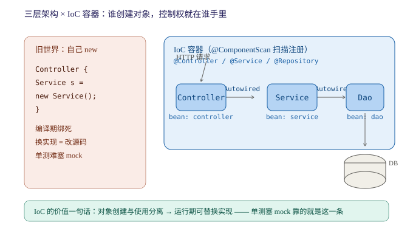

## Day 72 (2026-10-1)
### 今天学习了Web基础及SpringBoot入门,四道锁实算题,写了LC98验证二叉搜索树.
> web基础及SpringBoot我们需要掌握什么.

**我的回答**
1. Web用于接收和处理业务并返回数据,几个概念:
- 静态资源: 服务器上存储的不会改变的数据,如HTML,CSS等
- 动态资源: 服务端根据用户的请求和其他数据动态生成的,每次请求都可能发生改变,如servlet,现在用的spring.
2. SpringBoot可以帮助我们快速地构建应用程序,简化开发,提升效率
3. HTTP:超文本传输协议,特点:
- 基于TCP协议,面向连接,安全
- 一次请求对应一次响应
- 无状态的协议: 对事务处理没有记忆力(多次请求间不能共享数据,但响应速度快)
4. 请求协议: 包含请求行,请求头和请求体,请求行包含方法,URL和协议版本,请求头包含客户端信息和请求体包含请求数据
5. 响应数据: 包含状态行,响应头和响应体,状态行包含协议版本,状态码和状态消息,响应头包含服务器信息和响应体包含响应数据

**错漏点**

静态/动态资源、请求/响应三段结构（行、头、体）都对了。**但 HTTP 特性里有一处概念硬伤**：

> “基于TCP协议，面向连接，**安全**”

**HTTP 是明文传输，不安全**——“安全”是 **HTTPS** 的特点（HTTP + SSL/TLS 加密，默认端口 443）。课程里这两个是分开讲的，你把它们焊在一起了。这属于“见字不知其码”级别的混淆，进纠错本。顺带一提，“面向连接”是 TCP 的属性传导给 HTTP 的说法，HTTP 自己不管连接——每次请求-响应完连接即可释放，keep-alive 复用是 HTTP/1.1 的优化，知道即可。

**“无状态”这条反而值得展开**，因为它是个钩子：无状态 = 服务器不保存每个客户端的会话上下文 → 减轻服务器负担、响应快，**代价是多次请求间不能共享数据**——这个“代价”就是 P121-124 要发明 Cookie / Session / 令牌的**理论动机**。三天后学到登录认证时回头看你今天这句话，两边就都活了。

**SpringBoot 部分太薄了**——P42“入门解析”的核心是三件事，你只写了“快速构建”一句：

添加到对话

| 特性  | 一句话 | 和你已学的连接点 |
| --- | --- | --- |
| **起步依赖 starter** | `spring-boot-starter-web` 一个坐标 = Spring MVC + 内嵌 Tomcat + Jackson 全家桶 | 昨天学的 Maven 坐标，starter 就是“打包好的坐标组合” |
| **内嵌 Tomcat** | `java -jar` 直接跑，不用装服务器部署 war | 计划里“Tomcat 会用即可”的落地形态 |
| **自动配置** | `@SpringBootApplication` 里的 `@EnableAutoConfiguration` | **第四阶段死磕源码的头号对象，现在知道有它就行** |

请求/响应结构再补两个即将用到的点：**GET 请求体为空**（参数拼在 URL 后）、POST 参数在请求体；状态码按大类记——2xx 成功、3xx 重定向、4xx 客户端错（404/401 你马上会在 JWT 阶段天天见）、5xx 服务端错。P75 讲 Restful 时 GET/POST/PUT/DELETE 会和这些状态码一起回来。

> 锁实算题解答.

**我的回答**
1. where id = 15 for update → 唯一索引命中,退化为记录锁,只锁住命中行
2. where id = 12 for update → 唯一索引未命中,间隙锁,锁(10,15)的开区间
3. where id > 5 for update → 唯一索引范围查询,临建锁,锁(5,max]左开右闭区间
4. 普通索引 age（10 / 22 / 22 / 30），where age = 22 for update → 锁(10,30)开区间

**错漏点**

两个精化：①"max"的规范叫法是 **supremum 伪记录**（InnoDB 在每条索引末尾放的最大值哨兵），面试说“锁到 supremum”比“锁到 max”专业一档；②第 4 题你答对了范围但没写**为什么**走到 30 才停——非唯一索引意味着右边**可能还有 22**，InnoDB 必须走到第一个“确定不是 22”的值（30）才敢收手。这个“为什么”是面试官的下一问。

> LC98验证二叉搜索树.

**我的回答**
1. 这题需要严格验证二叉搜索树的规则,即左子树的值小于根节点的值,右子树的值大于根节点的值,且左子树和右子树也必须是二叉搜索树
2. 我通过中序遍历,将数据放入栈中,判断是否为单调递增的即可

**错漏点**

## Day 73 (2026-10-3)
### 今天复习了HashMap与Hashtable的区别,学习了SpringBoot案例,了解IOC与DI的概念,写了LC530二叉搜索树的最小绝对差.
> HashMap与Hashtable的区别及原因.

**我的回答**
1. 总体来说: HashMap更高效,但无法保证多线程下的安全;Hashtable效率较低,但能在多线程的情况下保证安全性. 具体区别:
2. HashMap继承于AbstractMap,而Hashtable继承于古老的遗留类Dictionary.
3. HashMap允许出现一个null键和多个null值,它本身对null做了特殊处理,会放在0索引下标的桶内;而Hashtable本身添加数据时需要用key进行比较来保证安全,如果允许null键的话会存在歧义,所以不允许出现null键null值.
4. 迭代器方面HashMap采用的是fail-fast类型,在迭代时使用非迭代器的方法修改HashMap结构会抛异常;Hashtable内部存在fail-fast以及修改时不会抛异常的的迭代器.
5. 线程安全方面HashMap操作都是无锁操作,无法保证多线程下的安全性,甚至在JDK8之前头插法时还会出现循环链表的情况,JDK8时改为尾插法解决了这个问题;而Hashtable对非查询的方法都加锁,虽然多线程下能保证线程安全,但锁粒度太大,性能比较低.
6. 实际开发中首选HashMap,在多线程情况下可以使用ConcurrentHashMap,采用CAS+synchronized锁的结构,锁粒度更细,性能更好.

**错漏点**

框架全对，两处细节值得表扬：JDK7 头插法并发扩容成环 → JDK8 尾插修复（很多面试者不知道版本差异）；“实际开发用 ConcurrentHashMap，CAS + synchronized”给的方案也对。三处精化：

**1. Hashtable 不允许 null 的理由不是`歧义`的原因**单线程下 null 键没有歧义。真实原因很工程：**Hashtable 的方法体里直接 `key.hashCode()`，没有 null 防护，null 进去就 NPE**；而 HashMap 专门写了 null 分支（`hash(null) = 0`，所以落在 0 号桶——你这半句是对的）。一个是“没防护”，一个是“特殊处理”，不是“歧义不允许”。

**2. Hashtable 的“两套迭代器”你没说清归属**：老方法 `keys()` / `elements()` 返回的是 **Enumeration**（不 fail-fast，修改不抛异常）；而集合视图 `entrySet().iterator()` 返回的 **Iterator 是 fail-fast** 的。两个名字对应两套 API。

**3. 补一个限定**：尾插法解决的是“扩容成环死循环”，**没有解决并发 put 数据覆盖丢失**——HashMap 线程不安全三表现：覆盖丢失 / 成环（JDK7）/ size 不准。你覆盖了前两个，第三个知道即可。

> SpringBoot案例书写及其规范及基本概念.

**我的回答**
1. SpringBoot开发的分层思想(高内聚低耦合),主要分为三层:
- controller: 控制层,接收前端发出的请求,对请求处理,并响应数据
- service: 业务逻辑层,处理具体的业务逻辑
- dao: 数据访问层,负责数据访问操作,包括增删改查的操作
2. 控制反转: Inversion Of Control,简称IOC;对象创建控制权由自身转向外部(容器),这种思想称为控制反转.
- IOC有关的知识点: @Component注解,表示将这个类交给IoC容器处理;几个衍生注解,用于区分:
- @Controller 标注在控制层类上
- @Service 标注在业务逻辑层类上
- @Respository 标注在数据访问层类上(由于于Mybatis整合,用的少)
- @Autowried 标注在变量上,为该变量注入依赖
- 这几个注解想要生效,还需要被组件扫描注解@ComponentScan扫描,该注解实际上已经包含在启动类注解@SpringBootApplication中,默认扫描范围为启动类所在包及其子包,这意味着其他包中的注解不会生效
3. 依赖注入: Dependency Injection 检查DI,容器为应用程序运行时,提供所需要的依赖,称之为依赖注入,基于@Autowried的依赖注入主要分为一下三种:
- 属性注入: 直接在变量上标注,代码简洁易开发;缺点是隐藏了类之间的依赖关系,破坏封装
- 构造函数注入: 在构造器上加注解,如果当前类中只存在一个构造函数,@Autowried可以省略;依赖关系清晰,但可能会导致构造函数臃肿
- setter注入: 保证了类的封装性,但需要额外的set方法
4. Bean对象: IOC容器中创建,管理的对象,被称之为Bean对象,默认为变量类型首字母小写的驼峰命名形式,需要在知道Bean对象时注意大小写
5. @Autowried中默认是按照**类型**进行注入的,存在多个相同类型的bean将会冲突,此时的三个解决方案:
- @Primary 在其中一个类上加该注解以提高其优先级
- @Qualifier("...") 与@Autowried结合使用,指定要注入的bean类
- @Resource(name = "..") JavaEE规范提供的注解,默认按照名称注入

**错漏点**

内容密度很高：三注入方式的权衡、类型冲突三方案（@Primary / @Qualifier / @Resource）全对，@ComponentScan 默认扫描范围这个“Controller 不生效”的头号坑你也记了。**但先说一个必须立刻处理的问题——注解拼写**：

- **@Autowried**（×4 处）→ 正确是 **@Autowired**（au**to**wired，自动装配）
- **@Respository** → 正确是 **@Repository**（多了个 s）

这两个注解从明天开始就是你天天手敲的东西，和“临建锁”同属拼写复发模式，进纠错本。写代码时 IDE 会救你，**白板手写时没人救**。

概念层补两刀：

**1. IoC 的“为什么”你没写**（第三层）：`new` 在自己手里 = 编译期绑死，换实现就要改源码；控制权交给容器 = **运行期可替换**——这就是为什么单测时能往里塞一个 mock 实现。这一句是 IoC 的全部价值，也是 P46-49 到单测之间缺的那根线：

**2. 三种注入方式你没给推荐位**​ 面试追问“哪种最好”：**Spring 官方推荐构造器注入**——依赖可声明为 `final`（不可变）、对象构造完即依赖齐备（不会出现“注入了一半的对象”）、单测不靠容器也能 new 出来传 mock。你写的“单一构造器可省 @Autowired”这个细节是对的，正好是它的便利面。

Bean 命名再送一个彩蛋：类名**前两个字母都大写**时 Bean 名保持原样（如 `USBService` → `usbService` 是错的，就是 `USBService`）——JavaBeans 的 decapitalize 规则，知道即可。

> LC530二叉搜索树的最小绝对差

**我的回答**
1. 二叉搜索树严格按照左子节点值小于根节点值且右子节点值大于根节点值,且其子树也是二叉搜索树
2. 该题的简单解法就是通过中序遍历,此时数据是单调递增的;逐个比较相邻的节点的差值就能得到最小差值.
3. Morris遍历解法效率更高,且不需要使用栈;核心思想就是如果该节点没有左子树,就访问当前节点并转向右子树;
如果该节点存在左子树,就一路找到该子树的最右子节点并将其本为null的右子节点设为cur;这正好是中序遍历的顺序;此时cur节点还未动,等到遍历到临时记录cur的节点时再释放cur并转使cur = cur.right

