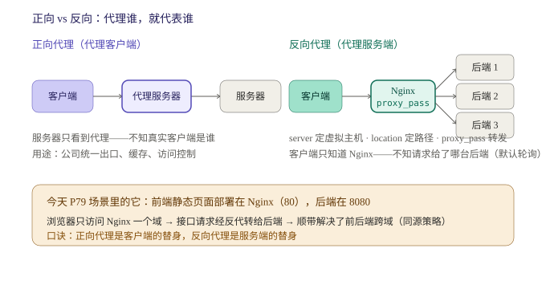
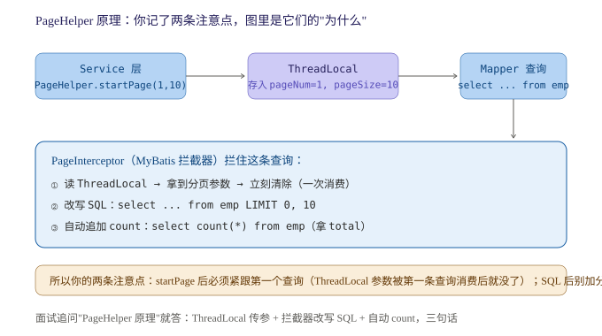

## Day 72 (2026-10-1)
### 今天学习了Web基础及SpringBoot入门,四道锁实算题,写了LC98验证二叉搜索树.
> web基础及SpringBoot我们需要掌握什么.

**我的回答**
1. Web用于接收和处理业务并返回数据,几个概念:
- 静态资源: 服务器上存储的不会改变的数据,如HTML,CSS等
- 动态资源: 服务端根据用户的请求和其他数据动态生成的,每次请求都可能发生改变,如servlet,现在用的spring.
2. SpringBoot可以帮助我们快速地构建应用程序,简化开发,提升效率
3. HTTP:超文本传输协议,特点:
- 基于TCP协议,面向连接,安全
- 一次请求对应一次响应
- 无状态的协议: 对事务处理没有记忆力(多次请求间不能共享数据,但响应速度快)
4. 请求协议: 包含请求行,请求头和请求体,请求行包含方法,URL和协议版本,请求头包含客户端信息和请求体包含请求数据
5. 响应数据: 包含状态行,响应头和响应体,状态行包含协议版本,状态码和状态消息,响应头包含服务器信息和响应体包含响应数据

**错漏点**

静态/动态资源、请求/响应三段结构（行、头、体）都对了。**但 HTTP 特性里有一处概念硬伤**：

> “基于TCP协议，面向连接，**安全**”

**HTTP 是明文传输，不安全**——“安全”是 **HTTPS** 的特点（HTTP + SSL/TLS 加密，默认端口 443）。课程里这两个是分开讲的，你把它们焊在一起了。这属于“见字不知其码”级别的混淆，进纠错本。
顺带一提，“面向连接”是 TCP 的属性传导给 HTTP 的说法，HTTP 自己不管连接——每次请求-响应完连接即可释放，keep-alive 复用是 HTTP/1.1 的优化，知道即可。

**“无状态”这条反而值得展开**，因为它是个钩子：无状态 = 服务器不保存每个客户端的会话上下文 → 减轻服务器负担、响应快，**代价是多次请求间不能共享数据**——这个“代价”就是 P121-124 要发明 Cookie / Session / 令牌的**理论动机**。三天后学到登录认证时回头看你今天这句话，两边就都活了。

**SpringBoot 部分太薄了**——P42“入门解析”的核心是三件事，你只写了“快速构建”一句：

添加到对话

| 特性  | 一句话 | 和你已学的连接点 |
| --- | --- | --- |
| **起步依赖 starter** | `spring-boot-starter-web` 一个坐标 = Spring MVC + 内嵌 Tomcat + Jackson 全家桶 | 昨天学的 Maven 坐标，starter 就是“打包好的坐标组合” |
| **内嵌 Tomcat** | `java -jar` 直接跑，不用装服务器部署 war | 计划里“Tomcat 会用即可”的落地形态 |
| **自动配置** | `@SpringBootApplication` 里的 `@EnableAutoConfiguration` | **第四阶段死磕源码的头号对象，现在知道有它就行** |

请求/响应结构再补两个即将用到的点：**GET 请求体为空**（参数拼在 URL 后）、POST 参数在请求体；状态码按大类记——2xx 成功、3xx 重定向、4xx 客户端错（404/401 你马上会在 JWT 阶段天天见）、5xx 服务端错。P75 讲 Restful 时 GET/POST/PUT/DELETE 会和这些状态码一起回来。

> 锁实算题解答.

**我的回答**
1. where id = 15 for update → 唯一索引命中,退化为记录锁,只锁住命中行
2. where id = 12 for update → 唯一索引未命中,间隙锁,锁(10,15)的开区间
3. where id > 5 for update → 唯一索引范围查询,临建锁,锁(5,max]左开右闭区间
4. 普通索引 age（10 / 22 / 22 / 30），where age = 22 for update → 锁(10,30)开区间

**错漏点**

两个精化：①"max"的规范叫法是 **supremum 伪记录**（InnoDB 在每条索引末尾放的最大值哨兵），面试说“锁到 supremum”比“锁到 max”专业一档；②第 4 题你答对了范围但没写**为什么**走到 30 才停——非唯一索引意味着右边**可能还有 22**，InnoDB 必须走到第一个“确定不是 22”的值（30）才敢收手。这个“为什么”是面试官的下一问。

> LC98验证二叉搜索树.

**我的回答**
1. 这题需要严格验证二叉搜索树的规则,即左子树的值小于根节点的值,右子树的值大于根节点的值,且左子树和右子树也必须是二叉搜索树
2. 我通过中序遍历,将数据放入栈中,判断是否为单调递增的即可

**错漏点**

## Day 73 (2026-10-3)
### 今天复习了HashMap与Hashtable的区别,学习了SpringBoot案例,了解IOC与DI的概念,写了LC530二叉搜索树的最小绝对差.
> HashMap与Hashtable的区别及原因.

**我的回答**
1. 总体来说: HashMap更高效,但无法保证多线程下的安全;Hashtable效率较低,但能在多线程的情况下保证安全性. 具体区别:
2. HashMap继承于AbstractMap,而Hashtable继承于古老的遗留类Dictionary.
3. HashMap允许出现一个null键和多个null值,它本身对null做了特殊处理,会放在0索引下标的桶内;而Hashtable本身添加数据时需要用key进行比较来保证安全,如果允许null键的话会存在歧义,所以不允许出现null键null值.
4. 迭代器方面HashMap采用的是fail-fast类型,在迭代时使用非迭代器的方法修改HashMap结构会抛异常;Hashtable内部存在fail-fast以及修改时不会抛异常的的迭代器.
5. 线程安全方面HashMap操作都是无锁操作,无法保证多线程下的安全性,甚至在JDK8之前头插法时还会出现循环链表的情况,JDK8时改为尾插法解决了这个问题;而Hashtable对非查询的方法都加锁,虽然多线程下能保证线程安全,但锁粒度太大,性能比较低.
6. 实际开发中首选HashMap,在多线程情况下可以使用ConcurrentHashMap,采用CAS+synchronized锁的结构,锁粒度更细,性能更好.

**错漏点**

框架全对，两处细节值得表扬：JDK7 头插法并发扩容成环 → JDK8 尾插修复（很多面试者不知道版本差异）；“实际开发用 ConcurrentHashMap，CAS + synchronized”给的方案也对。三处精化：

**1. Hashtable 不允许 null 的理由不是`歧义`的原因**单线程下 null 键没有歧义。真实原因很工程：**Hashtable 的方法体里直接 `key.hashCode()`，没有 null 防护，null 进去就 NPE**；而 HashMap 专门写了 null 分支（`hash(null) = 0`，所以落在 0 号桶——你这半句是对的）。一个是“没防护”，一个是“特殊处理”，不是“歧义不允许”。

**2. Hashtable 的“两套迭代器”你没说清归属**：老方法 `keys()` / `elements()` 返回的是 **Enumeration**（不 fail-fast，修改不抛异常）；而集合视图 `entrySet().iterator()` 返回的 **Iterator 是 fail-fast** 的。两个名字对应两套 API。

**3. 补一个限定**：尾插法解决的是“扩容成环死循环”，**没有解决并发 put 数据覆盖丢失**——HashMap 线程不安全三表现：覆盖丢失 / 成环（JDK7）/ size 不准。你覆盖了前两个，第三个知道即可。

> SpringBoot案例书写及其规范及基本概念.

**我的回答**
1. SpringBoot开发的分层思想(高内聚低耦合),主要分为三层:
- controller: 控制层,接收前端发出的请求,对请求处理,并响应数据
- service: 业务逻辑层,处理具体的业务逻辑
- dao: 数据访问层,负责数据访问操作,包括增删改查的操作
2. 控制反转: Inversion Of Control,简称IOC;对象创建控制权由自身转向外部(容器),这种思想称为控制反转.
- IOC有关的知识点: @Component注解,表示将这个类交给IoC容器处理;几个衍生注解,用于区分:
- @Controller 标注在控制层类上
- @Service 标注在业务逻辑层类上
- @Respository 标注在数据访问层类上(由于于Mybatis整合,用的少)
- @Autowried 标注在变量上,为该变量注入依赖
- 这几个注解想要生效,还需要被组件扫描注解@ComponentScan扫描,该注解实际上已经包含在启动类注解@SpringBootApplication中,默认扫描范围为启动类所在包及其子包,这意味着其他包中的注解不会生效
3. 依赖注入: Dependency Injection 检查DI,容器为应用程序运行时,提供所需要的依赖,称之为依赖注入,基于@Autowried的依赖注入主要分为一下三种:
- 属性注入: 直接在变量上标注,代码简洁易开发;缺点是隐藏了类之间的依赖关系,破坏封装
- 构造函数注入: 在构造器上加注解,如果当前类中只存在一个构造函数,@Autowried可以省略;依赖关系清晰,但可能会导致构造函数臃肿
- setter注入: 保证了类的封装性,但需要额外的set方法
4. Bean对象: IOC容器中创建,管理的对象,被称之为Bean对象,默认为变量类型首字母小写的驼峰命名形式,需要在知道Bean对象时注意大小写
5. @Autowried中默认是按照**类型**进行注入的,存在多个相同类型的bean将会冲突,此时的三个解决方案:
- @Primary 在其中一个类上加该注解以提高其优先级
- @Qualifier("...") 与@Autowried结合使用,指定要注入的bean类
- @Resource(name = "..") JavaEE规范提供的注解,默认按照名称注入

**错漏点**

内容密度很高：三注入方式的权衡、类型冲突三方案（@Primary / @Qualifier / @Resource）全对，@ComponentScan 默认扫描范围这个“Controller 不生效”的头号坑你也记了。**但先说一个必须立刻处理的问题——注解拼写**：

- **@Autowried**（×4 处）→ 正确是 **@Autowired**（au**to**wired，自动装配）
- **@Respository** → 正确是 **@Repository**（多了个 s）

这两个注解从明天开始就是你天天手敲的东西，和“临建锁”同属拼写复发模式，进纠错本。写代码时 IDE 会救你，**白板手写时没人救**。

概念层补两刀：

**1. IoC 的“为什么”你没写**（第三层）：`new` 在自己手里 = 编译期绑死，换实现就要改源码；控制权交给容器 = **运行期可替换**——这就是为什么单测时能往里塞一个 mock 实现。这一句是 IoC 的全部价值，也是 P46-49 到单测之间缺的那根线：


**2. 三种注入方式你没给推荐位**​ 面试追问“哪种最好”：**Spring 官方推荐构造器注入**——依赖可声明为 `final`（不可变）、对象构造完即依赖齐备（不会出现“注入了一半的对象”）、单测不靠容器也能 new 出来传 mock。你写的“单一构造器可省 @Autowired”这个细节是对的，正好是它的便利面。

Bean 命名再送一个彩蛋：类名**前两个字母都大写**时 Bean 名保持原样（如 `USBService` → `usbService` 是错的，就是 `USBService`）——JavaBeans 的 decapitalize 规则，知道即可。

> LC530二叉搜索树的最小绝对差

**我的回答**
1. 二叉搜索树严格按照左子节点值小于根节点值且右子节点值大于根节点值,且其子树也是二叉搜索树
2. 该题的简单解法就是通过中序遍历,此时数据是单调递增的;逐个比较相邻的节点的差值就能得到最小差值.
3. Morris遍历解法效率更高,且不需要使用栈;核心思想就是如果该节点没有左子树,就访问当前节点并转向右子树;
如果该节点存在左子树,就一路找到该子树的最右子节点并将其本为null的右子节点设为cur;这正好是中序遍历的顺序;此时cur节点还未动,等到遍历到临时记录cur的节点时再释放cur并转使cur = cur.right

## Day 74 (2026-10-4)
### 解决昨天的遗留问题,学习了JDBC和MyBatis的基础,写了LC501二叉搜索树中的众数
> 最小Demo验收,merge分支,一个SQL语句的知识点

**我的回答**
1. 在postman中通过localhost:8080/list看到返回数据的Json格式,完成验收
2. 将mark-reading中的branch分支合并了,并删除掉重复的git记录
3. 对于id是主键,存在1,3,10三个id的情况: select...id > 5...未命中的情况,会建(3,10],(10,+无穷]两个临建锁,正无穷是supremum的伪记录.

**错漏点**

**Merge ✓，而且我读了仓库的 reflog，"删除重复 git 记录"的真相是这样的**：你在 feature 分支上执行了 `git rebase main`，Git 的 patch 等价检测发现 feature 上那个 docs-gitignore 提交和 main 上的内容完全相同，**自动跳过了它**——不是你手动删的历史，无损，这正是 rebase 的正常行为。
完整链：feature 三提交 → rebase main（自动去重）→ checkout main → `merge --no-ff`（'ort' 策略，你采纳了保留拓扑的建议）→ 删除 feature 分支。干净利落，两处好评：

- 顺手看到了今天的提交 `a6f5aa2`："引入 JaCoCo 覆盖率插件，**数据文件放纯 ASCII 路径**"——这才是中文路径问题的真解：不搬项目，把 JaCoCo 输出重定向到英文路径。比我之前猜的“搬目录”精准，commit message 也写了为什么，规范。
- 一个提醒：**merge 完记得 push**——远端的 main 还停在旧位置，这次亲手敲。
- 一个小遗憾：全程零冲突，**“冲突解决”还没真练过**。不压新账，下次 mark-reading 有改动时留一行两边都改的代码，两分钟的事。

**锁自测 ✓**：数据 1/3/10，`id > 5` → (3,10] + (10, sup]，全对，supremum 术语一天就用上了。两个抠字级别的：①“supremum **的**伪记录”→ supremum 本身就是伪记录的名字；②“未命中的情况”——等值查询才谈命中/未命中，范围查询的机制是“定位到**第一条满足条件的记录**（10）再往后扫”，措辞换个说法更准。

> JDBC与MyBatis基础

**我的回答**
1. JDBC本质是java提供的一套用于java语言操作数据库的统一规范,即接口;但其原始操作语法繁琐,对于大数据操作时操作量大,还存在硬编码问题,每次需求更改都要更改原始代码
2. 预编译SQL概念: 普通的通过与用户输入的用户名与密码拼接查询数据库的登录方式,可能会被通过SQL注入的方式破坏原有的SQL语句,达成无需密码登录的情况;而预编译SQL可以解决这类问题.
3. 通过connect对象.prepareStatement("select...where username = ? and password = ?")来进行预编译;ps对象.setString(用户名,密码)传入数据;
这种预编译占位符的形式会将用户输入的内容作为一个整体传入SQL语句,而不是拼接,避免了SQL注入的危险;且这种方式下SQL语句进入内存中,后续所有相同的语句都能复用该语句,不会因为查询对象的改变而不使用内存.
4. MyBatis是一款优秀的**持久层**框架,用于简化JDBC的开发,操作步骤:
- 创建SpringBoot模块,引入MyBatis相关依赖;准备数据库表,实体类;在application.properties配置文件中配置数据库连接信息,包括驱动,数据库URL,用户及password
- @Mapper注解,用于放在接口上,表示自动创建该接口的实现了对象并放入IoC中;该接口中存放对应的含SQL语句的注解,如:@Select(".."),@Update(".."),@Delete(..)
- @SpringBootTest注解,用于进行单元测试,在单元测试时,自动生成SpringBoot环境
5. 数据库连接池: 是一个容器,用于分配和管理数据库连接,类似于线程池;它允许我们复用连接池中的连接,而不是一直创建;释放空闲时间超过最大空闲时间,避免连接池耗尽;标准接口: DataSource
- 常见连接池: Hikari(默认连接池),Druid

**错漏点**

框架层全对：JDBC = 规范（接口）、注入机制、MyBatis 流程、连接池/DataSource/Hikari/Druid。**一处硬伤必须纠——setString 的参数**：

> “ps 对象.setString(用户名，密码)”

第一参数是**占位符的位置索引（int），而且从 1 开始**：

java

```
ps.setString(1, username);
ps.setString(2, password);
```

按你的字面复现直接编译不过。顺带一个经典混淆点：**JDBC 占位符索引从 1 起，数组下标从 0 起**——面试冷不丁会问。另外接口名是 **Connection**（不是 connect）。

两个精化 + 一个缺项：

1. “语句进内存可复用”——MySQL 驱动**默认是客户端预编译**（驱动侧转义占位符后发完整 SQL），服务端真预编译要 `useServerPrepStmts=true`；但防注入两者都成立，因为参数永远不参与 SQL 结构解析。知道有这层即可。
2. **缺项：`#{}` vs `${}`**——MyBatis 的占位符二选一是面试高频，和今天的预编译直接联动：`#{}` = 预编译占位（对应 JDBC 的 `?`，防注入）；`${}` = 字符串拼接（有注入风险），只用于表名/列名/排序字段这类没法参数化的地方。明天 P68 起会大量出现，带着这条看。
3. 小补充：`@Mapper` 标单个接口；接口多了用 `@MapperScan` 在启动类上批量扫。

> LC501二叉搜索树中的众数

**我的回答**
1. 这题我最开始想的是进行中序遍历,通过map记录每个节点值和值出现的次数,遍历完后在比较map的各个value,将最大value赋值给maxCount,并遍历map取出这些key放入list中,再创建一个list.size()大小的数组放list中的数据并返回,结果超时了.
2. 更简单的解法是利用BFS的特性,中序遍历相当于在遍历一个有序的数组,相同的val只会连续出现;需要在遍历到每个节点时都判断当前节点的val是否为新val,是就更新count为1,对于pre为null时也要设置为1;count>maxCount时更新maxCount并清空list
,最后将list.stream().mapToInt(Integer::intValue).toArray()转化为数组
3. 额外空间为O(1)的方法就是Morris遍历,与昨天的题目类似,不过需要注意count的逻辑.

**错漏点**

**1. Map 解法“超时”值得回头诊断。**​ Map 计数是 O(n)，10^4 规模不可能超时——大概率是把“找 max / 收集结果”的循环放进了**每个节点的处理里**（变成 O(n²)），或者每步都重建集合。“没过，为什么”和“能过，有没有问题”是同一块肌肉，回头看看那版代码错在哪一行。

## Day 75 (2026-10-5)
### 复习了Collections.synchronizedMap与ConcurrentHashMap的区别及选型;学习了MyBatis的增删改查,XML映射配置及yml文件配置;重写LC236及写LC235.
> Collections.synchronizedMap与ConcurrentHashMap的区别及选型.

**我的回答**
1. Collections.synchronizedMap会直接为Map所有方法加锁,并且所有方法共享一个监视器对象,一个线程一旦持有锁,其他所有线程全部阻塞;该Map的迭代器为fail-fast类型,并且该Map的添加操作还不是原子性的,需要我们手动加锁.
2. ConcurrentHashMap在JDK8及之后通过segment分段锁改为了CAS+synchronized的形式,桶中无元素时CAS插入,有元素时synchronized锁桶头,不影响其他桶操作,锁粒度更细;迭代器为弱一致性的,迭代过程中修改不会抛异常.
3. 实际开发中首选ConcurrentHashMap,多线程下吞吐效率远高于synchronizedMap

**错漏点**

主线准确，JDK8 细节（segment 分段锁 → CAS 空桶插入 + synchronized 锁桶头、弱一致迭代器）全对。**但有一处概念硬伤**：

> “该 Map 的添加操作还不是原子性的，需要我们手动加锁”

**synchronizedMap 的单个方法（put / get）是原子的**——synchronized 包装的就是方法本身，单次 put 不需要你手动加锁，否则这个类就没有存在意义了。不原子的是**复合操作**：`if (!map.containsKey(k)) map.put(k, v)` 这种 check-then-act 序列，以及**迭代**（迭代器是 fail-fast 的，并发修改抛 CME，遍历期间要手动 `synchronized(map)` 包住）。一句话版：**方法级线程安全 ≠ 复合操作线程安全**。

顺带两个选型时的加分点：

- CHM 不光快，还**给了原子复合操作**：`putIfAbsent` / `computeIfAbsent`——synchronizedMap 要手动锁才能干的事，CHM 一个 API 搞定。
- 和昨天的 Hashtable 复习连成闭环：**Hashtable 禁 null 是实现没防护（NPE），CHM 禁 null 是设计决定**——并发下 `get(key)` 返回 null 分不清“不存在”还是“值就是 null”，二义性在并发语境是真问题。同一个“禁 null”，两个不同理由，面试放一起讲很出彩。

> MyBatis的增删改查注解形式注入及XML映射配置

**我的回答**
1. 昨天提到的两种符号:
- #{} 占位符,执行时会将#{...}替换为?,生成预编译SQL,防注入且性能高
- ${} 拼接符,执行时会将参数直接拼接在SQL语句中,存在SQL注入风险,只在表名或字段名动态设置时使用
2. 增删改查操作对应的注解@SELECT(..),@Insert(..),@Delete(..),@Update(..)
- 通过在Mapper接口中定义相关方法及注解,并指定SQL语句结合占位符的形式来实现对数据库的操作
- @Param注解: 为接口的方法参数起别名,当拥有多个参数时使用;值得注意的是,虽然官方的springBoot项目骨架配置了parameters不会在编译时将参数转化为默认名字,但@Param依旧是保证正确性,可读性和可维护性的关键
3. XML映射配置,对于复杂的SQL语句配置时使用,三个原则:
- 1. XML映射文件与Mapper接口名称一致,并且加两者需保证同包同名
- 2. XML映射文件的namespace与接口的全限定名保持一致
- 3. XML映射文件中id与Mapper方法接口中的方法保持一致,并保证返回值类型一致
- 如果不想同包同名,也可以通过配置文件指定XML映射文件位置
4. yaml,yml文件格式:
- key与value之间使用": "冒号加空格隔开,采用缩进分层的方式,相比于properties配置文件更加简洁,层级更加清晰
- 对于定义数组/List/Set: 缩进前使用"- "分隔
- 配置以0开始的数字时需要使用''引上,否则会被认为为8进制数字

**错漏点**

#{}` vs `${}` 昨天补的课，今天复述全对**——“执行时替换为 ? 生成预编译 SQL”这个机制描述准确。补课次日内化，这个速度值得记录。

XML 三原则（同包同名 / namespace=全限定名 / id+返回类型一致）全对，yml 的“0 开头会被当八进制”也对（YAML 1.1 的规范行为，SnakeYAML 实现的，`09` 直接报错、`010` 变 8）。两处精化：

1. @Param 那句表述有点绕，理一下：JDK 8 编译默认**不保留参数名**（反射只能拿到 arg0/arg1），但 spring-boot-parent 骨架默认开了 `-parameters` 编译选项，参数名得以保留——所以多参数时不写 @Param 常常也能跑。但 @Param 是**显式契约**：重构改参数名也不炸、读代码的人一眼看懂 SQL 里 `#{name}` 对应谁。你说的“保证正确性、可读性、可维护性”结论正确。
2. “复杂 SQL 用 XML”具体指什么，下周就会见到：**动态 SQL（if / where / foreach）**​——`<if test="...">` 按条件拼 SQL 片段。这是 XML 映射存在的真正理由，也是第四阶段回来深挖的点，这两周吃“会用”。

> LC236及LC235

**我的回答**
1. LC236的递归主要是判断当前结点为null?p?q?,只有这三者才传递上去,并在上层中判断左右子结点否!=null,都满足时返回当前结点,不慢足时就返回left或right中不为null的结点,都不存在就返回null.
2. LC236的迭代法,通过Map同时记录该结点的一个子结点及该结点,当Map中存在p和q的整个父路径时停止;将p的父路径中的结点用一个Set收集,在不断向上找q的父结点,当某个结点存在于Set中时,代表两条路径相交,此结点就是结果
3. LC235也可以使用LC236的递归解决,但可以利用二叉搜素树的特性;树中只存在三种情况:p和q都在左子树,向左递归;p和q都在右子树,向右递归;p和q一个在左一个在右,那么当前结点就是返回值;而二叉搜索树中值有序,按照此特性每次判断val大小进行递归即可
4. LC235迭代法通过if判断该特性,并进行对应迭代即可,无需格外空间记录

**错漏点**

## Day 76 (2026-10-6)
### 今天复习了Collections.unmodifiableMap和Map.of()的区别,Redis为什么快;了解并学习了开发规范,Restful风格,数据封装,Nginx反向代理;写了LC701.
> 创建不可变集合及Collections.unmodifiableMap和Map.of()的区别

**我的回答**
1. Java主要有这几种创建不可变集合的方式:Collections.unmodifiableMap,Map.of(),Map.copyOf(),Map.entries();
2. 其中Collections.unmodifiableMap创建的并非完全不可变的集合,它只是创建了原map的一个不可变视图,修改该视图会抛出UnsupportedOperationException,但仍然可以通过原map,原map的修改会同步到视图中.
3. Map.of()创建的是完全不可变的集合,任何修改操作都会抛出UnsupportedOperationException,但Map.of()最多只能存放10个键值对,要想创建更大的不可变集合应使用Map.entries()
4. 如果想为现有的map创建不可变集合就使用Map.copyOf().

**错漏点**

**核心理解全对**：“unmodifiableMap 是视图不是真不可变、原 map 的修改会同步进视图、Map.copyOf 才是真拷贝”——视图 vs 快照这个关键区别你抓住了。**​但术语错了一处、出现两次**：

> “Map.entries()”

**没有这个方法。**​ 正确的是两个名字：`Map.entry(k, v)`（单数，造一个键值对）配 `Map.ofEntries(Map.entry(...), Map.entry(...), ...)`（超过 10 对时的写法）：

java

```java
Map<String, Integer> m = Map.ofEntries(
    Map.entry("a", 1),
    Map.entry("b", 2)   // ... 想多少对多少对
);
```

记忆钩子：`Map.of` 的参数重载到 10 对封顶 → 超了就 `ofEntries` + `entry` 拆开传。两个小补充：`Map.of` **不允许 null 键值**、重复键直接 `IllegalArgumentException`；`Map.copyOf` 遇到本来就是不可变的 Map 会直接返回原引用（不浪费一次拷贝）。

> Redis为什么这么快?它的全部操作都是单线程吗?为什么不采用多线程的方式?生产中OPS突然从8万降到0,排查后发现是一个命令造成的,该命令可能是什么?生产中如何规范

**我的回答**
1. Redis快的原因主要体现在4个方面:
- 纯内存操作,所有操作都在内存中进行,不受磁盘速度慢影响
- IO多路复用(epoll): 一个线程同时监听多个socket,存在事件时才执行,不存在时不执行
- 单线程无锁竞争与上下文开销
- 采用高效的数据结构:跳表,渐进式rehash,zipList等结构
2. Redis6.0时将网络IO操作改为支持多线程,但命令执行依旧是单线程模式;并且Redis还存在后台线程:AOF与磁盘持久化线程,异步删大key线程
3. Redis的单线程CPU操作非常快,速度瓶颈主要在网络IO上;且Redis本身含有多种数据结构list/ZSet/map等,若采用多线程都要加锁,复杂度就大大提高了,得不偿失.
4. 很有可能是KEYS,HGETALL,DEL这种执行时会阻塞线程的命令
5. 实际开发应严格禁止使用遍历类命令;采用scan游标扫描或在删除时采用UNLINK异步删除.

**错漏点**

这是三天复习线里质量最高的一块。四原因（内存 / epoll 多路复用 / 单线程无锁无切换 / 高效结构）✓，Redis 6.0 网络 IO 多线程但命令执行单线程 ✓，后台线程（AOF fsync、异步删大 key）✓，为什么不多线程（瓶颈在网络不在 CPU、多数据结构加锁复杂度）✓——**尤其“OPS 8 万→0 是什么命令”这道生产排查题答满了**：KEYS / HGETALL / DEL 这类阻塞主线程的命令，治理方案 SCAN 游标 + UNLINK 异步删。这是面试官最爱的“场景反推题”，你已经能接住。

三处小抠：①Redis 里的类型术语叫 **Hash**，不叫 map（和 Java 撞名了，面试注意切术语）；②“渐进式 rehash”是**扩容策略**不是数据结构——跳表/ziplist/listpack 才是结构；③治理清单再补一条：`FLUSHALL / FLUSHDB` 生产禁令，以及遍历家族的对应替换（`SMEMBERS → SSCAN`、`HGETALL → HSCAN`）。

> 今天的规范风格学习,数据封装,什么时Nginx与反向代理.

**我的回答**
1. 当下主流的开发方式为前后端分离的方式并采用Restful风格进行构建: 它的特点是采用URL定位资源,并通过请求方式确定具体要进行哪种操作,而不是将操作名写入URL中;描述功能模块时通常采用复数形式表示该种模块
2. 因为java代码的开发规范与SQL语句不同,当存在数据库字段名与实体类属性名不同时,会存在无法返回数据的情况,三种解决方式:
- 手动结果映射: 通过@Results和@Result进行映射@Results({ @Result(column= "字段名", property = "属性名")...})
- SQL起别名: 直接在SQL语句中给字段名起个跟属性名相同的别名
- 开启驼峰命令: 前面两种方式都需要手动逐个配置,大任务下比较麻烦;在配置文件中配置:
```
mybatis:
    configuration: 
        map-underscore-to-camel-case: true
```
- 该配置会自动通过驼峰命名映射:(xxx_abc -> xxxAbc)
3. Nginx是一款免费开源服务器,可以作为负载均衡器,反向代理服务器
- 反向代理指的是通过代理服务器代替后端服务器接收客户端请求,并将请求转发给后端;也可以将后端的响应回复给客户端;这种方式可以防止后端服务器直接暴露在前端面前,也可以来确保负载均衡,将请求发送给压力小的服务器
- server的作用:定义一个虚拟主机,由listen和server_name(域名)共同决定哪个站点接收请求
- location: 定义URL路径匹配规则
- proxy_pass: 将匹配到的请求转发到指定的后端

**错漏点**

Restful 三要素（URL 定位资源、请求方式定操作、复数命名）✓，字段名映射三方案（@Results 手动 / SQL 别名 / 驼峰开关）✓ 且指出了前两个“逐个配置麻烦”的代价，Nginx 的 server / location / proxy_pass 职责 ✓。三处精化 + 一个缺项：

1. **“驼峰命令”→“驼峰命名”**（错别字级，但出现在配置项语义里就扎眼）。
2. 负载均衡“将请求发送给压力小的服务器”——**默认策略是轮询**（round-robin），压力导向是 `least_conn` 这类显式配置的策略。面试说错默认值会掉分。
3. 正反代理对比你只写了反向——上图就是补齐的对比，口诀一句话：**正向代理是客户端的替身（服务器不知真实客户端），反向代理是服务端的替身（客户端不知真实后端）**​。P79 联调场景里它还顺带解决了跨域：前端和接口同域（都是 Nginx 80），浏览器的同源策略根本不触发——这是“为什么前后端分离要配 Nginx”的完整答案。
4. **缺项：Result 统一响应封装**（P78 的核心）。三层返回的是 `{code, message, data}` 统一格式：

java

```java
public class Result {
    private Integer code;   // 1 成功 0 失败（课程约定）
    private String message;
    private Object data;
    // 静态工厂：Result.success(data) / Result.error(msg)
}
```



> LC701.二叉搜索树中的插入操作反思

**我的回答**
1. 刚来时将这题想复杂了,看了题解后知道只需要在符合二叉搜索树规则的null位置将新结点插入即可,不需要修改树的结构
2. 递归解法: 当前结点为null时new TreeNode(val)并return,(root.val > val)向左子树递归,else向右子树递归
3. 迭代法: pre记录上个结点,cur记录当前结点,进行while循环,(root.val > val) cur = cur.left,反之亦然;当退出循环时判断当前结点时pre的哪个子结点再连接上去即可.
4. 不修改原树: 递归并每次new TreeNode(root.val);每次递归时递归方向返回值连接,将另一边的子树设置整体连接,因为另一个子树必定不是新结点所在

**错漏点**

## Day 77 (2026-10-7)
### 今天复习了stream流及map()与flatMap()的区别;通过Tlias项目练习了如何从前端接收数据并返回,学习logback,Slf4j门面,顺便复盘一下;写了LC450.删除二叉搜索树中的节点
> stream流及map()与flatMap()的扁平化处理

**我的回答**
1. stream流的特点是惰性求值,它必须由终端操作或者短路操作进行"触发"才会执行,每一个元素像通过流水线一样经过流中的处理;
2. 需要注意的是,当条件满足短路操作的条件后,比如findFirst(),后续的元素将不会被处理
3. map()主要是对数据进行一些函数化处理,但它不会改变数据的嵌套结构,每个元素产生的流仍然是单独的流
4. flatMap()会对处理流进行扁平化处理,比如List(List(1,2),List(3,4)),在经过flatMap()扁平化处理后会成为List(1,2,3,4)

**错漏点**

惰性求值（终端操作触发）、findFirst 短路后续不处理、flatMap 扁平化示例（List(List(1,2),List(3,4)) → List(1,2,3,4)）——全对，例子选得好。一处表述要拧清楚：

> “map()……每个元素产生的流仍然是单独的流”

更准的说法是：**map 是一对一映射，flatMap 是一对多再摊平**。map 的 lambda 返回一个值（类型可以变，`s → s.length()`）；
flatMap 的 lambda 返回一个流/可拆的东西，然后框架把这些子流**合并**成一个流。你说的“不改变嵌套结构”本质是：map 返回 `Stream<List<R>>` 时嵌套还在，flatMap 才把它拍成 `Stream<R>`。面试一句话版本：**map 一进一出，flatMap 一进多出再铺平**。

> 如何从前端接收参数?JSON,路径参数如何处理?logback有哪些知识需要我们了解?

**我的回答**
1. Controller层接收前端参数主要有三种方式:
- 方式一: 使用原始的HttpServletRequest对象获取请求,繁琐且需要手动转换
- 方式二: 通过spring提供的@RequestParam注解将参数传递给形参;但需要注意该注解的request默认为true,此时使用注解就必须在请求时传递参数
- 方式三: 在请求参数名与方法形参相同时,直接写对应参数即可,可以省略@RequestParam注解(如何实现的不了解)
2. 对于JSON格式的参数,通常会使用对象进行封装;规则: JSON数据的键名必须与对象的属性名保持一致,并且需要使用@RequestBody注解进行标识
3. 路径参数: 通过URL直接传递路径参数,使用{..}来标识该路径参数,并使用@PathVariable(..)注解获取路径参数,保持当前参数名与路径参数名一致可以省略()中的内容
4. Logback是log4j的升级版,使用它需要我们引入Logback依赖并配置logback.xml文件,可在文件中进行配置
5. 如要在记录某类的日志,通用语法:private static final Logger log = LoggerFactory.getLogger(该类的class对象);如果引入了lombok依赖,只需要在类上写@Slf4j注解即可使用log中的方法
6. 日志级别: trace(记录文件运行轨迹) < debug(记录程序中调试过程的信息,一般将其视为最低级别) < Info(记录一般信息) < warn(记录警告信息) < error(记录错误信息)
7. 日志解决了普通的sout只能打印在控制台,无法写入文件且如果要关闭需要逐个注释或删除的缺点,它可以一键开启和关闭,并可以设置所能看到的是何种级别的日志.

**错漏点**

接参三方式（HttpServletRequest / @RequestParam / 同名省略）、@RequestBody 键名对齐、@PathVariable 路径参数——框架全对。三处纠补：

1. **属性名拼写：是 `required`，不是 "request"**​（默认 true 的结论对）。@Autowired→@Autowried、@Repository→@Respository、required→request——注解拼写已经是本周最高频丢分点，进纠错本。
2. 你标注“（如何实现的不了解）”——这个机制其实 **Day 75 讲过同款**：省略注解后 Spring 按参数名匹配，前提是编译时保留了参数名（spring-boot-parent 默认开 `-parameters`）。MyBatis 的 @Param 和 Spring MVC 的参数绑定是同一块底层。当时没连上，这次连起来。
3. 补两个边界：**@RequestBody 一个方法只能标一个**（请求体只有一份）；GET 没有请求体，它配 POST/PUT。

Logback 部分：LoggerFactory.getLogger / @Slf4j / 级别顺序 / 日志 vs sout 的优点都对。**最大的缺项：你的标题写了“Slf4j 门面”，正文却一个字没讲它**——上图就是补讲：slf4j 是接口层（门面），logback 是实现层，换 log4j2 不改一行业务代码，**和你学过的 JDBC 完全同构**（JDBC:MySQL 驱动 = slf4j:logback）。
这个类比是你现成的记忆挂钩。两处小纠：Boot 项目**不需要手动引 logback 依赖**（starter-web 传递自带 spring-boot-starter-logging，开箱即用）；logback.xml 的核心三件套记一下：**Appender**（输出到哪：控制台/文件）、**logger**（哪个包什么级别）、**pattern**（格式，如 `%d %level %msg`）。

> LC450的反思.

**我的回答**
1. 这道题处理比较复杂,我还是通过看题解才了解该如何处理.
2. 对于这题的思路是要对不同情况进行不同的处理,当最后未找到,返回root;找到结点,结点的一个子结点为null时,将结点的非null子树连接到pre;找到结点,但两个子树都不为null,此时将左孩子的头结点放到右孩子的最左结点上.
3. 第二种方法,用中序的后继结点进行替换: 迭代法思路:先通过迭代找到目标结点,处理两个子结点都不为null的情况,在右子树中找到中序后继,并将后继结点的值赋给cur结点,并让pre指向该后继结点的父结点,cur指向当前后继结点;后续处理一个子节点为null的情况就可以直接复用处理该结点.
4. 或者采用递归,当找到key结点时,先判断左右结点是否存在null,存在就返回另一个子树;再处理两个子树都不为null,依旧找中序的后继结点newkey并赋值给root.val,然后递归right子树,key为newKey,情况就变成了左子树为null的处理方案,最后递归结束返回root

**错漏点**

两个精化：

1. **pre 的连接方向没写**：`pre.left = child` 还是 `pre.right = child`，取决于 cur 是 pre 的哪一侧——迭代版最容易翻车的就是这一行。
2. 一个你没点破的巧：**叶子节点（两子都 null）不需要单独分支**——“一子为 null 返回另一边”时另一边也是 null，自然涵盖。很多题解列四种情况，其实三种就够，这个统一性值得写进笔记。

## Day 78 (2026-10-8)
### 今天复习了方法引用的知识;实操写了Tlias中的分页查询的处理,PageHelper和动态SQL;写了LC669.修剪二叉搜索树.
> 方法引用的四种格式是什么?它能与Lambda表达式完全等价吗?

**我的回答**
1. 方法引用的四种格式:
- 类名::静态方法 : 通过类名引用静态方法,如Integer::parseInt.
- 类名::实例方法 : 此时原本抽象类中的第一个参数被当作方法的调用者,如: String::toUpperCase
- 对象::实例方法 : 通过对象来调用实例方法,如: System.out::println
- 类名::new : 要将参数转化为其他类型时使用,并且同时支持无参和有参构造
2. 一般在Lambda表达式内部只需要简单逻辑时使用,复杂逻辑只能使用Lambda表达式完成.
3. 参数传递与方法签名完全一样,实际上方法引用指向的是已经存在的方法,可能会比Lambda更快,但主要区别是在可读性上

**错漏点**

四种格式一次写全，而且**“类名::实例方法，第一个参数被当作调用者”**——最反直觉的那条你写对了（`String::toUpperCase` 配 `Function<String,String>`，s 变成 receiver）。但第 3 条有个**自相矛盾**要抓出来：

- “参数传递与方法签名完全一样”

你自己第 1 条刚写过“第一个参数被当作方法的调用者”——`String::toUpperCase` 里 `toUpperCase()` 本身**零参数**，接口却吃一个参数。签名根本不一样。
正确规则一句话：**接口的首参当调用者，剩余参数当方法的实参**（`BiFunction<String,String,Boolean>` 可以吃 `String::equals`——首参是 receiver，第二个参数传给 equals）。
另外两处小抠：构造器引用说成“将参数转化为其他类型时使用”——更准的说法是 **lambda 的返回值是一个新对象**（Supplier / Function 场景）；“可能比 Lambda 更快”没有依据（现代 JVM 两者都会被内联优化，性能等价）——你自己后半句“主要区别在可读性上”才是对的结论

> 分页查询处理及如何返回,PageHelper和动态SQL

**我的回答**
1. 原始的分页查询方式是通过接收前端操作,并在mapper层编写对应的分页查询SQL语句,controller层调用service实现,service层负责调用mapper层并封装返回给controller层.
- @RequestParam(defaultValue = "..") 可以为参数设置初始值,避免手动赋值
2. PageHelper是第三方提供的帮助我们处理分页查询的插件;我们就不需要手动书写分页的语句了,几个注意点:
- startPage后必须紧跟第一个MyBatis查询,中间不能有其他查询
- SQL注解中的SQL后不要加";"
- @DateTimeFormat(pattern= ..) 可以指定前端传递的时间参数格式
3. 如果SQL语句比较复杂且需要动态处理,可以将其配置在xml文件中并使用动态SQL的格式,两个标签:
- <if ..>..</if> 只有符合条件时才拼接对应的SQL语句
- <where>..</where> 根据查询的条件,生成where关键字并去除多余的and或or

**错漏点**

分层链路、`defaultValue`、startPage 紧跟第一条查询、SQL 不加分号、`@DateTimeFormat`——都对，尤其那两条 PageHelper 注意点是实操真踩过才会记的。**但你记的是“规矩”，缺的是“为什么”**——上面的图就是原理，
它把你两条注意点全部解释掉了：`startPage` 只是往 **ThreadLocal** 塞参数，真正的活由 **MyBatis 拦截器**干（改写 SQL 加 LIMIT + 自动发 count），ThreadLocal 的参数**被第一条查询消费后立刻清除**——所以“必须紧跟第一个查询”，不然参数就漏给别的查询或干脆丢了；SQL 被拦截器改写，所以分号会坏事。面试追问“PageHelper 原理”就用图里那三句话。

补三个小点：①返回封装的标准结构是 **PageBean{ total, rows }**（你写“封装返回”太虚，这个结构名点一下）；②动态 SQL 家族还有 `<foreach>`——下周 P110 批量删除会用到，到时候回来补；
③把昨天的钩子收掉：PageHelper 生成的就是 `LIMIT offset, size`，**大偏移深分页它不解决**——`limit 1000000, 10` 为什么慢、怎么优化（覆盖索引 + 子查询定位 / 游标），是你 MySQL 阶段深分页知识的直接延续，属于主项目追问链素材，这两周不用动，知道这条线连着即可。



> LC669.修剪二叉搜索树的反思

**我的回答**
1. 刚开始看这道题没有思路,看别人的思路后解出来了;对于这题我们要分情况讨论,先处理root.val不在[low,high]区间的情况,此时抛去另一子树和root,将新树再进行处理
2. 对于递归解法: 按照以上思路进行递归即可,退出条件是root == null;当前结点不在范围时就向不符合范围的另一边递归;在范围内就正常递归,最后返回root.
3. 这题的迭代法很难想到,我是看题解后理解: 如果root不在范围内,就不断迭代,直到找到范围内的结点,作为新root,然后在分别剪枝左子树和右子树;
处理左子树时不断向最右迭代,cur.left.val < low时: cur.left = cur.left.right; cur = cur.right

**错漏点**

**1. 方向表述要拧准。** 你写“抛去另一子树”“向不符合范围的另一边递归”——两个“另一”指代相反，字面复现会懵。精确版：

- `val < low`：左子树**整棵必弃**（全部更小），返回 `trim(root.right)`
- `val > high`：右子树**整棵必弃**（全部更大），返回 `trim(root.left)`

**2. 你漏写了这题最漂亮的一步：返回值连接。**“在范围内就正常递归”——字面缺了 `root.left = trim(root.left); root.right = trim(root.right)` 这两行。注意这条线：**LC701（插入）、LC450（删除）、LC669（修剪）三题全是同一招**——“递归返回值接到父节点”。450 里你要判断 pre 的连接方向，而 669 连 pre 都不需要——越界的整棵子树直接被返回值替换掉，**抛弃 + 重挂一步完成**。这是“递归统一语义原则”在 BST 结构题上的完整形态，值得在笔记里把三题钉成一页。

**3. 迭代版你只写了左子树剪枝**（`cur.left.val < low` → `cur.left = cur.left.right`，沿右链走 ✓），右子树是对称镜像：`cur.right.val > high` → `cur.right = cur.right.left`，沿左链走。


