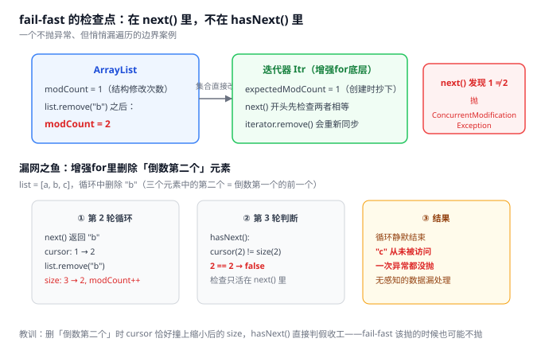
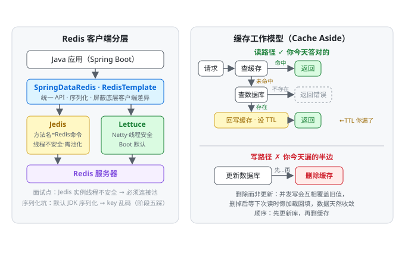

## Day 55 (2026-9-14)
### 今天按照昨天的缺点,好好理了一下undo redo和binlog的区别,readView可见性4条规则.学习了Redis的命令客户端,通用,String,JSON结构Hash类型命令,跟着随想录学习了二叉树,写了LC144.
> 关于undo redo和binlog及readView可见性4条规则.

**我的回答**
1. redo log:
- 职责: 用来实现事务的持久性,保证崩溃后能恢复数据
- 写入方式: 循环写入,基于WAL先行日志机制,先写入Redo Log Buffer再写入磁盘,每次将脏页数据刷入磁盘时同步进行checkpoint刷脏
- 生命周期: 刷脏后数据立即清除
2. undo log:
- 职责: 用于事务回滚保证事务原子性和未MVCC提供版本链
- 写入方式: 写入的是事务提交前的旧值
- 生命周期: 事务提交后不会立即销毁,因为这些数据也可能存在于MVCC版本链中
3. binlog:
- 职责: 用于误删数据库时的数据恢复,主从复制及归档审计
- 写入方式: 写入的是所有的DML和DDL语句,但不包括查询语句
- 生命周期: 长期存在,可以无限追加
4. readView可见性4条规则
- 维护4个核心字段: m_ids: 当前活跃事务id集合. min_trx_id:最小活跃事务id. max_trx_id: 将要分配的事务id. creator_trx_id: readView创建者的事务id
- RC级别下的比较规则:
- trx_id == creator_trx_id? 可以访问->说明是当前这个事务更改的.
- trx_id < min_trx_id?可以访问->说明数据已提交
- trx_id > max_trx_id?不可访问->说用该事务是readView后开启的
- min_trx_id<=trx_id<=max_trx_id?如果trx_di不在m_ids,表示可以访问->数据已提交

**错漏点**

还有四处要修：

| 你的表述 | 修正  |
| --- | --- |
| binlog "写入的是所有的 DML 和 DDL **语句**" | 只在 STATEMENT 格式下成立。**​默认格式是 ROW——记的是每行的实际变更，不是语句**。Day 53 你刚写过三种格式，这里又退回去了 |
| redo log 刷脏后"数据立即**清除**" | 不是清除，是“**可被覆盖**"（checkpoint 推进，那段空间可重写）。循环写没有删除这个动作 |
| 比较规则标注"**RC 级别下**" | 比较规则与隔离级别**无关**，RC/RR 用的是同一套规则，区别只在 readView 的**生成时机**。这是第二次撞同一面墙 |
| "未 MVCC" | "为 MVCC"（错字） |

四条规则你默出了主干，但有两个漏洞需要补全成**完整版**（可直接抄进笔记）：

plaintext

```
若 trx_id == creator_trx_id  → 可见（自己改的）
若 trx_id <  min_trx_id      → 可见（早已提交）
若 trx_id >= max_trx_id      → 不可见（readView 之后才开启的）
若 min <= trx_id < max：
    在 m_ids 中  → 不可见（还没提交）        ← 你漏了这半边
    不在 m_ids   → 可见（已提交）
不可见 → 沿 DB_ROLL_PTR 找 undo 链上的上一版本，重新走一遍判断   ← 你漏了这一步
```

最后那行“**沿版本链回溯重判**”是算法的闭环——漏了它，不可见的版本就悬在半空没有出路。你写的 `trx_id > max` 严格来说应为 `>=`（max 是“将要分配”的 id，等于它的事务此刻不存在），实际效果等价，但笔记按 `>=` 记。

> Redis学习到的命令.

**我的回答**
1. 启动Redis: redis-cli [options] [commonds] 可以指定ip地址,端口和密码. help [commands] 可以查看命令的使用方法
2. 通用类型命令: KEYS(查看符合模板的所有key),DEL(删除指定key),EXISTS(查看key是否存在),EXPIRE(给key设置有效期),TTL(查看key有效期)
3. String类型命令: 
- set: 添加或修改一个String类型的键值对
- get: 根据key获取string类型的value
- mset/mget: 批量
- incr/decr: 让一个整形自增/自减一次
- INCRBY: 自增并指定步长
- SETNX: 添加个string类型的键值对,已存在则不添加
- SETEX: 添加个string类型的键值对,并指定存活时期
4. Redis支持多级key,中间用:隔开,如果Value是一个Java对象,可以序列化为JSON字符串后存储,但难以修改字符串中的内容,此时就可以使用Hash类型
5. Hash类型: 可以将对象中的每一个字段独立存储,格式为(key (field value)),常见命令有:
- HSET key field value: 添加或修改hash类型的key的field的值
- HGET key field: 获取hash类型的key的field的值
- HMSET/HMGET: 批量添加/获取
- HKEYS/HVALS: 获取所有的filed/value
- HINCRBY: 同String类型
- HSETNX: 同String类型

**错漏点**

1. **KEYS 在生产环境禁用**：它 O(n) 全量扫描且 Redis 命令执行是单线程，键多时直接阻塞所有请求——用 `SCAN` 游标分批替代。这是面试常问“KEYS 有什么危险”的标准答案。
2. `SET key value EX seconds NX` 一条命令同时完成 setex + setnx（2.6.12+ 推荐写法），将来学分布式锁（阶段五）会大量用到——**它能保证“加锁+设过期”的原子性**，两条命令分开写就有中间崩溃导致死锁的风险。
3. `DEL` 也是阻塞命令，删除大 key 用 `UNLINK`（异步删除）。

错字继续点名：common**ds**→commands、存活时**期**→时间、**filed**→field（两次）。

> 二叉树学习开始.

**我的初答**
1. 几个概念:
- 满二叉树: 一个二叉树只有度为0或2的节点,且度为0的节点都在同一层
- 完全二叉树: 除了最底层可能没填满,其它层都填满,且最下面的结点都集中在左边
- 二叉搜索树: 左节点小于根结点,右结点大于根结点
- 树的数据存储方式: 链表或数组
2. LC144前序遍历,只需要写个简单的递归就能解答,关键是要将判null放在最前面
3. 递归的三个原则:
- 确定递归函数的参数和返回值
- 确定终止条件
- 确定单层递归逻辑

**补充**

BST 的定义：你说“左节点小于根结点，右结点大于根结点”——不只是直接左右子节点，而是整棵左子树的所有节点 < 根 < 右子树的所有节点。这个精确度直接决定你后面 LC98（验证二叉搜索树）能不能一次做对，那题的典型错误就是只比较了父子节点。

## Day 56 (2026-9-15)
### 今天复习了List的迭代器修改原理,学习了Redis的List类型,Set类型和sortSet类型命令,LC写了145,94.
> 关于List的迭代器修改原理.

**我的回答**
1. 如果要对ArrayList,LinkedList这类fail-fast类型的集合进行迭代器或增强for循环遍历时,若对其进行结构性修改,如:remove.必须使用迭代器内部的方法,否则会抛出ConcurrentModificationException.普通for循环则不需要,但需要自己处理索引变化,可以使用反向遍历.
2. fail-fast机制: iterator内部存在一个expectedModCount == modCount的判断,ArrayList内部存在一个modCount变量用于记录修改集合结构的次数.创建迭代器时两个count相等,集合直接修改,会让modCount++,但不会修改expectedModCount,导致两者不相等,抛出异常.
这种机制用于防止迭代过程中结构修改导致获得错误结果,发现出现立即抛出异常失败.值得注意的是: modCount并非volatile,并发情况下依旧无法保证安全.

**错漏点**

三层都到位：机制（modCount/expectedModCount）、合法修改路径（迭代器内部方法）、并发局限（modCount 非 volatile）。最后那条尤其好——很多人只知道“会抛异常”，不知道 fail-fast 本质是**尽力而为（best-effort）的 bug 检测器**，JDK 文档原话是 "should be used only to detect bugs"，正确性从不靠它保证。

三个精度补充：

| 你的表述 | 补充  |
| --- | --- |
| “结构性修改，如 remove” | 结构性修改 = **改变集合大小**的操作（add/remove）。`set(i, e)` 改内容不算，不会触发 fail-fast |
| “必须使用迭代器内部的方法” | 第二层原因你没写全：`iterator.remove()` 之所以合法，是它删完会执行 `expectedModCount = modCount` **同步**——这才是“合法”的底层解释 |
| 普通for + 反向遍历 | 对。再加一条选型账：`iterator.remove()` 在 LinkedList 上 O(1)，在 ArrayList 上 O(n)（要搬移后续元素） |

还有一个你应该会喜欢的边界案例（“能过，但有没有问题？”那种）——**fail-fast 有一个著名的漏网之鱼**：



补一条并发侧的闭环（呼应你 Day 35 学的 ConcurrentHashMap）：**fail-fast 的对立面是 fail-safe（弱一致迭代器**)​——`CopyOnWriteArrayList` 的迭代器持有创建瞬间的数组快照，遍历期间集合怎么改都不影响它（但它的迭代器不支持 remove，调了直接抛 UnsupportedOperationException）；`ConcurrentHashMap` 的迭代器同理。所以“遍历时修改”的正确答案分两条路：单线程用 iterator.remove()，多线程换并发集合。

> Redis的几种类型命令.

**我的回答**
1. list类型: 可以看作是一个双向链表,但底层更加复杂,支持正向检索和反向检索,通常用于存放有顺序的内容,常见命令:
- L/RPUSH key element...: 向左/右方向添加一个或多个元素
- L/RPOP key: 移除并返回左/右侧第一个元素,没有则返回null
- LRANGE key start end: 返回一段角标的元素(从0开始,闭区间)
- BL/BRPOP: 与L/RPOP类似,但没有元素等待指定时间
2. Set类型: 与Java中的HashSet结构类似,具有HashMap的特征: 无序,元素不允许重复.支持交集,并集,差集等功能,常见命令:
- SADD key member...: 添加一个或多个元素
- SREM key member...: 移除set中指定的元素
- SCARD key: 返回set中元素的个数
- SISMEMBER key member: 判断一个元素是否在set中
- SMEMBERS: 返回set中所有的元素
- SINTER key1 key2..:求交集
- SDIFF key1 key2..:求差集
- SUNION key1 key2..:求并集
3. SortSet类型: 可排序的set集合,SortSet的每一个元素都包含一个score字段,通过score对集合进行排序,底层是一个(SkipList)跳表加Hash表,常见命令:
- ZADD key score member: 添加一个或多个元素,如果存在则修改其内容
- ZREM key member: 删除指定元素
- ZSCORE key member: 获取指定元素的score
- ZRANK key member: 获取指定元素的排名
- ZCARD key: 获取指定sortSet的元素个数
- ZCOUNT key min max: 获取score在指定范围内的元素个数
- ZINCRBY key increment member: 让指定的元素自增,步长为increment的值
- ZRANGE key min max: 按照score排序后,获取指定排序范围内的元素
- ZRANGEBYSCORE key min max: 按照score排序后,获得指定score范围内的元素

**错漏点**

命令清单基本全对，ZSet 底层“跳表 + Hash 表”也对。逐个纠：

| 你的表述 | 修正/补充 |

| --- | --- |
| **SortSet** | 术语是 **ZSet / SortedSet**——今天进纠错本。命令前缀 Z 就是它 |
| ZADD “存在则修改其**内容**” | 修改的是 **score**（member 本身就是定位键，内容没得改） |
| BLPOP “没有元素等待指定时间” | 少了核心两个字：没有元素时**阻塞**等待——B = Blocking。`lpush + brpop` 就是阻塞队列，这是 List 做消息队列的根基 |
| Set “与 HashSet 结构类似” | 只对一半：Redis Set 底层是**双结构**——元素全为整数且数量少（默认 ≤128）时用 **intset**（有序整数数组，二分查找），否则转 hashtable |
| SDIFF “求差集” | 有方向：以**第一个 key 为被减数**，`SDIFF a b` = a − b，顺序换掉结果不同 |

场景这张表比命令更重要——面试问的是“这类型用在哪”：

| 类型  | 典型场景                         | 关键命令 |
| --- |------------------------------| --- |
| List | 消息队列（lpush+brpop）、朋友圈/最新动态列表 | LPUSH / BRPOP / LRANGE 0 -1 |
| Set | 点赞收藏标签（去重）、**共同关注（交集**)​、抽奖  | SADD / SISMEMBER / SINTER / SPOP |
| ZSet | **排行榜**、延迟队列（score=执行时间戳）    | ZINCRBY / ZREVRANGE |

**面试补充（必背标准答案）**​：“用 Redis 实现排行榜”——`ZINCRBY rank:2026w38 1 用户` 更新分数，`ZREVRANGE rank:2026w38 0 9 WITHSCORES` 取 TOP10。追问“为什么用跳表不用红黑树”：范围查询时跳表定位起点后**沿底层双向链表顺序扫**即可，红黑树要中序回溯上下横跳；且实现简单、层数可调（空间换时间）——这和你 HashMap 那套“为什么红黑树不用 AVL”是同一个问法，第三层答案的结构可以复用。

大 key 警告（和 KEYS/DEL 同源）：`SMEMBERS`、大集合全量 `ZRANGE` 是 O(n) 阻塞命令，生产用 `SSCAN`/`ZSCAN` 游标分批。

> LC145,94.

**我的回答**
1. 与前序遍历类似,只需要注意顺序即可.


## Day 57 (2026-9-16)
### 今天学习了Redis的认识Jedis和SpringDataRedis和添加缓存,Linux的grep,wc命令和管道符,写了迭代法的前中后遍历题.
> Jedis和SpringDataRedis是什么,什么是缓存,如何添加缓存?

**我的回答**
1. Jedis是Redis的java客户端,提供了操作缓存的各种方法.,SpringDataRedis是Spring中对Redis的集成模块,提供了不同Redis客户端的整合,统一的API等功能.
2. 缓存就是数据交换的缓存区,通常读写效率比较高. 优点: 降低后端负担,提升读写速率. 缺点: 加重数据一致性成本,运维成本和代码维护成本.
3. 添加缓存与缓存工作模型: 首先要获取请求,如果缓存命中,直接返回,如果缓存未命中,判断数据库中是否存在,若不存在直接返回错误,若存在则返回数据库中的内容并将该内容加到缓存中.

**错漏点**

概念层你都提对了，但这块今天有两个实质遗漏，先说小的：

**“Jedis 提供了操作缓存的各种方法”太虚了**。精确说法：Jedis 的 API 就是 Redis 命令的一比一映射——`jedis.set()`、`jedis.lpush()`、`jedis.zadd()`，命令名即方法名。它真正值得记的是面试点：**Jedis 实例线程不安全，必须用 JedisPool 池化**；而 Lettuce 基于 Netty、线程安全，**Spring Boot 2.x 起默认客户端是 Lettuce**——这就是“SpringDataRedis 支持多客户端”这句话的实体。

**缓存工作模型你只答了一半**——读路径全对（命中直返 / 未命中查库 / 不存在报错 / 存在回写缓存再返回），但**写路径整条没答**：数据发生变更时缓存怎么办？还有回写缓存时漏了 **TTL**（不设过期时间的缓存等于把一致性问题永久化，也是后面雪崩问题的根源）。这两块正是 P38 缓存更新策略和 P40-43 要展开的内容，今天先把模型补全：



写路径的两个“为什么”，先在概念层记住（P38 和阶段五会反复回来）：

- **为什么删缓存而不是更新缓存**：两个并发写请求各自更新库和缓存，交错执行时后写的旧值会覆盖新值；删除则把回填交给下一次读，天然收敛。
- **为什么先库后缓存**：反过来（先删缓存再写库）的话，删除后另一事务读 miss、回填**旧值**，库更新完缓存里就永久是旧数据了。

再预告一个阶段五必踩的坑（现在混脸熟）：RedisTemplate **默认用 JDK 序列化**，写进去的 key 在 redis-cli 里看是一串 `\xac\xed\x00\x05...` 乱码——解法是自定义 `StringRedisSerializer`。到时候你自然会想起来

> grep,wc命令与管道符.

**我的回答**
1. grep命令用于过滤文件行
- 语法: grep [-n] 关键字 文件路径  其中[-n]表示显示文件行数. 关键字表示要匹配的内容. 文件路径可以作为内容输入端口.
2. wc命令用于统计文件的行数,字符数量等.
- 语法: wc [-c -m -l -w] 文件路径  其中-c表示字节数 -m表示字符数 -l表示行数 -w表示单词数量. 文件路径可以作为内容输入端口.
3. 管道符 | : 管道符前的命令的结果可以作为管道符后命令的输入

**错漏点**

功能描述都对，一处术语精度：`-n` 显示的是**行号**（该行在文件里的编号），不是“行数”（总行数）。这个和“临键锁/回表”是一类丢分点，进纠错本。

| 命令  | 补充   |
| --- |-------------------------------------------|
| grep | `-i` 忽略大小写、`-r` 递归目录——之后 `find + grep` 组合查代码会高频用 |
| wc  | `-c` 字节 vs `-m` 字符：**UTF-8 下一个汉字 3 字节**，所以中文文本 `-c` 是 `-m` 的三倍。这和你 MySQL Day 34 学的 char/varchar 字节字符区分是同一根线 |
| 管道符 | 正确。经典组合先记一个：`ps -ef \\| grep mysql \\| wc -l` 统计 mysql 进程数——三连管道，三个命令各司其职 |

> 关于三道题的迭代解法.

**我的回答**
1. 对于迭代法遍历树的方法,就是通过栈模拟递归的方法.对于前序遍历,先将根结点入栈,不断向左压栈并将值加入list中,当左结点为空时遍历右子树
2. 对于中序遍历,则是先不断向左压栈,先不将数据放入list,到头后再弹栈加入list再转入右子树cur = node.right.
3. 后序遍历,依旧先向左压到树底,但需要一个额外的prev来记录上次处理的结点,每次判断结点加入list前都需要保证右子树已处理完

**错漏点**

两个精度拧一下：

1. 你描述的前序是 **cur 下行风格**（一路向左压栈并输出，到头 `cur = pop().right`）——这是把中序模板复用到前序，一套心智模型三题通用，是好事。但要知道面试官口中的“标准前序迭代”常指另一种：弹一个 → 输出 → 压右 → 压左。两种都合法，被人问起别懵。
2. “当左结点为空时遍历右子树”——严格说是**转向“刚弹出的那个节点”的右子树**。弹出的不一定是刚压的，是栈顶积压的祖先。

## Day 58 (2026-9-17)
### 今天复习了KEYS命令的风险及SCAN的替代原理,学习了缓存的更新策略,三种操作缓存的方法,认识了缓存三兄弟(缓存穿透,缓存雪崩,缓存击穿),重新写了前三个下迭代法,采用递归的方式写了LC102.
> KEYS 命令的生产风险与 SCAN 的替代原理.

**我的回答**
1. KEYS命令在生产中被禁用的原因是因为Redis命令执行是单线程的,KEYS会扫描整个缓存,期间其他所有请求都会被阻塞,这些命令又在KEYS执行完后全部涌入缓存中,导致缓存压力暴增,可能会导致缓存穿透等问题
2. SCAN采用游标查询,会将一次查询分为无数个小的查询,每次默认查询十个目标,完成一个小查询后立即将线程操作权让出,不会阻塞其他任务.
- 游标查询原理: Redis的keyspace的结构是hash表,hash表也会随着数据的数据进行扩容和缩减,SCAN通过记录下每次小扫描最后的桶下标,帮助下一次扫描进行定位,而且采用了反向二进制编码方式来计算对应的桶下标,帮助定位.
- SCAN可能会扫描到重复的元素,rehash后key会重新计算下标,如果被放到了一个未被扫描的桶中,该key会被再次扫描一次.

**错漏点**

> 缓存更新策略与操作缓存的方法.

**我的回答**
1. 缓存更新策略主要分为三种:
- 内存淘汰: 不需要我们操作,Redis在内存慢时自动淘汰部分内容,一致性很差,不需要维护
- 超时剔除: 主动为缓存内容加TTL,超时后自动被剔除,一致性一般,需要进行维护
- 主动更新: 编写业务逻辑时,在更新数据库内容时,主动更新缓存,一致性很高,维护成本也高
2. 操作缓存的三种方法:
- Cache aside pattern: 由操作者在操作数据库的同时更新缓存.这种方法也是最为常用的方法.操作时需要考虑的问题:
- 删除缓存还是更新缓存? 如果每次更新数据库都更新缓存,更新后的缓存可能很久都不会被命中,会出现大量的无用更新,如果是删除缓存,下次请求时才会将数据库的同步到缓存,减少缓存的消耗
- 如何保证缓存和数据库的操作的同时成功和失败? 对于单体系统,将两种操作放在一个事务中即可. 对于分布式系统,需要采用分布式系统的方案
- 是先操作缓存还是先操作系统? 如果先操作缓存再操作系统,期间无法保证其他请求不查询Redis,此时缓存中数据已被删除,但数据库还未更新,可能会导致缓存中又刷入旧数据,此时又需要等待该旧数据超时或主动刷入才能在Redis中存入新值.如果先操作数据库再操作缓存,线程仍然不安全,但效果相比更好
- Read/Write Through Pattern: 将缓存与数据整合未一个服务,由服务来维护一致性,但维护成本高
- Write Behind Caching Pattern: 调用者只操作缓存,又其它线程实现将数据异步刷新到磁盘

**错漏点**

> 缓存穿透,缓存雪崩,缓存击穿的概念及解决方案.

**我的回答**
1. 缓存穿透: 缓存穿透指的是请求的内容在缓存和数据库中都不存在,这些请求都会被打入到数据库中,会为数据库带来巨大的压力. 常见的解决方案:
- 缓存空对象: 当出现缓存穿透现象时,将该请求的空对象放在缓存中,之后的该请求就会命中缓存,而不是直接打入数据库.
- 优点: 操作简单,维护方便
- 缺点: 缓存额外消耗,存大量无用信息占用缓存.可能会出现一致性问题,某个请求的内容在第一次时不存在,第二次请求创建了,但存在内存中的依旧是空对象.解决方法就是给每个空对象加个短的TTL.
- 布隆过滤器: 用户的请求先进入布隆过滤器,过滤器判断该请求内容是否可能存在,若可能存在才放行
- 原理: 本质上是一个超大数组,通过三个哈希函数来计算数据对应的下标,三个下标都符合时代表可能存在,放行.只要有一个下标不匹配就拒绝请求.
- 优点: 内存占用较少,没有多余的key
- 缺点: 实现复杂,存在误判可能.
- 其他方法: 增加id的复杂性,减少被猜出攻击的可能.加强用户端校验,进行注册登录后才可登录.对热点参数进行限流.加强对基础数据的校验.
2. 缓存雪崩: 指同一时间大量key失效或Redis宕机,导致大量请求直接打入数据库,带来巨大压力.
- 解决方案: 给key的TTL加随机数,给业务添加多级缓存,利用Redis集群提高服务的可用性,给业务缓存添加降级限流策略
3. 缓存击穿: 也叫热点key问题,当一个被高并发访问的重建业务较复杂的key突然失效,导致大量请求打入数据库,无数的请求访问突然冲击数据库,常见解决方案:
- 互斥锁: 通过分布式锁加并发控制,保证只有一个请求查询数据库并重建缓存,其余线程自旋重试
- 优点: 实现简单,一致性强
- 缺点: 获取锁失败的线程全部自旋等待,有额外内存开销,高并发下可能出现线程堆积,并且有死锁风险
- 逻辑过期方案: 向缓存值中嵌入逻辑过期时间方案,缓存过期由一个异步线程进行更新.其他线程不阻塞,返回的是缓存中的旧值
- 优点: 线程无阻塞,性能更高,始终能给请求返回数据
- 缺点: 存在数据不一致窗口,实现复杂度高,需要额外维护逻辑过期字段和异步更新逻辑

**错漏点**

> LC题目理解.

**我的回答**
1. 自己重新写了三道迭代题目,加深了自己的理解,原本对栈来实现还有些疑惑,每次出栈再看栈顶可以帮我们回到上一层,cur指针加两次while循环对右子树重复向左压栈的功能
2. 对于层序遍历的递归解法,天然符合树的结构,需要注意的是结点为null时退出递归以及集合长度问题,每深入一层都要在集合中添加个集合并add元素

